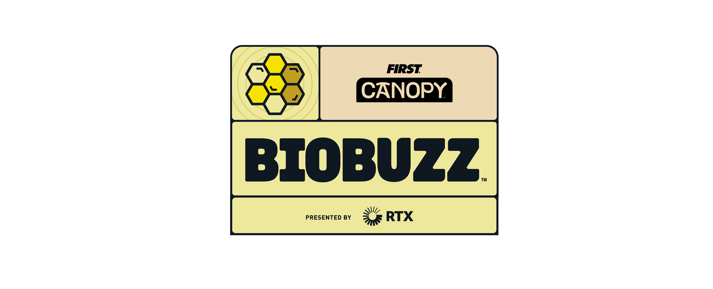

# BIOBUZZ 한국어 매뉴얼

<h2 align="center"></h2>

<h2 align="center"><strong>2026-2027 FIRST® Tech Challenge                  BIOBUZZ™ Competition Manual</strong></h2>



<figure><figcaption></figcaption></figure>



<figure><figcaption></figcaption></figure>



<h4 align="center">Official Manual Link</h4>

{% embed url="https://ftc-resources.firstinspires.org/ftc/game/cm-html/BIOBUZZ%20Competition%20Manual%20-%20V1.htm" %}


**중요:** 본 페이지는 학습과 이해를 돕기 위한 비공식 한국어 번역입니다. 규칙 또는 설명이 다른 버전과 충돌하는 경우 FIRST의 Game and Season Materials 페이지에 게시된 **최신 영문 PDF**을 기준으로합니다.

