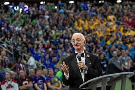
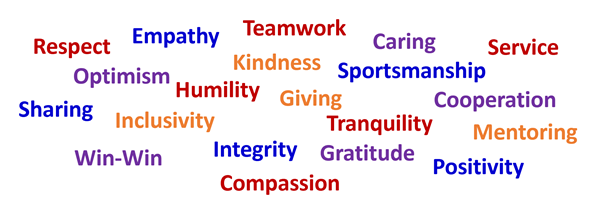
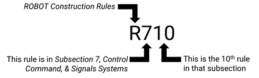

# 1 소개

## 1.1 FIRST® 소개 

FIRST®(For Inspiration and Recognition of Science and Technology)는 청소년들의 과학과 기술에 대한 관심을 고취하기 위해 설립되었습니다. 설립 이후 FIRST는 STEM 교육을 발전시키는 세계적인 청소년 비영리 단체로 성장했으며, 혁신을 고취하고 자신감을 키우며 청소년들이 미래를 준비하도록 돕는 전 세계적 운동으로 자리 잡았습니다.

FIRST의 프로그램은 교실 안팎에서 학습, 관심, 역량 개발에 입증된 지속적 영향을 미치며, 학생들이 자신의 미래를 만들어가도록 끊임없이 지원하는 FIRST 자원봉사자, 교육자, 멘토, 스폰서가 있기에 가능합니다.

매년 참가자들은 같은 사명을 지닌 전 세계 사람들과 하나의 커뮤니티를 이루는 데서 오는 영감과, 공통의 도전을 해결하기 위해 함께 노력하면서 형성되는 유대감을 직접 경험합니다. FIRST 학생들은 STEM 학습의 엄밀함과 전통적인 스포츠의 재미와 흥분이 결합된 발견의 여정을 떠나게 됩니다.

FIRST와 프로그램에 대한 자세한 내용은 [FIRST 웹사이트](https://www.firstinspires.org/)를 참고하십시오.

**목적 · Purpose**FIRST는 오늘의 청소년들이 내일의 세상을 준비하도록 하기 위해 존재합니다.

**비전 · Vision**과학과 기술이 존중받고, 청소년들이 과학·기술 분야의 리더가 되기를 꿈꾸는 세상을 만들어 우리의 문화를 변화시킵니다.

**미션 · Mission**FIRST의 미션은 청소년들에게 더 나은 세상을 만들 수 있는 기술, 자신감, 회복탄력성을 길러주는 삶을 변화시키는 로봇 프로그램을 제공하는 것입니다.

## 1.2 FIRST® Tech Challenge 

FIRST는 학생들의 현재 수준과 환경에 맞게 설계된 폭넓은 로봇 경험을 제공합니다. 어떤 상황의 학생이든 모든 수준에서 흥미롭고 도전적인 경험을 할 수 있도록 합니다. 뛰어난 FIRST 프로그램들 가운데 FIRST® Tech Challenge가 특별한 이유는 무엇일까요?

**규모(Scale), 기술 수준(Skill Level), 복잡성(Complexity), 유연성(Flexibility), 학생 주도성(Student Ownership)**

* **규모.** 교실 규모의 FIELD와 교실 환경에서 안전하게 사용할 수 있는 ROBOT을 사용하므로, 학생들이 모일 수 있는 곳이라면 어디에서나 FIRST Tech Challenge를 운영할 수 있습니다. 소규모 팀도 성공할 수 있어 팀원은 여러 역할에서 두루 뛰어나게 활동하거나 한 역할에 전문화할 수 있습니다.
* **기술 수준.** FIRST Tech Challenge는 진출 기회를 갖춘 Championship 수준의 플레이를 원하는 학생과, 이제 막 자기 교실에서 플레이를 배우는 학생 모두에게 도전을 제공합니다. 전문가가 경험을 주도해야 하는 것이 아니라, 배려 깊은 성인이 학생의 자기 탐색을 지원하면 되는 단계적 성장 경험을 제공합니다.
* **복잡성.** ROBOT은 기본 Starter Kit만으로 완전히 만들 수도 있고, 맞춤 설계로 전부 제작할 수도 있으며 두 접근 방식을 혼합할 수도 있습니다. 고급 제작을 활용할 기회는 있지만, 교실 밖의 도구는 선택 사항이지 필수 사항은 아닙니다.
* **유연성.** 9월에 시작하여 3월까지 이어지고, 4월부터 7월까지 캡스톤 이벤트가 열리는 긴 시즌 구조를 통해 팀은 집중적인 활동 기간을 회복 기간이나 다른 학교 활동 사이에 배치하면서도 반복적 개선 중심의 제작 경험을 유지할 수 있습니다.
* **학생 주도성.** 소규모 팀이 교실에서 안전하게 사용할 수 있는 ROBOT으로 긴 시즌 동안 경쟁하는 구조는 학생들이 자기 탐색을 통해 독립적으로 배우고 팀의 여정 더 많은 부분에 주인의식을 느끼도록 합니다.

그리고 물론 FIRST Tech Challenge는 FIRST 프로그램 전반에서 경험할 수 있는 커뮤니티, 협업, 아웃리치, 성장의 기회를 모두 제공합니다.

자세한 내용은 [FIRST Tech Challenge 웹페이지](https://www.firstinspires.org/programs/ftc)를 참고하십시오.

## 1.3 FIRST Ethos와 Core Values 

### 1.3.1 Gracious Professionalism® 

Gracious Professionalism®은 FIRST 정신의 일부입니다. 이는 높은 수준의 작업을 장려하고, 타인의 가치를 중요하게 여기며, 개인과 공동체를 존중하는 행동 방식입니다.

Gracious Professionalism을 통해 치열한 경쟁과 상호 이익은 공존할 수 있습니다. 참가자는 열정적으로 경쟁하면서도 서로를 존중하고 공감합니다. 상대를 헐뜯지 않으며, 진정성 없는 상투적인 칭찬으로 포장하지도 않습니다. 지식, 경쟁, 진실성, 공감이 자연스럽게 함께합니다.

궁극적으로 Gracious Professionalism은 의미 있는 삶을 추구하는 한 부분입니다. 전문가가 지식을 품위 있게 사용하고, 개인이 진실성과 배려를 갖고 행동할 때 모두가 이익을 얻고 사회가 더 나아집니다.

이 용어는 FIRST의 저명한 고문이자 경쟁 로봇의 아버지로 불린 Dr. Woodie Flowers(1943-2019)가 만든 표현입니다.

**Figure 1-1 · 경쟁 로봇의 아버지이자 Gracious Professionalism의 옹호자와 모범이었던 Dr. Woodie Flowers**

> “FIRST 정신은 모든 사람이 가치 있게 대우받는 방식으로 높은 수준의, 충분한 지식에 근거한 일을 하도록 장려합니다. Gracious Professionalism은 FIRST 정신의 일부를 설명하기에 좋은 표현인 것 같습니다. 이것은 FIRST를 특별하고 훌륭하게 만드는 요소 중 하나입니다.”\
> **— Dr. Woodie Flowers**

Gracious Professionalism은 Woodie가 남긴 선물이며, 이제 우리 모두가 그 가치를 지키는 사람이 되었습니다. Woodie는 Gracious Professionalism을 엄밀히 정의하는 것이 필수적인 것은 아니라고 자주 말했지만, Gracious Professionalism에 대해 계속 이야기하는 것은 매우 중요하다고 강조했습니다.


Gracious Professionalism은 사람마다 그것을 추구하는 방식이 달라야 하기 때문에 이해하기 어려울 수 있습니다. Gracious Professionalism에 대해 이야기하다 보면, 이것이 우리 각자의 내면에 있는 좋은 면과 서로 그리고 세상과 관계를 맺을 때 나타나는 좋은 모습을 상징하게 되었다는 점이 금방 분명해집니다.

이는 언제나 지향해야 하는 이상이지, 달성해서 끝나는 목표가 아니며, 누군가를 평가하는 방법도 아닙니다. 그러므로 누군가가 “Graciously Professional하다” 또는 “Graciously Professional하지 않다”고 말하기보다는, 그 사람이 그 특성의 일부를 구현하고 있다고 보는 것이 적절합니다.

어떤 행동을 “GP답지 않다”고 이야기하고 싶을 때에는 개선이 필요한 구체적인 행동을 이야기하는 것이 더 적절합니다. 그 사람이 무례했는가? 예의가 없었는가? 정직하지 않았는가?

Graciously Professional하다는 것은 개별 속성 하나하나보다 더 큰 개념입니다.


**Gracious Professionalism이 의미할 수 있는 몇 가지 예는 다음과 같습니다.**

* 모두에게 이익이 되는(win-win) 배려 있는 태도와 행동
* 타인을 존중하고 그 존중이 행동으로 드러나는 사람
* 전문가는 특별한 지식을 갖고 있으며, 사회는 그 지식을 책임 있게 사용하리라 믿는다는 점
* Gracious Professional은 자신과 타인 모두에게 기분 좋은 방식으로 가치 있는 기여를 한다는 점

**FIRST의 맥락에서 이는 모든 팀과 참가자가 다음을 실천해야 함을 의미합니다.**

* 강한 경쟁자가 되는 법을 배우는 동시에 그 과정에서 서로를 존중하고 친절하게 대하기
* 누구도 배제되거나 가치 없다고 느끼지 않도록 하기

성공적인 팀은 이 개념을 함께 검토하고 지속적으로 되새기는 데 시간을 씁니다. 팀원들은 실제 삶에서 Gracious Professionalism이 실천되는 사례를 함께 찾아보는 것이 좋습니다. 대회에서 서로에게 Gracious Professionalism의 여러 측면을 보여줄 기회를 자주 강조하고, 모든 팀원이 자신이 이 가치를 어떻게 구현할 수 있을지 제안하도록 격려하십시오.

**Figure 1-2 · Gracious Professionalism을 구현하는 사람에게 적용될 수 있는 단어들. 여러분의 워드클라우드에는 어떤 단어를 넣겠습니까?**

### 1.3.2 Coopertition® 

Coopertition®은 치열한 경쟁 속에서도 조건 없는 친절과 존중을 보여주는 것입니다. 이는 서로 직접 경쟁하는 상황에서도 팀들이 협력하고 서로 도울 수 있다는 개념과 철학에 기반합니다. FIRST Tech Challenge의 ALLIANCE 구조는 본질적으로 Coopertition®을 보여줍니다. 한 MATCH의 상대팀이 다음 MATCH에서는 ALLIANCE 파트너가 될 수 있습니다. 이런 의미에서 모두가 최선을 다해 플레이할 때 모든 팀이 이익을 얻습니다.

### 1.3.3 Core Values 

FIRST Core Values는 FIRST의 근본이며 우리 프로그램만의 고유한 가치입니다. 우호적인 스포츠맨십, 타인의 기여에 대한 존중, 팀워크, 학습, 지역사회 참여를 강조합니다. FIRST 커뮤니티는 Core Values를 통해 Gracious Professionalism®과 Coopertition®의 철학을 표현합니다.

* **Discovery:** 새로운 기술과 아이디어를 탐구합니다.
* **Innovation:** 창의성과 끈기를 활용해 문제를 해결합니다.
* **Impact:** 배운 것을 적용해 세상을 더 나은 곳으로 만듭니다.
* **Inclusion:** 서로를 존중하고 서로의 차이를 받아들입니다.
* **Teamwork:** 함께할 때 우리는 더 강합니다.
* **Fun:** 우리가 하는 일을 즐기고 함께 축하합니다!

### 1.3.4 왜 FIRST Ethos와 Gracious Professionalism을 받아들여야 하는가? 

FIRST와 이러한 가치가 익숙하지 않은 사람은 이렇게 생각할 수도 있습니다. “이건 나와 상관없어. 주변 세상에서는 이런 모습을 보지 못하는데, 왜 나까지 이렇게 행동해야 하지?”

> **더 나은 세상을 만들고, 더 의미 있는 삶을 추구하며, 인간만의 고유한 가치를 함께 기념하기 위해서입니다.**

#### 더 나은 세상 만들기

FIRST의 미션은 “청소년에게 더 나은 세상을 만들 수 있는 기술, 자신감, 회복탄력성을 제공하는 것”입니다. 그렇다면 우리가 원하는 세상은 어떤 모습일까요? 우리는 어떤 문화의 일원이 되고 싶을까요?

FIRST는 모든 사람이 FIRST의 가치를 구현하고 행동으로 Gracious Professionalism을 보여주기 위해 노력하는 세상이라면 매우 살기 좋은 세상이 될 것이라 믿습니다.

#### 의미 있는 삶 추구하기

그리고 이러한 행동은 사람의 마음도 좋게 만듭니다. 우리는 자신이 효과적으로 기여하고 있다는 감각이 자신을 긍정적으로 느끼는 데 큰 역할을 한다는 것을 알고 있습니다. 이러한 행동은 삶의 모든 영역에 긍정적인 영향을 줄 것입니다.

열심히 노력하는 과정은 재미있고 깊은 만족을 줄 수 있으며, 합리적인 자존감을 형성하는 것은 장기적인 행복의 중요한 부분입니다. 더 나은 세상을 만들기 위해 이런 행동을 시작하더라도, 결국 자신의 삶도 더 의미 있게 만들어가게 될 것입니다.

#### 아직도 회의적인가요? FIRST에서 직접 시도해 보세요.

여러 면에서 FIRST는 현실 세계를 위한 연습입니다. 우리는 FIRST 커뮤니티를 원하는 방향으로 만들어갈 기회를 갖고 있습니다. 학생들이 선택하기 쉬운 상황에서 Graciously Professional한 결정을 내릴 기회를 제공하면, 그 느낌을 경험하고 작동 방식을 배우며, 더 어려운 상황에서도 같은 선택을 할 준비를 할 수 있습니다.

우리는 우리가 기념하는 것을 더 많이 만들어냅니다. 그러므로 노력, 진실성, 공정한 경기, 스포츠맨십, 공감, 그리고 인간만의 고유한 가치를 함께 기념합시다.

## 1.4 대회의 정신 

### 1.4.1 FIRST Staff의 메시지 

RTX가 후원하는 BIOBUZZ에 오신 것을 환영합니다! 2026-2027 FIRST Tech Challenge 시즌을 시작하게 되어 기쁩니다. 지금 일어나고 있는 변화, 절대 변하지 않기를 바라는 것, 그리고 프로그램의 성공과 성장으로 인해 우리가 마주한 과제를 설명하고자 합니다.

FIRST Tech Challenge에는 매우 다양한 배경, 연령, 기술 수준의 참가자가 함께합니다. 우리 프로그램은 캡스톤 경험이면서 동시에 기초 경험이기도 합니다. FIRST Tech Challenge에서 가장 숙련된 참가자들은 업계 전문가들조차 감탄할 기술적 성취를 담은 ROBOT을 만들고, 많은 사람이 불가능하다고 생각하는 과제를 수행합니다. 동시에 FIRST Tech Challenge는 처음 로봇 스포츠를 경험하는 학생과 팀에게 진입로를 제공합니다.

우리의 게임은 어떤 스포츠 이벤트와 비교해도 손색없는 흥분과 볼거리를 제공하는 수준에서 플레이되기도 하지만, 동시에 교실, 차고, 학교 도서관에서도 플레이됩니다.

경험 많은 참가자들이 알고 있고 신규 참가자들이 곧 배우게 될 사실은 다음과 같습니다.

> “완벽한 해법은 없습니다. 오직 트레이드오프와 타협만 있을 뿐입니다. 우리는 가장 균형 잡힌 결과를 제공한다고 믿는 트레이드오프를 선택해야 합니다.”

우리의 약속은 이 모든 수준에 있는 학생과 팀이 FIRST Tech Challenge에서 환영받는 보금자리를 찾도록 하는 것입니다. 모든 팀이 ALLIANCE에 의미 있게 기여하고, 경험이 쌓일수록 반복적으로 개선하며, 진정한 sport of the mind™에서 경쟁하는 짜릿함을 느낄 수 있는 방식으로 “play robots” 할 수 있도록 하겠습니다.

#### 시즌의 과제: Championship 수준의 경기 vs. 플레이를 배우는 경험

디펜딩 월드 챔피언이든 첫 StarterBot을 만드는 팀이든, 학생들의 학습과 역량 성장을 가능하게 하는 도전적인 게임을 제공합니다. 이러한 도전에는 과거 시즌에서 익숙한 주제를 포함해 이전 시즌의 기술을 발전시키도록 하는 동시에, ‘메타’를 바꾸는 새로운 역학을 포함해 커뮤니티가 계속 배우고 실험하도록 합니다.

FIRST Tech Challenge는 앞으로도 최상위 팀들이 자신의 역량을 보여주고 시즌 과제에 창의적이고 탁월한 해법을 제시할 수 있는 높은 신뢰도의 Championship 수준 경험을 제공할 것입니다. 이것은 변하지 않습니다. 그러나 동시에 사전 STEM 경험이 없거나 Championship 수준 이벤트에 접근하기 어려운 학생을 포함해 전 세계 더 많은 청소년이 FIRST Tech Challenge에 참여할 수 있기를 바랍니다.

이를 위해서는 학생, 코치, 자원봉사자, 지역 리더에게 프로그램의 접근성을 높여야 합니다.

#### 모든 수준에서의 대회 공정성

FIRST Staff와 모든 FIRST 자원봉사자는 모든 대회의 모든 MATCH가 완벽하기를 바랍니다. 완벽할 수 없더라도 대회의 공정성을 보호하고 모든 팀에게 공정한 경기를 보장하고자 합니다. 스포츠가 성숙해지면서 팀들의 경기력은 크게 향상되었고 이는 매우 자랑스러운 일입니다. 그러나 그 성공과 함께 추가적인 과제도 나타났고, 이제 대회의 공정성을 유지하는 일이 점점 더 어려워지고 있습니다.

최근 몇 년간의 변화는 게임 설계, FIELD 설계, 자원봉사자에게 더 큰 부담을 주었습니다. 최고 수준의 플레이를 가능하게 하기 위한 여러 노력은 입문 수준의 플레이 경험을 제공하기 더 어렵게 만들기도 했습니다. 우리는 두 목표를 모두 달성하기 위해 무언가를 바꿔야 한다고 생각합니다.

#### 2026-2027 시즌 및 이후의 변화

2026-2027 시즌에는 BIOBUZZ의 설계 방식과 Competition Manual 작성 방식에 의도적인 변화가 있습니다. 이 변화는 향후 게임과 시즌에도 계속 이어갈 계획입니다. 이전 시즌의 매뉴얼은 가능한 모든 상황을 다루기 위해 정확한 조건과 세부 사항을 규정하는 데 초점을 두었고, 모든 시나리오를 포함하려는 과정에서 유연성이 줄어들었습니다.

BIOBUZZ 매뉴얼은 “규칙의 정신(spirit of the rule)”을 강조하고, 대회 자원봉사자가 선의에 따라 합리적인 판단을 내릴 수 있도록 권한을 부여합니다. BIOBUZZ 규칙은 “의도된 경기 방식(intended gameplay)”을 강조하며, 참가자와 자원봉사자가 규칙의 정신과 의도를 더 쉽게 이해할 수 있도록 작성되었습니다.

규칙은 자원봉사자가 발생하는 모든 행동이나 사건을 일일이 관찰하고 기록하도록 요구하기보다, 대회의 정신에 반하는 더 큰 행동과 전략을 살펴볼 수 있도록 설계되었습니다. 예를 들어 상대팀의 게이트 접근을 전략적으로 막는 행동과 단순히 상대 게이트 구역에 들어가는 행동을 구분하는 식입니다.

이렇게 하면 자원봉사가 더 쉬워지고, 자원봉사자는 FIRST Volunteering의 정신에 따라 팀을 지원하는 일에 더 집중할 수 있으며, 모두에게 더 일관된 대회 경험을 제공할 수 있습니다.

이 변화는 우리 모두가 FIRST Ethos와 FIRST Core Values가 설명하는 윤리적 기준을 지킬 때만 가능합니다. 우리는 여전히 팀들이 승리를 위해 경쟁하기를 바랍니다. 다만 동료 경쟁자와 규칙을 집행하는 대회 자원봉사자에게 배려와 존중을 보이는 방식으로 경쟁하기를 바랍니다.

이러한 문화를 만들기 위해 모든 FIRST 참가자가 따라야 할 Framework of Behaviors와 Competition Integrity Contract를 강조합니다. 참가자와 자원봉사자가 이 프레임워크에 뜻을 모으면 많은 규정을 단순화하고 프로그램에 참여하는 모두의 부담을 줄이며, 우리 모두가 성공하기 더 쉬운 환경을 만들 수 있습니다.

감사합니다. 이번 시즌 앞으로 펼쳐질 모든 것을 기대합니다!

**— FIRST Tech Challenge Staff**

### 1.4.2 Framework of Behaviors 

FIRST Tech Challenge의 문화는 글로벌 커뮤니티의 습관과 행동으로 형성됩니다. 우리 스포츠가 팀들에게 긍정적인 공간으로 남도록 하기 위해 참가자, 멘토, 교육자, 후원자, 동문, 자원봉사자 모두가 윤리적 행동의 프레임워크를 따르기를 기대합니다. 이 프레임워크는 지향해야 할 철학부터 명확한 규칙과 규정까지 포함합니다.

* **Gracious Professionalism & FIRST Core Values**\
  Gracious Professionalism은 모든 행동을 이끄는 기준이며, 우리는 항상 그 철학과 일치하도록 행동해야 합니다. FIRST Core Values를 기념하고 그것이 우리 행동의 중심에 있도록 하는 것이 Gracious Professionalism을 구현하고 FIRST 고유의 문화를 지키는 방법입니다.
* **FIRST Code of Conduct**\
  FIRST의 성인 참가자와 미성년자의 부모는 모든 참가자의 안전을 보장하기 위한 행동 및 청소년 보호 요건을 담은 FIRST Code of Conduct 준수를 확인합니다.
* **Competition Integrity Contract**\
  FIRST Tech Challenge의 모든 팀은 아래 Section 1.5 Competition Integrity Contract(CIC)를 따라야 합니다. CIC는 대회의 공정성과 The Sport의 장기적인 건전성을 보호하는 팀 행동을 규정합니다.
* **Competition Rules: Competition Manual, Team Updates, Q\&A**\
  각 시즌의 게임은 Competition Manual의 규칙과 규정으로 정의됩니다. 이 규칙은 매년 바뀌지만, 모든 팀이 대회 참가 자격을 갖추기 위해 충족해야 할 기준과 경기 중 모든 팀이 따라야 할 구체적인 행동을 설명합니다.

### 1.4.3 멘토의 역할 

FIRST의 미션은 청소년에게 더 나은 세상을 만들 수 있는 기술, 자신감, 회복탄력성을 제공하는 프로그램을 만드는 것이며, FIRST Tech Challenge에서 멘토는 그 목표를 이루는 핵심 요소입니다. 성인 멘토링은 FIRST가 효과적인 이유로 입증된 요소입니다.

> **멘토나 코치와 함께 일하는 것은 학습 과정의 중요한 부분입니다.**\
> FIRST 프로그램의 학생 멘토링은 STEM 진로에 대한 더 나은 이해와 함께 학생의 자신감, 자존감, 만족감 향상으로 이어질 수 있습니다.

자연스럽게 이런 질문이 생깁니다. “멘토는 ROBOT 제작에 어느 정도까지 관여해야 하는가?”

답은 계속 같습니다. **“팀의 청소년에게 영감을 주는 데 필요한 만큼.”**

**각 팀의 ROBOT은 그 팀만의 여정과 경험을 보여주어야 하며, 모든 팀의 여정은 고유합니다.**

멘토의 관여 수준은 팀마다 다르고 시즌마다 달라질 수 있습니다. 예를 들어 충분한 CAD 역량을 가진 학생 또는 학생 그룹이 있다면 멘토의 제한적인 지도와 감독만으로 ROBOT CAD 모델 대부분을 만들 수 있습니다. 다음 시즌에 그 학생들이 졸업하고 같은 역량을 가진 학생이 아직 없다면, 같은 멘토가 더 직접적으로 관여해야 할 수도 있습니다.

FIRST는 팀 운영에 하나의 정답을 강제하지 않습니다. 각 팀은 현재 학생들의 수준에 맞게 구조를 설계해야 하며, 성공은 항상 개별 학생의 성장 결과를 기준으로 봐야 합니다. 이는 멘토 교육 자료와 모범 사례 공유를 통해 강화되며, 모든 팀이 학생에게 가장 잘 맞는 방식을 찾으면서 지속적으로 개선할 수 있도록 합니다.

### 1.4.4 FIRST 자원봉사의 정신 

FIRST 자원봉사자는 모든 팀의 성공을 돕기 위해 존재하며, 가능하다면 참가자가 규칙을 위반하지 않도록 적극적으로 도와야 합니다. FIRST를 특별하게 만드는 요소 중 하나는 자원봉사자가 모든 FIRST 학생의 멘토 역할을 할 수 있는 문화입니다.

자원봉사자는 규칙 집행 중심 문화로, 팀은 대립적 행동으로 쉽게 기울 수 있습니다. FIRST 팀과 자원봉사자는 모든 상호작용에서 서로 싸우는 것이 아니라 함께 일해야 한다는 점을 기억해야 합니다.

다음과 같은 말이 자주 언급됩니다.

> “Gracious Professionalism을 통해 치열한 경쟁과 상호 이익은 공존할 수 있습니다. 참가자는 열정적으로 경쟁하면서도 서로를 존중하고 공감합니다.”

이처럼 치열하고 강도 높은 경쟁 자체도 Gracious Professionalism을 구현하는 직접적인 한 부분이 될 수 있습니다. FIRST 팀, 학생, 멘토는 우리 스포츠에 큰 열정을 가지고 있으며, 당연히 탁월함과 “필드에서의 성공”을 추구하면서 매우 열심히 경쟁하게 됩니다.

FIRST는 자원봉사자도 이러한 경쟁의 열기 속에서 존중과 공감으로 대응하도록 준비시킵니다. 성공적인 운영을 위해 자원봉사자는 매 시즌 FIRST가 제공하는 자료와 교육을 활용해야 합니다. 이는 규칙뿐 아니라 FIRST가 규칙을 어떻게 집행하고자 하는지에 관한 공식 지침까지 충분히 이해해야 함을 뜻합니다. 이를 통해 각 대회가 가능한 한 공정하고 일관되게 운영될 수 있습니다.

많은 FIRST 학생들에게 대회 경험은 몇 명의 성인 자원봉사자와 나눈 몇 번의 상호작용으로 정의될 수 있습니다. 따라서 모든 FIRST 자원봉사자는 항상 친절하고, 지원적이며, 공정하고, 팀 중심적인 방식으로 행동하는 것이 매우 중요합니다. FIRST 자원봉사가 특별한 또 다른 이유는 대회의 공정성을 유지할 책임을 맡으면서도 FIRST Core Values를 강화하고 언제나 Gracious Professionalism을 실천하기 위해 최선을 다해야 하기 때문입니다.

FIRST에 시간을 자원봉사하는 사람들을 움직이고 동기를 부여하는 두 표현은 \*\*“Giving Back”\*\*과 \*\*“Paying It Forward”\*\*입니다. 매년 FIRST 자원봉사가 되어 학생, 멘토, 동료 자원봉사자에게 최고의 경험을 만드는 특별한 기회를 가질 수 있습니다.

가까운 지역 이벤트에서 자원봉사를 고려해 보십시오. 다만 모든 지원자가 모든 이벤트의 모든 역할에 배정될 수 있는 것은 아닙니다. Volunteer Coordinator 및 지역 Program Delivery Partner(PDP)와 협력하여 자신의 지역에서 가장 의미 있게 기여할 방법을 찾아보십시오. 역할별 자원봉사 자료 전체는 Volunteer Resources Page에서 확인할 수 있습니다.

## 1.5 Competition Integrity Contract (CIC) 

Section 1.4.2 Framework of Behaviors를 실제 행동으로 옮기는 요소로서 Competition Integrity Contract(CIC)는 FIRST Tech Challenge의 모든 팀이 대회 안팎에서 어떻게 행동해야 하는지를 정의합니다.

CIC는 두 범주로 나뉩니다. 모든 팀이 대회의 공정성을 보호하기 위해 따라야 하는 **Sporting Ethics Code**와, Gracious Professionalism을 구현하면서 모든 팀이 **Have Fun, Make Friends, Chase Excellence**를 실현하도록 돕는 **Behavior Guidelines**입니다.

### 1.5.1 Sporting Ethics Code 

**우리 팀은 다음을 약속합니다.**

#### 우리는 부정행위를 하지 않습니다.

우리 팀은 규칙의 정신을 의도적으로 위반하지 않습니다. FIRST가 대회를 운영하기 위해 사용하는 시스템을 우회하지 않습니다. 학생 대회에서 부정행위로 승리한다면 부끄러운 일일 것입니다. 진정한 승리는 모두가 같은 규칙 아래 명예, 공정한 경기, 진실성을 갖고 플레이할 때만 가능합니다.

#### 우리는 항상 진실성을 갖고 행동합니다.

아무도 보고 있지 않을 때에도 명예롭게 행동하는 것을 자랑스럽게 여깁니다. FIRST Volunteering의 정신을 존중하며, 자원봉사자가 단순히 규칙을 집행하는 데 시간을 쓰기보다 팀을 지원하는 데 집중하기를 바랍니다. 확인되지 않는 규정까지 포함해 모든 규정을 지켜야 함을 이해합니다. 우리의 행동은 “들키지 않고 무엇까지 할 수 있는가”가 아니라 “무엇이 옳은가”를 기준으로 합니다.

#### 우리는 의도된 방식으로 게임을 플레이합니다.

우리는 The Sport가 “Red Alliance vs. Blue Alliance”로 설계되었으며 “Teams vs. Volunteers”가 되어서는 안 된다는 점을 이해합니다. 규칙이 발생 가능한 모든 상황을 나열하도록 설계된 것이 아님을 이해합니다. 우리 팀은 규칙의 “허점(loopholes)”을 이용해 이점을 얻으려 하지 않습니다. 규칙의 구체적인 문구가 모호하다면 규칙의 의도와 대회의 정신을 행동의 기준으로 삼습니다.

#### 우리 팀이 규칙을 집행하는 주체가 아님을 압니다.

우리 팀은 공정한 경기와 좋은 스포츠맨십을 중요하게 생각합니다. 부적절하다고 확신하는 일을 본다면 대회 관계자에게 정중하게 알립니다. 상황을 확대하고 해결하는 책임은 Event Staff와 FIRST Headquarters에 있음을 이해합니다. 인지된 위반 사항을 이유로 누군가를 비난, 조사, 공개적으로 지목하거나 공격하는 것은 적절하지 않으며, 특히 무례하거나 대립적인 방식으로 해서는 안 된다는 점을 이해합니다.

### 1.5.2 Behavior Guidelines 

**우리 팀은 다음을 약속합니다.**

#### 목적지보다 여정을 먼저 봅니다.

우리 팀은 승리하기 위해 열심히 노력할 것입니다. 우리가 하는 모든 일에서 탁월함을 추구할 것입니다. 성공을 대회 결과로 정의하지 않고, 배운 교훈과 맺은 친구를 기준으로 봅니다. FIRST 대회는 우리의 성장을 확인하고, 다른 팀들과 함께 모두가 걸어온 여정을 축하하는 기회입니다.

#### 존중과 좋은 스포츠맨십을 실천합니다.

우리는 항상 타인을 존중하기 위해 노력합니다. 결과와 상관없이 전문적으로 행동하고, 나중에 돌이켜보아도 자랑스러울 행동을 하도록 노력합니다. 경쟁이 치열하고 감정이 고조되는 순간에도 마찬가지입니다. 대회가 끝난 뒤 원하는 대로 되지 않았던 세부 사항은 기억하지 못할 수 있지만, 어려운 순간에 우리가 어떻게 행동했는지는 기억하게 될 것입니다.

_우리는 팀원을 지지합니다. 파트너를 칭찬합니다. 상대를 축하합니다._

#### 서로 돕습니다.

타인을 돕고 존중과 친절로 대할 때 우리는 최고의 결과를 만듭니다. 성공하고 싶지만, 누군가의 실패 덕분에 성공하고 싶지는 않습니다. 서로 경쟁하고 있더라도 모두가 최선의 플레이를 하도록 돕고 싶습니다. 그리고 결과와 관계없이 함께 축하할 것입니다. (...물론 우리가 이기면 더 좋겠지만요.)

#### 우리는 “더 높은 길”을 선택합니다.

우리는 모두 성장 중이며 완벽한 사람은 없습니다. 존중한다는 것은 다른 사람의 행동이 우리의 기대에 미치지 못할 때 이해하고 공감하며 때로는 용서하는 것을 의미합니다. 누군가 옳지 않아 보이는 방식으로 행동하더라도 그것이 우리의 행동까지 바꾸게 두지 않도록 노력합니다. 모두에게는 각자의 여정이 있으며, 우리가 항상 볼 수 없는 어려움을 겪고 있습니다. 우리는 자신의 성장에 집중하고, 우리에게 무례한 사람에게도 존중을 유지합니다.

#### 재산과 시설을 존중합니다.

우리 팀은 항상 우리가 발견했을 때보다 더 나은 상태로 남겨두도록 노력합니다. 장비, 시설, 타인의 재산에 예상 가능한 손상을 주지 않도록 행동합니다. 우리가 만든 쓰레기는 치우며, 사고가 발생해 우발적인 손상이 생기면 적절한 담당자에게 알립니다.

#### 긍정적인 안전 문화를 만듭니다.

우리는 우리 자신이나 주변 사람의 안전을 알면서 위험에 빠뜨리지 않습니다. 우리 팀은 만나는 모든 사람의 안전을 돕습니다. “안전 규칙을 단속하는 문화”보다 안전한 의사결정과 안전 모범 사례의 이해를 가르치는 것을 강조합니다. 이를 통해 구성원은 익숙하지 않은 상황에서도 스스로 안전하게 행동하는 법을 배웁니다.

#### 건강한 선택을 합니다.

대회는 매우 흥미롭고 때로는 우리의 시간과 관심을 모두 소모할 위험이 있습니다. FIRST Tech Challenge와 삶에서 성공하려면 정신적·신체적 건강을 우선해야 함을 이해합니다. 매우 바쁜 때에도 모든 팀원이 충분히 수분을 섭취하고, 잘 먹고, 활동적으로 움직이며, 충분히 자고, 규칙적으로 쉬도록 합니다.

또한 어떤 창의적인 과정에서도 회복할 시간을 포함한 적절하고 때로는 여유 있는 일정이 장시간 무리해서 “갈아 넣는” 것보다 더 좋은 결과를 만들 수 있음을 이해합니다. 대회 안팎에서 모든 팀원이 최상의 상태일 때 팀도 가장 성공적입니다.

#### 우리는 모두 같은 팀입니다.

이곳은 서로 다른 배경과 공유할 경험을 가진 훌륭한 사람들이 모인 글로벌 커뮤니티입니다. 필드에서는 팀들이 서로 치열하게 경쟁해야 합니다. 필드 밖에서는 모두 같은 팀입니다. 학생, 멘토, 자원봉사자, 이벤트 운영자 모두 같은 이유로 이곳에 있습니다. 재미있게 놀고, ROBOT을 플레이하고, 이야기를 나누고, 멋진 것을 만들고, 만나는 모든 사람에게 배우며, 멋진 일을 축하하고, 무엇보다 서로에게 훌륭한 사람이 되기 위해서입니다.

### 1.5.3 위반, 완화 조치 및 상향 보고 

CIC 위반은 위반의 상황에 따라 상향 보고(escalation) 및/또는 완화 조치(mitigation)가 필요할 수 있습니다. 이러한 위반은 이벤트 현장 안팎에서 발생할 수 있습니다.

특정 대회 규정 위반에 대한 상향 절차는 Escalation Guidelines(추후 공개)에 설명됩니다. 일부 상황은 Lead Robot Inspector(LRI), Head Referee, FIRST Technical Advisor(FTA)와 같은 대회 자원봉사자에게 전달되어 완화 조치가 이루어질 수 있습니다.

더 심각한 위반, 특히 Sporting Ethics Code 위반은 Event Director 및/또는 FIRST Headquarters로 상향됩니다. FIRST Headquarters의 판단에 따라 이러한 위반은 팀이 제재를 받거나 현재 및/또는 향후 이벤트에서 실격되는 결과로 이어질 수 있습니다. 조사 후 FIRST Headquarters의 판단에 따라 심각한 위반은 팀 또는 개인이 FIRST Tech Challenge 프로그램에서 일시 정지되거나 영구 제외되는 결과로 이어질 수 있습니다.

FIRST는 open door policy를 운영합니다. 이벤트에서 발생한 우려 사항은 customerservice@firstinspires.org로 이메일을 보내거나 support에 연락하여 FIRST Headquarters에 알릴 수 있습니다.

## 1.6 접근성과 포용성 

FIRST는 STEM for Everyone™을 지향하며, 필요한 편의를 요청하는 장애가 있는 참가자에게 합리적인 편의를 제공하기 위해 노력합니다. 이벤트에서 편의가 필요한 참가자는 행사 전에 지역 운영진에게 연락하여 필요한 조치가 제공될 수 있도록 해야 합니다. 지역 운영진은 합리적인 편의를 제공하기 위해 규칙에 예외를 적용할 수 있으며, 그러한 예외가 과도한 부담을 만들거나 안전상의 우려를 초래해서는 안 됩니다.

## 1.7 Competition Manual 이해 및 활용 

### 1.7.1 이 문서와 표기 규칙 

2026-2027 Competition Manual은 2026-2027 시즌과 RTX가 후원하는 BIOBUZZ™ 게임에 관한 정보를 제공하는 모든 FIRST Tech Challenge 팀의 기준 자료입니다. 이 문서를 통해 다음 내용을 확인할 수 있습니다.

* BIOBUZZ 게임의 전반적인 개요
* BIOBUZZ 플레이 FIELD에 대한 세부 정보
* BIOBUZZ 게임 플레이 방법
* 안전, 행동, 게임 플레이, 검사, 이벤트 등과 관련된 규칙
* ROBOT 제작 규칙
* 시즌 동안 팀이 다음 단계로 진출하는 방법

Competition Manual은 “최종 기준(source of truth)”으로 의도되었습니다. 지원 문서도 이 정보와 일치하도록 작성되지만 일부 불일치가 발생할 수 있습니다. 차이가 있을 경우 Competition Manual이 우선합니다.

매뉴얼 전반에서는 경고, 주의, 핵심 단어와 구문을 강조하기 위한 특정 표기 방식을 사용합니다. 이러한 표기는 중요한 정보를 알리고 팀이 규정을 준수하는 ROBOT을 안전하게 제작하도록 돕기 위한 것입니다.

문서 안에서 다른 절 제목이나 규칙을 참조하는 링크는 회색 배경의 파란색 밑줄 텍스트로 표시됩니다. 외부 자료 링크는 파란색 밑줄 텍스트로 표시됩니다.

이 문서의 미리보기 버전에 아직 포함되지 않은 규칙을 참조하는 링크는 대괄호 안에 Section 문자와 ###으로 표시됩니다. 예를 들어 Game Rule이 공개되기 전에 해당 규칙을 교차 참조하면 \[G###]로 표시되며, 해당 절이 공개되면 실제 규칙 번호로 대체됩니다.

FIRST Tech Challenge와 BIOBUZZ의 맥락에서 특별한 의미를 갖는 핵심 용어는 Section 16 Glossary에서 정의되며 문서 전체에서 ALL CAPS로 표시됩니다.

규칙 번호 방식은 해당 규칙이 속한 Section, Subsection, 그리고 그 Subsection 안에서의 규칙 위치를 나타냅니다. 문자는 규칙이 게시된 Section을 나타냅니다.

**I** · Section 3 Competition Eligibility and Inspection (I)

**E** · Section 5 Event Rules (E)

**A** · Section 6 Awards (A)

**G** · Section 11 Game Rules (G)

**R** · Section 12 ROBOT Construction Rules (R)

**T** · Section 13 Tournament (T)

**L** · Section 14 League Play Tournaments (L)

**C** · Section 15 FIRST Championship (C)

그다음 숫자는 규칙이 있는 Subsection을 나타냅니다. 마지막 숫자는 해당 Subsection 안에서 그 규칙이 위치하는 순서를 나타냅니다.

**Figure 1-3 · 규칙 번호 구성 방식**


경고, 주의, 참고 사항은 주황색 상자에 표시됩니다. 이러한 내용에는 규칙의 배경에 대한 설명, 규칙을 이해하거나 해석하는 데 도움이 되는 정보, 그리고 규칙의 영향을 받는 시스템을 구현할 때 사용할 수 있는 가능한 “모범 사례(best practices)”가 포함될 수 있으므로 주의 깊게 읽으십시오.

주황색 상자도 매뉴얼의 일부이지만 실제 규칙과 동일한 효력을 갖지는 않습니다. 규칙과 주황색 상자의 문구가 의도치 않게 충돌한다면 규칙이 주황색 상자의 문구보다 우선합니다.


영국식 단위(Imperial dimensions) 뒤에는 미터법 사용자를 위한 비교 가능한 미터법 단위가 괄호로 표시됩니다. 미터법 변환값은 가장 가까운 0.05cm 단위로 반올림됩니다. 예: “17.5 in. (\~44.45 cm)”. 미터법 변환은 편의를 위한 참고 자료일 뿐이며, 본 매뉴얼과 공식 도면에 제시된 영국식 단위를 무효화하거나 대체하지 않습니다. 즉 치수와 규칙은 항상 영국식 단위 측정을 기준으로 판단합니다.

규칙에는 규칙 또는 규칙 묶음을 간략히 전달하기 위한 구어체 표현, 즉 headline이 포함됩니다. headline 형식에는 두 가지가 있습니다. 매 시즌 존재할 것으로 예상되며 구체적인 세부 사항만 시즌마다 바뀌는 Evergreen Rule은 앞에 별표가 붙은 **굵은 녹색 텍스트**의 headline으로 표시됩니다.

이는 규칙의 전반적인 주제와 존재 자체는 시즌마다 일정하지만, 게임별 용어나 구체적인 세부 사항은 필요에 따라 바뀔 수 있음을 의미합니다. 예를 들어 ROBOT 확장 제한을 다루는 Evergreen Rule 안에서 게임별 용어가 바뀌거나, 구체적인 확장 제한이 바뀌거나, Evergreen actuator rule 안에서 허용되는 모터 수가 바뀔 수 있습니다. 이러한 규칙은 해당 Section의 앞부분에 배치되므로 규칙 번호도 시즌마다 바뀔 가능성이 낮습니다. 그 밖의 모든 규칙 headline은 **굵은 주황색 텍스트**를 사용합니다.

규칙의 구체적인 문구와 구어체 headline 사이에 불일치가 있다면 이는 오류이며, 구체적인 규칙 문구가 최종 권위를 갖습니다. 차이를 발견하면 customerservice@firstinspires.org로 알려주십시오.

이벤트에서 기대할 사항, 커뮤니케이션 자료, 팀 조직 권장 사항처럼 일반적으로 특정 시즌에 종속되지 않는 팀 자료는 FIRST Tech Challenge Resources Page에서 확인할 수 있습니다.

### 1.7.2 번역본 및 기타 버전 

FIRST Tech Challenge Competition Manual은 원래 영어로 공식 작성되며, 영어가 모국어가 아닌 FIRST Tech Challenge 팀을 돕기 위해 때때로 다른 언어로 번역됩니다. 이러한 자료는 Game and Season Materials 페이지에 게시됩니다.

텍스트 기반 영문 버전은 보조공학 기기 사용을 위한 경우에 한해 제공될 수 있으며 재배포 용도로 제공되는 것은 아닙니다. 자세한 내용은 FIRST Tech Challenge에 customerservice@firstinspires.org로 문의하십시오.

FIRST Tech Challenge AI Chatbot과 같은 추가 자료는 도움을 주는 도구로 제공되지만, Competition Manual이 최종 권위를 갖습니다. 이 매뉴얼의 다른 버전에서 규칙이나 설명이 수정된 경우, Game and Season Materials 페이지에 게시된 **최신 영문 PDF 버전**이 최종 권위본입니다.

### 1.7.3 Team Updates 

Team Updates는 공식 시즌 문서(예: 매뉴얼, 도면)의 개정 사항이나 중요한 시즌 소식을 FIRST Tech Challenge 커뮤니티에 알리는 데 사용됩니다. Team Update 게시물은 Game and Season Materials 페이지에 다음 일정으로 게시됩니다.

* Kickoff 당일부터 FIRST Championship 2주 전까지 매주 목요일

Team Updates는 다음 형식을 사용합니다.

* 추가된 내용은 노란색으로 강조됩니다. 이것이 예시입니다.
* 삭제된 내용은 취소선으로 표시됩니다. 이것이 예시입니다.

이벤트의 Driver Meeting 이후에 게시된 Team Update는 해당 이벤트에는 적용되지 않습니다.

### 1.7.4 Question & Answer System 

Question and Answer System(Q\&A)은 팀이 게임 플레이, 대회 규칙, 심사와 진출, ROBOT 제작 규칙, FIELD 설치에 대해 질문할 수 있는 자료입니다. 팀은 이전에 질문된 내용과 답변을 검색하거나 새로운 질문을 제출할 수 있습니다. 질문에는 이해를 돕는 예시를 포함하거나, 여러 규칙의 관계와 차이를 이해하기 위해 복수의 규칙을 참조할 수 있습니다.

Q\&A는 2026년 9월 28일 미국 동부시간(ET) 오후 12시에 열립니다. Game Q\&A 시스템은 FIRST Dashboard의 Lead Coach 1 또는 Lead Coach 2 계정으로 접근합니다.

Q\&A 결과는 공식 매뉴얼 본문의 개정으로 이어질 수 있으며, 이러한 개정은 Section 1.7.3 Team Updates에서 설명한 절차를 통해 안내됩니다.

Moderator는 매주 월요일부터 팀 질문에 답변하고 목요일 오후 5시(ET)에 마감합니다. Q\&A의 답변은 매뉴얼 본문보다 우선하지 않지만, 두 자료 사이의 불일치를 줄이기 위해 모든 노력을 기울입니다. Q\&A의 답변은 각 이벤트에서 논의를 돕는 데 사용할 수 있지만, REFEREE와 INSPECTOR가 규칙 적용의 최종 권한을 가집니다. 자원봉사 권한자들의 규칙 집행 경향에 우려가 있다면 FIRST에 알려주십시오.

Q\&A는 특정 상황이 이벤트에서 어떻게 전개될지에 대해 확정적인 예측을 제공하는 자료가 아닙니다. 다음과 같은 질문은 답변되지 않을 수 있습니다.

* 모호한 상황에 대한 판정 요청
* 현재 또는 과거 이벤트에서 내려진 결정을 문제 삼는 질문
* 특정 ROBOT 시스템 설계의 합법성에 대한 설계 검토 요청
* 지나치게 광범위하거나 모호하거나 규칙 참조가 없는 질문
* 과거 특정 경기 상황에서 REFEREE가 어떻게 판정했어야 하는지 묻는 질문
* 중복 질문
* 본 매뉴얼에 이미 명확하게 정의되거나 답변된 질문

좋은 질문은 부품이나 설계의 특성, 게임 플레이 시나리오, 규칙에 대해 일반적인 형태로 묻고, 질문 안에서 관련 규칙 하나 이상을 참조하는 경우가 많습니다. 다음은 Q\&A에서 답변될 가능성이 높은 질문의 예입니다.

* “ROBOT에 사용하려는 장치에 보라색 AWG 40 전선이 기본 장착되어 있습니다. 이것이 R?? 및 R??를 충족하나요?”
* “Blue ROBOT A가 X를 하고 Red ROBOT B가 Y를 하는 상황에서 Rule G??가 어떻게 적용되는지 확신이 없습니다. 설명해 주실 수 있나요?”
* “ROBOT이 이 특정 행동을 한다면, 정의된 용어가 설명하는 행동을 하고 있는 것인가요?”
