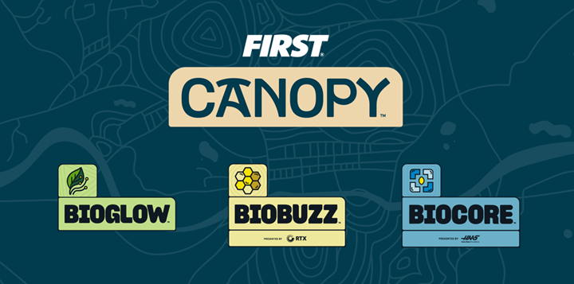

# 2 FIRST 시즌 개요 {#s-2}

## FIRST와 함께 번영하는 지구를 설계하세요

지구상의 어떤 것도 홀로 번영하지 않습니다. 모든 유전자, 종, 생태계는 깨끗한 공기, 맑은 물, 식량을 가능하게 하는 풍부한 생물다양성의 연결망의 일부입니다. STEM을 도구로, 자연을 영감으로 삼아 오늘날 가장 대담한 혁신가들은 우리가 함께 살아가는 지구를 보호하는 연결을 강화할 새로운 방법을 찾고 있습니다.

**만들기. 문제 해결하기. 팀워크를 통해 더 강해지기.**

자연에서 영감을 받은 2026-2027 로봇 시즌, **FIRST® CANOPY™**에 오신 것을 환영합니다.

**FIRST® CANOPY™ · BIOGLOW / BIOBUZZ / BIOCORE — FIRST 공식 HTML 원본 이미지**
