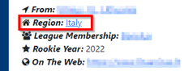
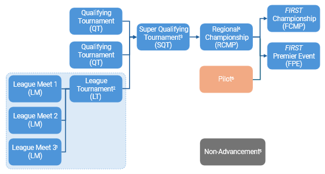
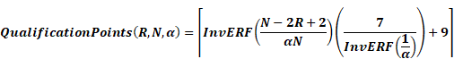
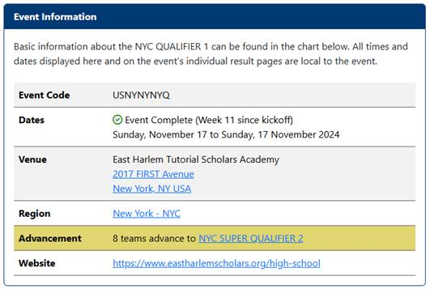

# 4 Advancement {#s-4}

팀은 자신의 **HOME REGION** 내에서 개최되는 이벤트를 통해서만 다음 단계로 진출할 자격을 얻습니다. 팀은 HOME REGION 밖에서 열리는 토너먼트에 초청되어 참가할 수 있지만, 이러한 타 지역 이벤트에서는 진출 자격을 얻을 수 없습니다.

팀은 FTC-Events 페이지에서 팀 번호를 조회하여 어느 HOME REGION에 배정되어 있는지 확인할 수 있습니다. 지역 Program Delivery Partner가 없는 지역의 팀이나 HOME REGION 안에서도 지리적으로 고립되어 있는 팀은 **customerservice@firstinspires.org**로 FIRST에 연락하여 시즌당 한 번에 한해 진출을 위해 접근성이 더 좋은 다른 지역으로 재배정을 요청할 수 있습니다.

**Figure 4-1 · FTC-Events 페이지의 Region 배정 표시**

FIRST Tech Challenge 토너먼트의 진출 구조는 Figure 4-2와 같습니다. 팀은 처음 참가하는 세 번의 입문 단계 이벤트, 즉 Qualifying Tournament(QT)와 League Tournament(LT) 중 어느 이벤트에서든 다음 단계로 진출할 수 있습니다. 팀은 한 시즌에 하나의 League에만 참가할 수 있습니다. League Tournament에 관한 자세한 내용은 Section 14 League Play Tournaments (L)를 참고하십시오. 팀은 입문 단계 이벤트에 세 번보다 많이 참가할 수 있지만, 시간순으로 처음 세 번의 이벤트에서만 진출 자격을 가집니다.

**Figure 4-2 · Tournament Advancement Structure**

- **1, 3, 5** — 선택적으로 운영되는 이벤트이며 모든 지역에서 제공되는 것은 아닙니다.
- **2** — League에 속한 모든 팀은 League Tournament에 참가합니다.
- **4** — State, Region 또는 Country Championship이라고도 부를 수 있습니다.
- **6** — 일부 신규 또는 성장 단계 지역에서만 운영됩니다.

팀은 해당 지역의 Qualifying Tournament 또는 League Tournament에서 Super Qualifying Tournament(SQT)로 진출하거나 Regional Championship(RCMP)으로 직접 진출할 수 있습니다. SQT는 더 많은 경쟁 단계가 필요한 대규모 지역에서 주로 사용하는 선택적 진출 단계입니다. 한 팀은 하나의 SQT에만 참가할 수 있습니다.

일부 특정 지역의 팀은 신규 또는 성장 단계 지역에서 가장 높은 수준의 대회인 Pilot 이벤트에서 FIRST Championship 및/또는 FIRST Premier Event로 진출할 수 있습니다.

각 지역 토너먼트에서 Regional Championship까지 몇 팀이 진출하는지는 해당 지역 Program Delivery Partner가 결정합니다. 각 Regional Championship에서 FIRST Championship 및 FIRST Premier Event로 진출하는 팀 수는 FIRST Staff가 결정합니다.

## 4.1 Advancement 포인트 계산 {#s-4-1}

각 진출 이벤트에서 팀은 해당 이벤트에서의 종합적인 성과를 통해 획득한 **Advancement Points**에 따라 순위가 결정됩니다. 아직 진출하지 않은 팀 중 순위가 높은 팀부터 해당 이벤트에 배정된 전체 진출 자리 수까지 다음 단계의 대회에 진출합니다. Advancement Points는 아래 Table 4-1에 따라 부여됩니다.

**Table 4-1 · Advancement Point Assignment**

<table><thead><tr><th>항목</th><th>획득하는 Advancement Points</th></tr></thead><tbody>
<tr><td>Qualification Phase Performance</td><td>Section 4.1.1의 공식에 따라 가장 높은 순위의 팀부터 가장 낮은 순위의 팀까지 <b>16점에서 2점 사이가 정규분포 형태로 부여</b>됩니다. 최소 2점, 최대 16점입니다.</td></tr>
<tr><td>ALLIANCE Lead</td><td><b>21 − ALLIANCE Lead 번호</b>. 예: ALLIANCE #3 Lead는 18점.</td></tr>
<tr><td>Draft Order Acceptance</td><td><b>21 − Draft Order Acceptance 번호</b>. 예: 세 번째 Draft Position을 수락한 팀은 18점.</td></tr>
<tr><td>Playoff Advancement</td><td>1위(Winners) <b>40점</b> 2위(Finalists) <b>20점</b> 3위 <b>10점</b> 4위 <b>5점</b> Section 13.8 Dual Division Events의 변경 사항도 참고하십시오.</td></tr>
<tr><td>Team Judged Awards</td><td>Inspire Award 1위 <b>60점</b> 2위 <b>30점</b> 3위 <b>15점</b> 그 밖의 1위 Award <b>12점</b> 2위 <b>6점</b> 3위 <b>3점</b> 포인트 대상 Award 목록은 A211 참조.</td></tr>
</tbody></table>

팀들의 총 포인트가 동점인 경우에는 Table 4-2의 추가 정렬 기준을 순서대로 적용하여 더 높은 순위의 팀을 결정합니다.

**Table 4-2 · 타이브레이커를 포함한 Advancement 정렬 기준**

<table><thead><tr><th>순서</th><th>정렬 기준</th></tr></thead><tbody>
<tr><td>1st</td><td>총 Advancement Points(Table 4-1에 따라 계산)</td></tr><tr><td>2nd</td><td>Judged Team Award Points</td></tr>
<tr><td>3rd</td><td>Playoff Advancement Points</td></tr><tr><td>4th</td><td>ALLIANCE Selection Results Points(ALLIANCE Lead 또는 Draft Order Acceptance)</td></tr>
<tr><td>5th</td><td>Qualification Phase Performance Points</td></tr><tr><td>6th</td><td>Qualification MATCH 평균 점수(FOUL 제외)</td></tr>
<tr><td>7th</td><td>Qualification AUTO 평균 점수</td></tr><tr><td>8th</td><td>개별 Qualification MATCH 최고 점수(FOUL 제외)</td></tr>
<tr><td>9th</td><td>개별 Qualification MATCH 두 번째 최고 점수(FOUL 제외)</td></tr><tr><td>10th</td><td>Event Management System에 의한 무작위 선정</td></tr>
</tbody></table>

### 4.1.1 Qualification Phase Performance {#s-4-1-1}

Qualification Phase Performance 포인트는 아래 공식을 사용하여 계산합니다. 이 공식은 다음 변수를 사용하는 **역오차함수(inverse error function)**입니다.

- **R** — Qualification MATCH가 끝난 시점의 해당 이벤트에서 팀의 Qualification 순위(Event Management Software에 표시되며 Section 13.6.3 Qualification Ranking에서 정의됨)
- **N** — 해당 이벤트의 Qualification 라운드에 참가하는 FIRST Tech Challenge 팀 수
- **Alpha (α)** — 이벤트 간 포인트 분포를 표준화하기 위해 사용하는 고정값 **1.07**

이 공식은 이벤트에서의 순위를 바탕으로 Qualification Phase Performance 포인트가 대략적인 정규분포를 이루도록 합니다. 대부분의 팀은 중간 수준의 포인트를 받고, 이용 가능한 가장 높은 점수나 가장 낮은 점수를 받는 팀은 상대적으로 적습니다.

Table 4-3은 28개 팀이 참가한 이벤트에서 서로 다른 순위의 팀이 받는 Qualification Phase Performance 포인트의 예를 보여줍니다. 시스템은 팀 순위와 이벤트 참가 팀 수에 따라 각 팀에 적절한 포인트를 자동으로 생성합니다.

**Table 4-3 · Qualification Round 포인트 배정 예시**

<table><tbody><tr><td>Rank</td><td>1</td><td>2</td><td>3</td><td>4</td><td>…</td><td>12</td><td>13</td><td>14</td><td>…</td><td>25</td><td>26</td><td>27</td><td>28</td></tr><tr><td>Points</td><td>16</td><td>15</td><td>14</td><td>14</td><td>…</td><td>10</td><td>10</td><td>10</td><td>…</td><td>6</td><td>5</td><td>5</td><td>4</td></tr></tbody></table>

### 4.1.2 ALLIANCE Selection Results {#s-4-1-2}

이 항목은 개별 팀의 Qualification 라운드 시드 성과와 다른 팀들로부터의 평가를 함께 측정합니다.

ALLIANCE Lead는 Qualification 단계의 시드 순위에 따라 인정됩니다. 이 순위는 일반적으로 여러 팀 성과 요소를 포함하는 게임 규칙의 결과입니다. ALLIANCE Partner는 다른 팀들로부터의 평가에 따라 보상을 받습니다. ALLIANCE에 합류하도록 초청받았다는 것은 다른 팀들이 그 팀에게 바람직한 특성이 있다고 판단했다는 의미입니다.

또한 ALLIANCE Lead는 같은 순번으로 Draft된 팀과 동일한 포인트를 받습니다. 예를 들어 3번째 ALLIANCE Lead의 선택을 수락한 팀은 3번째 ALLIANCE Lead와 같은 포인트를 받습니다. 수치 분석은 ALLIANCE Lead의 ROBOT 성능이 같은 순번으로 Draft된 팀과 대체로 비슷한 수준이라는 생각을 뒷받침합니다.

### 4.1.3 Playoff Performance {#s-4-1-3}

이 항목은 ALLIANCE의 구성원으로서 팀이 보인 성과를 측정합니다.

팀은 Playoff에서 얼마나 높은 단계까지 진출했는지에 따라 포인트를 획득합니다. Table 4-1에 설명된 대로 ALLIANCE에 속한 모든 팀에게 포인트가 부여됩니다.

Playoff를 위해 구성되는 ALLIANCE 수와 Playoff MATCH Bracket 예시에 관한 자세한 내용은 Section 13.7.2 Playoff MATCH Bracket을 참고하십시오.

### 4.1.4 Team Judged Awards {#s-4-1-4}

이 항목은 이벤트에서 심사되는 Team Award와 관련된 팀의 성과를 측정합니다.

> 이 시스템에서 Team Award에 부여되는 포인트는 수상 팀에게 그 Award가 갖는 전체 가치를 나타내거나, FIRST에게 그 Award가 갖는 전체 가치를 표현하기 위한 것이 아닙니다.

이 시스템에서 Award에 포인트를 부여하는 이유는 FIRST가 계속해서 **“More than Robots®”**임을 팀들이 인식하도록 돕고, 순위 시스템에서 Award를 수상한 팀이 수상하지 않은 팀보다 더 높은 위치에 오를 수 있도록 하기 위한 것입니다.

팀은 해당 이벤트에서 심사되는 Team Award에 대해서만 포인트를 받으며, A215에 따라 한 팀이 수상할 수 있는 Award의 수도 제한됩니다. Award가 심사되지 않거나, 팀을 대상으로 하는 Award가 아니거나(예: FIRST Leadership Award), 해당 이벤트에서 심사하지 않는 Award인 경우(예: Safety Animation Award) 포인트를 얻지 못합니다. 이벤트에서 수여되지 않은 Award의 포인트는 어느 팀에도 배정되지 않습니다. 포인트 획득 대상 Award 목록은 A211을 참고하십시오.

## 4.2 지역별 Advancement 배분 {#s-4-2}

지역 내 진출 팀 수는 Program Delivery Partner가 결정하며, 최소 진출 팀 수는 이벤트 전에 가능한 한 빨리 참가 팀들이 확인할 수 있도록 공개해야 합니다. 늦어도 ALLIANCE Selection이 시작되기 전까지는 공개되어야 합니다. Advancement 정보는 Figure 4-3과 같이 FTC-Events 페이지에 게시될 수 있습니다.

**Figure 4-3 · ftc-events.firstinspires.org 페이지에 표시되는 Event Advancement Information**

FIRST Championship 및 FIRST Premier Event로의 진출은 다음을 포함한 여러 요소를 바탕으로 FIRST Headquarters가 결정합니다.

- 전 세계 및 지역별 대표성
- Program Delivery Partner가 있는 신규 성장 지역
- 마감일 이전에 해당 지역에 등록된 팀 수(**BIOBUZZ 시즌은 2026년 11월 17일**)

  
  - 최소 등록 요건을 충족하는 지역
  - 해당 지역의 전체 팀 수

지역별로 배정되는 진출 자리 수에 관한 정보는 12월 초부터 FTC-Events 페이지에 게시됩니다. 이벤트 마감일까지 확보되지 않은 지역 배정 진출 자리는 FIRST HQ 또는 Premier Event Host에 반환되어 재배정됩니다. 재배정에는 새로운 지역에 자리를 배정하거나 대기 명단의 팀을 초청하는 경우가 포함될 수 있습니다.

