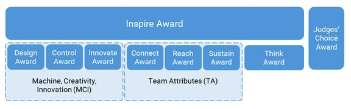
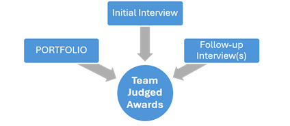
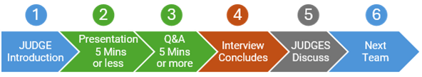
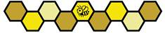

# 6 Awards (A)

이 Section에서는 FIRST Tech Challenge의 심사 구성 요소와 ROBOT 경기 관련 Award를 개괄적으로 설명합니다.

FIRST Tech Challenge는 FIELD 안팎에서 펼쳐지는 경쟁의 즐거움을 함께 기념합니다. 다음 Award를 통해 우리를 “More than Robots®”로 만드는 FIRST Core Values를 기념합니다. 이벤트 유형(예: League Tournament, Regional Championship, FIRST Championship)이나 규모에 따라 제공되는 Award 구성이 달라질 수 있으며, 모든 FIRST Tech Challenge 이벤트에서 모든 Award가 수여되는 것은 아닙니다. League Meet에서는 Award가 수여되지 않습니다. 자세한 내용은 Section 14 League Play Tournaments (L) 및 아래 각 절을 참고하십시오.

Team Judged Awards는 충분한 교육과 인증을 받고 이벤트를 준비한 지역사회 자원봉사자가 결정합니다. 핵심 심사 자원봉사 역할은 두 가지입니다.

* **JUDGES** — 팀을 만나 각 팀의 고유한 여정과 성취를 이해하고 축하하며 Award 요건에 따라 평가합니다. JUDGES는 Pit 및 경우에 따라 별도의 심사 공간에서 STUDENTS와 상호작용합니다. JUDGE Advisor의 안내 아래 JUDGES 전체가 Award 수상 팀을 결정합니다.
* **JUDGE Advisor (JA)** — 이벤트 전체에서 JUDGES를 교육·지휘·감독합니다. 심사 과정과 절차가 FIRST Tech Challenge 심사 지침에 맞게 진행되도록 관리하지만 Award 수상 팀을 직접 선택하지는 않습니다.

FIRST Tech Challenge 심사는 두 방식 중 하나로 진행됩니다. 대부분의 이벤트는 일반적인 현장 경기와 함께 대면(“traditional”) 심사를 진행합니다. 두 번째는 Hybrid 방식으로, 경기는 현장에서 진행하지만 모든 팀의 심사 일부 또는 전부를 경기 전에 원격으로 진행합니다. 이 매뉴얼은 주로 전통적인 대면 심사 과정을 설명합니다. 원격 심사도 동일한 전반적 심사 기준과 요건을 따르지만 일부 또는 모든 Interview가 온라인으로 진행되고 현장 미팅이 없을 수 있습니다.

팀은 전체 심사 과정에 대한 이해를 높이기 위해 Judge 및 Judge Advisor Manuals(추후 공개)를 읽을 수 있습니다. 또한 Outreach Terms and Definitions Document를 검토하여 FIRST의 성장을 위해 수행한 활동을 JUDGES와 커뮤니티에 명확하게 설명할 것을 권장합니다.

## 6.1 Team Judged Awards 개요 및 일정 

FIRST Tech Challenge Team Judged Awards는 하나 이상의 Award를 포함하는 세 범주, 즉 **Machine, Creativity, and Innovation (MCI)**, **Team Attributes (TA)**, **Documentation**으로 나뉩니다. 이 밖에 다른 범주에서 인정받지 못했지만 돋보이는 팀에게 Judges’ Choice Award가 수여됩니다. 가장 권위 있는 종합 Award는 Inspire Award입니다.

지역 Program Delivery Partner는 지역 Sponsor나 Initiative를 기념하기 위한 추가 Award를 수여할 수 있지만, Section 4 Advancement의 진출 계산에서는 이러한 Award를 Team Judged Award로 간주하지 않습니다.

**Figure 6-1 · Award hierarchy**

* **Inspire Award** — MCI, TA, Documentation 성취에서 뛰어난 팀을 인정합니다. 다른 팀에게 종합적인 영감을 주는 팀입니다.
* **MCI Awards** — ROBOT의 Brainstorming, Design, Construction, Operation, Control에서 팀의 기술적 성취를 인정합니다.
* **TA Awards** — 역량을 확장하고 프로그램과 팀의 지속을 위한 계획을 만들며 Outreach를 통해 FIRST의 메시지를 널리 알린 팀을 인정합니다.
* **Think Award** — PORTFOLIO를 사용해 팀의 과정과 ROBOT을 훌륭하게 기록한 팀을 인정합니다.
* **Judges’ Choice Award** — 독특한 노력, 성과 또는 팀의 역동성이 인정받을 가치가 있지만 다른 Award 범주에는 맞지 않는 팀을 인정합니다.

JUDGES는 여러 경로를 통해 팀의 정보를 수집합니다. 모든 팀은 Team Judged Award 기준을 직접 뒷받침하거나 JUDGES가 고려하기를 원하는 정보를 기록한 PORTFOLIO를 제출할 기회를 가집니다.


JUDGES가 선정한 모든 Award 수상 팀은 해당 Award 기준의 긍정적인 사례로 인정되는 것이며 반드시 “최고”의 팀이라는 의미는 아닙니다. JUDGES는 Section 6.3에 공개된 Award 기준만 고려합니다.


팀은 ROBOT Inspection 상태와 관계없이 심사에 참여할 수 있으며, ROBOT 없이 이벤트에 참가하더라도 Award 수상 자격을 가질 수 있습니다.

### 6.1.1 Award 심사에 고려되는 정보 출처 

JUDGES는 각 Award 심사에서 Initial Interview, Follow-up Interview, 그리고 해당되는 경우 PORTFOLIO를 정보 출처로 사용합니다.

**Figure 6-2 · Team Judged Awards의 정보 출처**

JUDGES가 팀을 평가할 때 사용할 수 있는 정보 출처 외에도 명시적으로 사용할 수 없는 정보가 있습니다. JUDGES는 현재 이벤트와 현재 시즌의 정보만 고려하도록 엄격히 지시받습니다. 심사 목적상 현재 시즌은 **2026년 1월 1일**에 시작합니다. JUDGES는 현재 이벤트에서 직접 보거나 들은 범위를 벗어난 정보를 고려할 수 없습니다.


A201.E에 따라 2026년 1월 1일 이후의 진행 과정, 도전 과제, 성취는 Team PORTFOLIO에 기록할 수 있으며 현재 시즌의 일부로 고려됩니다.


심사에서 고려할 수 없는 정보의 예는 다음을 포함하되 이에 한정되지 않습니다.

* 팀의 과거 성적(좋거나 나쁜 경우 모두)
* 팀에 대한 개인적 지식
* 웹사이트 및/또는 Social Media와 같은 외부 정보
* Award 기준에 명시된 경우를 제외한 ROBOT의 경기 성능(예: MATCH에서 획득한 점수)
* 경기 중 ROBOT Penalty
* 토너먼트에서의 팀 순위

Award는 FIRST가 STUDENTS에게 영감을 주고 함께 더 나은 미래를 만드는 가능성을 보여주는 방법입니다. 심사 과정은 독립적이고 배려하는 성인인 JUDGES가 STUDENTS의 성취를 인정하고 계속 학습하도록 격려하는 긍정적인 상호작용이 되어야 합니다.

### 6.1.2 Initial Interview 

모든 팀은 소수의 JUDGES 패널에게 준비된 구두 발표를 하고 이어서 자유로운 Q\&A를 진행할 수 있는 Initial Interview를 준비할 것을 권장합니다.

Initial Interview는 다음 세 형식 중 하나로 진행될 수 있습니다.

* **Scheduled in-person** — 정해진 시간과 별도 심사 공간에서 JUDGES와 계획된 미팅
* **Unscheduled in-person** — 특정 시간이 정해지지 않으며 JUDGES가 이벤트 Pit 또는 별도 심사 공간에서 팀을 만남
* **Remote** — Video Conferencing Platform을 이용한 온라인 미팅

세 형식 모두 동일한 규칙을 적용하며 팀은 JUDGES와 정보를 공유할 수 있습니다.

**Figure 6-3 · Initial Interview Timeline**

1. JUDGES가 팀에게 자신을 소개하고 준비된 Presentation으로 시작할 것인지 묻습니다.
2. A205에 따라 팀은 약 5분까지 방해받지 않고 발표할 수 있습니다.
3. 남은 시간 동안 JUDGES가 개방형 질문을 하고 팀과 상호작용합니다.
4. JUDGES가 Interview를 종료합니다.
5. JUDGES가 비공개로 Interview 내용을 논의하고 Feedback Form(추후 공개)을 작성합니다.
6. 다음 Interview 팀을 확인하고 과정을 반복합니다.

Event Director는 JUDGE Advisor 및 지역 Planning Committee와 협력하여 Initial Interview 형식을 결정하고 이벤트 전에 팀에 안내할 책임이 있습니다. 선택된 방식과 관계없이 해당 이벤트의 모든 팀은 같은 형식으로 Interview를 진행해야 합니다.


Pit에서 Initial Interview를 진행하는 이벤트의 팀은 Pit Area가 활동적이고 소음이 많은 환경이라는 점을 고려해야 합니다. JUDGES는 팀이 방해받지 않고 정보를 발표하고 질문에 답할 기회를 제공하지만 Pit Announcement나 일반적인 배경 소음 등 외부 방해가 발생할 수 있습니다.\
\
Pit에서 Interview를 진행하는 경우 JUDGES는 MATCH Queuer 및 Technical Volunteer와 협력하여 팀이 MATCH에 참가하고 ROBOT 작업도 할 수 있도록 합니다.


팀은 Interview 전에 Judge Interview Question Bank(추후 공개)를 검토하여 JUDGES가 물을 수 있는 질문 유형을 이해할 것을 권장합니다. 각 이벤트에서 JUDGE Advisor는 Question Bank에서 두 질문을 선정하여 모든 팀의 Initial Interview Q\&A 시작 시 동일하게 질문합니다. 하나는 MCI Award 범주, 하나는 TA Award 범주에 초점을 둡니다. 첫 두 질문 이후 JUDGES는 Award 기준에 대한 팀의 성과를 평가하기 위해 추가 질문을 할 수 있습니다.


추가 질문은 Question Bank에서 나올 수 있지만, 팀은 해당 문서에 없는 질문에도 답할 준비를 해야 합니다.


### 6.1.3 Pit Interview(s) 

모든 심사 패널이 Initial Interview를 마치면 JUDGES는 메모를 비교하고, 대회 중 Pit Area에서 팀을 다시 만나 비공식 Pit Interview를 진행할 수 있습니다. 이 과정에서 팀은 Initial Interview에서 제시한 자료를 더 자세히 설명하고 ROBOT Prototype, Design Artifact, Outreach Event의 사진이나 편지 등 추가 내용을 공유할 수 있습니다. 별도의 Presentation을 준비할 필요는 없지만 JUDGES의 질문에 답할 준비는 해야 합니다.


JUDGES는 Pit Interview 중 추가 정보를 읽을 수 있지만 JUDGE Deliberation에서 참고하기 위해 추가 자료를 가져가지는 않습니다.


### 6.1.4 지속적인 Outreach와 수치로 Impact 입증하기 

일반적으로 JUDGES는 일회성 또는 가끔 진행되는 Outreach보다 지속적으로 이어지는 Outreach를 더 높은 품질로 평가합니다. JUDGES는 활동이 실제로 접촉한 사람들에게 어떤 Impact를 주었는지 이해하려고 합니다.


팀은 FIRST Team 시작, Event 운영, 특정 인원에게 Reach하기 등 용어의 요건을 이해하기 위해 Outreach Terms and Definitions Document를 검토할 것을 권장합니다. 이러한 용어가 PORTFOLIO 또는 Interview에서 언급되면 JUDGES가 구체적인 질문을 할 수 있습니다.


## 6.2 Team Judged Award Rules 


#### A201 \*Team PORTFOLIO에는 제한이 있습니다. 

팀은 심사 과정의 일부로 사용할 Team PORTFOLIO를 제출할 수 있습니다. 이 문서 외의 인쇄물이나 Digital Content는 JUDGES가 Deliberation에서 고려하기 위해 수집하지 않습니다. Team PORTFOLIO는 다음 요건을 충족해야 합니다.

A. Team Number를 포함한 Cover Page 1장. 선택적으로 Team Name, PORTFOLIO 목차, Team Organization, Sponsor, Logo, Motto, ROBOT 및/또는 Team 사진을 포함할 수 있습니다.

B. Content는 최대 15페이지

C. US Letter(8.5 × 11 in.) 또는 A4(210 × 297 mm) 크기만 사용

D. Digital 제출 시 전체 파일 크기는 15MB 미만

E. 2026년 1월 1일 이후에 발생한 Progress, Challenge, Accomplishment만 포함

> Cover Page의 내용은 어떤 Award 기준 평가에도 사용되지 않습니다. 허용된 15페이지를 초과한 내용은 JUDGES가 검토하지 않습니다.\
> \
> PORTFOLIO의 Personally Identifying Information(PII)은 엄격히 최소화해야 합니다. 학생 Privacy를 위해 이름과 성의 첫 글자만 사용하십시오. 학생 사진은 허용되지만 Full Name은 공개해서는 안 됩니다.\
> \
> JUDGES는 Cover Page를 통해 PORTFOLIO가 어느 팀의 것인지 확인합니다. Cover Page를 빠뜨려 팀을 식별할 수 없으면 심사에서 제외될 수 있습니다.\
> \
> 가독성을 고려해 설계하십시오. 10pt 미만 Font와 이미지 위의 낮은 Contrast Text는 피하십시오. JUDGES가 읽을 수 없는 내용은 평가할 수 없습니다.\
> \
> JUDGES는 PORTFOLIO의 Link, Website, Video를 클릭하지 않습니다. Interview에서 받은 추가 인쇄물을 심사실로 가져갈 수도 없습니다. 보여주고 싶은 내용은 PORTFOLIO 자체에 직접 넣으십시오.\
> \
> 지적재산권을 존중하고 Footnote 또는 Endnote로 출처를 밝힌다면 AI와 Research Aid를 PORTFOLIO 작성에 사용할 수 있습니다. 예: “Portfolio created by Team XXXXX and ChatGPT”.\
> \
> 성장을 보여주기 위해 이전 시즌을 언급할 수 있지만 강조점은 현재 시즌에 있어야 합니다.



#### A202 \*PORTFOLIO는 요청된 방식과 기한에 맞춰 제출해야 합니다. 

심사에서 PORTFOLIO를 고려받으려면 Event Director의 지시와 명시된 기한에 따라 제출해야 합니다. 별도 지시가 없다면 Initial Interview에서 인쇄본 1부를 제출합니다.

> 제출 시기와 방법은 Event Director가 이벤트 전에 안내해야 합니다. 사정상 지시를 따르기 어려운 경우 Event Director는 JUDGE Advisor와 협력하여 심사 과정에 과도한 부담이 되지 않는 범위에서 모든 Team PORTFOLIO를 받을 수 있도록 합리적인 편의를 제공해야 합니다.\
> \
> JUDGES와의 Pit Interview를 위해 Digital 또는 Physical 추가 사본을 Pit에 준비할 것을 권장합니다.



#### A203 \*팀은 Initial Interview에 참여해야 합니다. 

Judged Award 심사 대상이 되려면 Initial Interview에 참여해야 합니다.

> Scheduled 방식이라면 Event Director 또는 지역 Program Delivery Partner가 이벤트 전에 배정 시간을 알려야 합니다. 일정 충돌 또는 예기치 못한 사정으로 Interview 시간을 놓친 경우 가능하다면 이벤트 현장에서 합리적인 대체 Interview를 마련하도록 협의해야 합니다.



#### A204 \*Initial Interview에 필요한 자원을 준비하십시오. 

팀은 다음을 준비해야 합니다.

A. 2명 이상으로 구성된 팀은 최소 2명의 STUDENT 대표

B. Interview 중 참고할 Team PORTFOLIO 사본

C. Team ROBOT을 포함할 수 있는 “Show and Tell” 시연 물품(권장하지만 선택)

D. A208에 따른 Silent Observer 1명(선택)

E. A209에 따른 Accommodation Support Person 1명(필요 시 선택)

> 가능한 많은 STUDENTS가 Initial Interview 과정에 참여할 것을 권장합니다. ROBOT이 없어도 심사에 참여하고 Judged Award 자격을 얻을 수 있습니다. Interview 중 ROBOT 전원을 켜고 기능을 시연할 수 있지만 심각한 지연을 일으켜서는 안 됩니다.



#### A205 \*모든 팀에게 동일한 Initial Interview 시간이 주어집니다. 

모든 팀의 Initial Interview는 동일한 길이로 배정되며 최소 10분입니다.



#### A206 \*Initial Interview Timer는 팀이 시작할 때 시작됩니다. 

JUDGES가 자신을 소개한 뒤 팀이 Presentation을 시작하거나 Interview의 Q\&A가 시작될 때 Timer가 시작됩니다. 시작까지 지나치게 오래 걸리는 팀에는 JUDGES가 즉시 시작하도록 경고하며, 이후 팀의 준비 여부와 관계없이 Timer가 시작됩니다.



#### A207 \*준비된 Initial Presentation 시간은 방해받지 않아야 합니다. 

팀이 원한다면 Initial Interview의 첫 5분은 준비된 구두 Presentation을 방해받지 않고 진행하도록 확보됩니다. 팀이 일찍 종료할 수 있으며 남은 시간은 JUDGES가 이끄는 STUDENTS와의 Q\&A 대화로 진행합니다.



#### A208 \*성인 Silent Observer 1명이 참석할 수 있습니다. 

성인 1명은 Judging Session에 참석하여 JUDGES와 STUDENT Team Member의 상호작용을 지켜볼 수 있습니다. Initial Interview 밖의 상호작용에는 Adult Coach(es)가 참석할 수 있습니다. Adult Observer와 Coach(es)는 JUDGES와 STUDENTS의 상호작용 중 개입하거나 적극적으로 Coaching할 수 없습니다.

> Silent Observer의 목적은 낯선 환경과 새로운 사람들 앞에서 발표하는 STUDENTS에게 조용한 심리적 안정감을 제공하는 것입니다.



#### A209 \*필요한 팀에는 통역 및/또는 수어 통역 편의를 제공합니다. 

팀의 모국어가 JUDGES의 언어와 다르면 Translator를 제공할 수 있으며 Sign Language 또는 기타 Adaptive Technology도 포함됩니다. Translator의 도움으로 Interview를 진행하려는 팀은 필요할 경우 2\~5분의 추가 Interview 시간을 요청하기 위해 사전에 Event Director와 협의해야 합니다. Translator는 성인일 수 있으며 A208의 Silent Observer와 별도로 추가될 수 있습니다.

> 대부분의 경우 Translator는 팀이 준비해야 합니다. 다른 편의가 필요하면 지역 Leadership에 문의하십시오.



#### A210 \*Initial Interview 중 사진·영상·음성 녹음은 금지됩니다. 

E116의 제한에 더해 Initial Interview 중 Video, Audio 또는 Photo Recording은 허용되지 않습니다.



#### A211 \*Award 수는 Event 규모에 따라 달라집니다. 

수여되는 Award의 총수는 Event에 Check-in한 Team 수를 기준으로 합니다. 모든 Competition에서 모든 Award가 수여되는 것은 아닙니다. Event 규모에 따라 Table 6-1에 지정된 Award만 Advancement Point 대상이 됩니다.

**Table 6-1 · 전체 Event 참가 Team 수에 따라 제공되는 Team Judged Awards**

<table><thead><tr><th>Award</th><th></th><th>Total Event Participating Teams</th><th></th><th></th><th></th></tr></thead><tbody><tr><td colspan="2"></td><td>4–10 Teams</td><td>11–20 Teams</td><td>21–40 Teams</td><td>41–64 Teams</td></tr><tr><td colspan="2">Inspire Award</td><td>1위</td><td>1위 2위</td><td>1위 2위 3위</td><td>1위 2위 3위</td></tr><tr><td colspan="2">Think Award</td><td>1위</td><td>1위</td><td>1위 2위</td><td>1위 2위 (3위*)</td></tr><tr><td rowspan="3">TA Awards</td><td>Connect Award</td><td>1위 (Connect, Reach, Sustain 중 하나만 수여)</td><td>1위</td><td>1위 (2위*)</td><td>1위 2위 (3위*)</td></tr><tr><td>Reach Award</td><td></td><td>1위</td><td>1위 (2위*)</td><td>1위 2위 (3위*)</td></tr><tr><td>Sustain Award</td><td></td><td>1위</td><td>1위 (2위*)</td><td>1위 2위 (3위*)</td></tr><tr><td rowspan="3">MCI Awards</td><td>Design Award</td><td>1위 (Innovate, Control, Design 중 하나만 수여)</td><td>1위</td><td>1위 (2위*)</td><td>1위 2위 (3위*)</td></tr><tr><td>Innovate Award</td><td></td><td>1위</td><td>1위 (2위*)</td><td>1위 2위 (3위*)</td></tr><tr><td>Control Award</td><td></td><td>1위</td><td>1위 (2위*)</td><td>1위 2위 (3위*)</td></tr><tr><td colspan="2">Judges’ Choice Award</td><td>Optional*</td><td>Optional*</td><td>Optional*</td><td>Optional*</td></tr></tbody></table>

> \* Discretionary Awards
>
> 이 규칙의 Dual Division Event 수정 버전은 Section 13.8 Dual Division Events를 참고하십시오.



#### A212 \*모든 팀에 심사 Feedback이 제공됩니다. 

모든 팀은 Initial Interview에 대한 Feedback을 받습니다. JUDGES는 Initial Interview 직후 팀에 대한 첫 인상을 바탕으로 Form을 작성합니다. 이 Feedback Form은 Deliberation에 사용되지 않으며 이후 JUDGES와 팀의 상호작용에서 얻은 업데이트된 Feedback을 포함하지 않습니다.

> 대면 심사의 경우 이벤트 종료 무렵 PORTFOLIO와 함께 반환되거나, 이벤트 이후 Lead Coach 1이 FTC-Scoring에서 Digital Version에 접근할 수 있습니다.



#### A213 \*팀은 자신의 지역에서만 Inspire Award를 받을 수 있습니다. 

팀은 HOME REGION 내 Tournament에서 경쟁할 때만 Inspire Award 1·2·3위 심사 대상이 됩니다.

> FIRST Championship과 FIRST Premier Event는 예외이며 모든 팀이 Inspire Award 심사 대상이 될 수 있습니다.



#### A214 \*여러 Qualifying 또는 League Tournament에서 Inspire Award 1위를 반복 수상할 수 없습니다. 

팀은 한 시즌 동안 Qualifying 또는 League Tournament 전체를 통틀어 Inspire Award 1위를 한 번만 받을 수 있습니다.

> Inspire 1위를 이미 수상한 팀도 이후 Qualifying 또는 League Tournament에서 Inspire 2위 또는 3위를 받을 수 있습니다. Qualifying 또는 League Tournament에서 Inspire 1위를 수상한 팀은 Regional Super Qualifying Tournament(해당되는 경우)와 Regional Championship에서 다시 Inspire 1위를 받을 수 있습니다.



#### A215 \*팀은 하나의 Judged Award만 받을 수 있습니다. 

한 이벤트에서 팀은 하나의 Team Judged Award에 대해서만 Winner 또는 Runner-up이 될 수 있습니다.

> Section 6.4 Tournament ALLIANCE Awards와 Section 6.5 Individual Awards의 추가 Award 수상을 막는 규칙은 아닙니다.


## 6.3 Team Judged Award Descriptions 

### 6.3.1 Inspire Award 

Inspire Award는 모든 FIRST 프로그램에서 강력한 Role Model이 되는 Team을 인정합니다. 이 Team은 여러 Judged Award의 강력한 후보이며 긍정적이고 존중하는 태도로 경쟁합니다.

Inspire Award Winner는 Playing Field 안팎에서 다른 Team에게 영감을 줍니다. 이들의 행동은 FIRST Core Values를 반영하고 Gracious Professionalism을 실천합니다. 다른 Team, Sponsor, Community, 그리고 JUDGES와 자신의 경험, 열정, 지식을 정기적으로 공유합니다. 하나의 Team으로 협력하며 ROBOT을 설계하고 제작하는 과제를 성공적으로 수행했음을 보여줍니다.

**Table 6-2 · Inspire Award Criteria**

| Inspire Award Criteria |   |                                                                                                                                                                                                            |
| ---------------------- | - | ---------------------------------------------------------------------------------------------------------------------------------------------------------------------------------------------------------- |
| Required               | 1 | Team은 PORTFOLIO를 제출해야 합니다.                                                                                                                                                                                 |
| Required               | 2 | Inspire Award는 모든 Judged Award의 가장 강한 특성을 종합적으로 인정합니다. Team은 다음 Judged Award Category 각각에서 최소 하나 이상의 Award에 강력한 후보여야 합니다.A.Machine, Creativity, and Innovation AwardsB.Team Attributes AwardsC.Think Award |
| Required               | 3 | Team은 긍정적이고 포용적이어야 하며, 각 Team Member가 Team의 성공에 기여해야 합니다.                                                                                                                                                  |
| Required               | 4 | Team은 자신의 경험과 지식을 JUDGES와 공유할 수 있어야 합니다.                                                                                                                                                                   |

### 6.3.2 Think Award 

Think Award는 뛰어난 PORTFOLIO를 작성한 Team을 인정합니다. PORTFOLIO는 이번 Season 동안 Team의 Engineering Journey와 성장을 명확하고 체계적으로 기록한 문서입니다. JUDGES는 이 문서를 검토하여 가장 적합한 수상 Team을 선정합니다. Team은 자신의 선택을 JUDGES가 이해할 수 있도록 Build, Design 또는 Programming Process에 관한 추가 세부사항을 PORTFOLIO에 포함할 수도 있습니다.

**Table 6-3 · Think Award Criteria**

| Think Award Criteria |   |                                                                                                                                                                                                                                                                                                       |
| -------------------- | - | ----------------------------------------------------------------------------------------------------------------------------------------------------------------------------------------------------------------------------------------------------------------------------------------------------- |
| Required             | 1 | Team은 PORTFOLIO를 제출해야 합니다. PORTFOLIO에는 다음 Engineering Topic 중 최소 하나가 포함되어야 합니다.A.Engineering Process를 사용했다는 EvidenceB.ROBOT Design과 관련하여 배우고 적용한 LessonC.Choice 비교: 여러 아이디어를 어떻게 검토했는지 보여주고, 왜 한 아이디어를 다른 아이디어보다 선택했는지 설명D.Math Choice: ROBOT 또는 Programming Design에 관한 의사결정을 내릴 때 Math를 어떻게 사용했는지 설명 |
| Encouraged           | 2 | PORTFOLIO의 정보는 읽기 쉽고 찾기 쉬워야 합니다.                                                                                                                                                                                                                                                                      |

### 6.3.3 Connect Award 

Connect Award는 Science, Technology, Engineering, Mathematics(STEM) Community 구성원과 의미 있는 Partnership을 구축한 Team을 인정합니다. 이러한 Partnership을 통해 Team은 장기적인 성장을 지원하는 새로운 지식, 기술, Resource를 개발합니다. Team은 Goal을 달성하기 위한 구체적인 Action이 정의된 명확한 Plan을 갖고 있습니다. 이 Award에는 PORTFOLIO 제출이 필수가 아닙니다.

**Table 6-4 · Connect Award Criteria**

| Connect Award Criteria |   |                                                                                                                                                                                |
| ---------------------- | - | ------------------------------------------------------------------------------------------------------------------------------------------------------------------------------ |
| Required               | 1 | Team은 Team Member Skill을 개발하기 위한 Plan을 설명하여 Professional Development Competency를 보여야 하며, 다음 두 가지를 모두 포함해야 합니다.A.Team의 Learning GoalB.그 Goal에 도달하기 위해 Team이 이미 취했거나 앞으로 취할 Step |
| Encouraged             | 2 | Team은 STEM Professional과 의미 있는 대면 또는 Virtual Relationship을 구축하고 유지하여 Networking Competency를 보여줍니다.                                                                             |
| Encouraged             | 3 | Team은 Mentoring, Knowledge Sharing, Technical Guidance 또는 Collaborative Activity를 통해 Engineering Community 구성원과 적극적으로 협력하여 Collaboration Competency를 보여줍니다.                    |

### 6.3.4 Reach Award 

Reach Award는 FIRST에 새로운 사람을 소개하고 모집한 Team을 인정합니다. Outreach 활동을 통해 다른 사람들에게 영감을 주고 FIRST Community에 합류하여 프로그램에 적극적으로 참여하도록 동기를 부여합니다. 이 Award에는 PORTFOLIO 제출이 필수가 아닙니다.

**Table 6-5 · Reach Award Criteria**

| Reach Award Criteria |   |                                                                                                                                                                       |
| -------------------- | - | --------------------------------------------------------------------------------------------------------------------------------------------------------------------- |
| Required             | 1 | Team은 다음 사항을 모두 명확하게 설명하여 Outreach Planning Competency를 보여야 합니다.A.Team의 Outreach ObjectiveB.Outreach Activity의 StrategyC.이러한 Activity가 FIRST Community의 성장에 어떻게 기여하는지 |
| Required             | 2 | Team은 이전에 FIRST Community에 참여한 적이 없는 새로운 Team, Coach, Mentor 또는 Volunteer를 성공적으로 모집했음을 보여야 합니다.                                                                       |
| Encouraged           | 3 | Team은 FIRST Ambassador 역할을 수행하고 효과적인 Outreach와 Communication을 통해 FIRST Program에 대한 Public Awareness를 높여 강한 Communication Competency를 보여줍니다.                           |
| Encouraged           | 4 | Team과 FIRST를 Public에 효과적으로 소개하는 창의적이고 지속적으로 개선되는 Outreach Material을 개발하여 Media 및 Promotion Competency를 보여줍니다.                                                         |

### 6.3.5 Sustain Award 

Sustain Award는 향후 Season에도 Team 또는 Program이 지속되고 성장할 수 있도록 필요한 Leadership, Resource, Organizational Practice를 확립한 Team을 인정합니다. 이 Award에는 PORTFOLIO 제출이 필수가 아닙니다.

**Table 6-6 · Sustain Award Criteria**

| Sustain Award Criteria |   |                                                                                                                                                                                                                               |
| ---------------------- | - | ----------------------------------------------------------------------------------------------------------------------------------------------------------------------------------------------------------------------------- |
| Required               | 1 | 
Team은 장기적인 성공을 위한 Plan을 설명하여 Organizational Sustainability Competency를 보여야 하며, 다음 중 하나 이상을 포함해야 합니다.
<ol><li>Financial Sustainability</li><li>Season Planning</li><li>Long-term Team Sustainability Objective</li></ol> |
| Required               | 2 | Team은 Sustainability Plan과 Objective를 향한 Progress를 어떻게 측정하고, 검토하고, 추적하는지 설명하여 Project Management Competency를 보여야 합니다.                                                                                                         |
| Encouraged             | 3 | Team은 명확하게 정의된 Team Role과 미래의 Student Leader를 준비시키기 위한 의도적인 Process를 통해 Leadership Development Competency를 보여줍니다.                                                                                                             |
| Encouraged             | 4 | Team은 Organizational Constraint를 식별하고, Mitigation Strategy를 실행하며, Challenge가 발생할 때 Plan을 조정하여 Risk Management Competency를 보여줍니다.                                                                                              |

### 6.3.6 Innovate Award sponsored by RTX 

Innovate Award는 Game Challenge에 대한 창의적인 Solution을 설계한 Team을 인정합니다. JUDGES는 ROBOT의 하나 이상의 부분에 Creative하고 Original한 Design을 적용한 Team에게 이 Award를 수여합니다. JUDGES는 Design 자체, 실제로 얼마나 잘 작동하는지, 그리고 그 Design에 담긴 Creative Thinking을 살펴봅니다. 이 Award는 전체 ROBOT의 Design 또는 ROBOT의 하나의 MECHANISM Design을 인정할 수 있습니다. Design은 대부분의 MATCH에서 잘 작동해야 하지만 모든 MATCH에서 반드시 작동할 필요는 없습니다. 이 Award에는 PORTFOLIO 제출이 필수가 아닙니다.

**Table 6-7 · Innovate Award Criteria**

| Innovate Award Criteria |   |                                                                                                 |
| ----------------------- | - | ----------------------------------------------------------------------------------------------- |
| Required                | 1 | Team은 자신의 Design을 어떻게 개발했는지 설명하는 Engineering Work의 Example을 보여주어 Engineering Competency를 입증합니다. |
| Required                | 2 | ROBOT 또는 ROBOT MECHANISM의 Design은 Creative, Unique 또는 둘 다여야 합니다.                                |
| Required                | 3 | Creative Design은 Stable하고 Reliable해야 합니다. 대부분의 경우 Team이 Game Goal을 달성하는 데 도움이 되어야 합니다.          |
| Encouraged              | 4 | Design에는 종종 Risk가 따릅니다. Team은 이러한 Risk를 어떻게 줄였는지 설명하는 것이 좋습니다.                                  |

### 6.3.7 Control Award 

Control Award는 Sensor와 Software를 사용하여 Game Challenge를 창의적인 방식으로 해결한 Team을 인정합니다. 예를 들어 Autonomous Operation, 더 지능적인 Mechanical System, 또는 결과를 향상시키는 Sensor 등이 있습니다. Solution은 대부분의 MATCH에서 잘 작동해야 하지만 모든 MATCH에서 반드시 작동할 필요는 없습니다. Team은 AUTO Period, TELEOP Period 또는 둘 모두에서 Solution을 사용할 수 있습니다. Team의 PORTFOLIO에는 Software, Sensor, Mechanical Control System의 Summary가 포함되어야 합니다.

PORTFOLIO에는 전체 Code 자체를 포함할 필요는 없습니다.

**Table 6-8 · Control Award Criteria**

| Control Award Criteria |   |                                                                                                                                                                                   |
| ---------------------- | - | --------------------------------------------------------------------------------------------------------------------------------------------------------------------------------- |
| Required               | 1 | Team은 PORTFOLIO를 제출해야 합니다. PORTFOLIO에는 다음 사항을 모두 포함해야 합니다.A.ROBOT의 Hardware 또는 Software Control COMPONENTB.각 COMPONENT 또는 System이 해결하는 ChallengeC.각 COMPONENT 또는 System의 Function |
| Required               | 2 | Team은 External Feedback을 사용하여 ROBOT을 Control하고 Performance를 향상시키는 Hardware 또는 Software Solution을 하나 이상 사용해야 합니다.                                                                  |
| Encouraged             | 3 | Control Solution은 대부분의 MATCH에서 일관되게 작동하는 것이 좋습니다.                                                                                                                                 |
| Encouraged             | 4 | Team은 Solution이 얼마나 Reliable한지 설명할 수 있습니다. 실제 작동을 시연하거나, 어떻게 개선할 수 있는지 설명하여 이를 보여줄 수 있습니다.                                                                                        |
| Encouraged             | 5 | Team은 Sensor, Hardware, Algorithm 또는 이들의 조합을 포함한 Control Solution을 개발하기 위해 Engineering Process를 사용하면서 배운 점을 설명하는 것이 좋습니다.                                                         |

### 6.3.8 Design Award 

Design Award는 Industrial Design의 원리를 이해하는 Team을 인정합니다. 이는 이번 Season Game의 요구사항을 충족하면서 Form, Function, Appearance의 균형을 맞추는 것을 의미합니다. Team의 Design Process는 효율적이고 Game Challenge를 효과적으로 해결하는 ROBOT으로 이어져야 합니다. 이 Award에는 PORTFOLIO 제출이 필수가 아닙니다.

**Table 6-9 · Design Award Criteria**

| Design Award Criteria |   |                                                                                                        |
| --------------------- | - | ------------------------------------------------------------------------------------------------------ |
| Required              | 1 | Team은 ROBOT이 Elegant하고, Efficient(제작과 운용이 단순함)하며, 그리고/또는 Maintenance가 Practical하다는 것을 설명하거나 보여주어야 합니다. |
| Required              | 2 | 하나의 COMPONENT만이 아니라 전체 ROBOT의 Design 또는 ROBOT을 제작하는 데 사용한 Detailed Process를 고려해야 합니다.                  |
| Encouraged            | 3 | ROBOT은 Appearance와 Function 때문에 다른 ROBOTS와 구별됩니다.                                                      |
| Encouraged            | 4 | Team은 Inspiration 또는 Function 등 자신의 Design Choice를 한 이유를 명확하게 고민했습니다.                                  |
| Encouraged            | 5 | Design은 일관되게 작동하며 Team의 Game Plan 또는 Strategy와 일치합니다.                                                  |

### 6.3.9 Judges’ Choice Award 

Judges’ Choice Award는 Optional Award이며 모든 FIRST Tech Challenge Event에서 수여되는 것은 아닙니다.

Competition 중 Judging Panel은 독특한 노력, Performance 또는 Team Dynamics 때문에 인정받을 가치가 있지만 다른 Award Category에는 맞지 않는 Team을 만날 수 있습니다. 이러한 독특한 Team을 인정하기 위해 FIRST는 Judges’ Choice Award를 제공합니다.

## 6.4 Tournament ALLIANCE Awards 

### 6.4.1 Winning Alliance Award

Single-Division Tournament 또는 Championship Event의 Playoff 마지막 MATCH에서 승리한 ALLIANCE에 수여됩니다. Dual-Division 또는 Multi-Division Event에서는 Division Playoff Winner와 Event Finals Playoff Winner 모두에게 Winning Alliance Award가 수여됩니다.

### 6.4.2 Finalist Alliance Award

Single-Division Tournament 또는 Championship Event의 Playoff 마지막 MATCH에서 Finalist ALLIANCE에 수여됩니다. Dual-Division 또는 Multi-Division Event에서는 Division Playoff Finalist와 Event Finals Playoff Finalist에게 수여됩니다.

## 6.5 Individual Awards 

### 6.5.1 FIRST Leadership Award

FIRST Leadership Award Semi-finalist, Finalist, Winner는 Student Leadership의 모범입니다. 이들은 FIRST Mission을 적극적으로 알리고 Inclusion, Teamwork, Impact 같은 Core Values를 옹호하며 Gracious Professionalism을 실천합니다. FIRST는 이 학생들이 평생 Leader, Alumni, Advocate로 계속 활동하도록 지원하고자 합니다. 전체 제출 세부 사항과 과거 FIRST Tech Challenge 수상자는 FIRST Leadership Award Webpage에서 확인할 수 있습니다.

### 6.5.2 Compass Award

Regional Championship Tournament 수준에서 선택적으로 제공되는 Award입니다. FIRST Championship에 참가하는 모든 팀은 FIRST Championship에서 이 Award에 지원할 기회를 가집니다.

Compass Award는 한 해 동안 팀에 뛰어난 Guidance와 Support를 제공하고 Gracious Professional의 의미를 보여준 성인 Coach 또는 Mentor를 인정합니다. FIRST Tech Challenge STUDENT Team Member가 40\~60초 Video로 후보를 추천하며, Video는 Mentor가 팀이 Inspirational Team이 되도록 어떻게 도왔는지와 다른 Mentor와 구별되는 점을 강조해야 합니다.

**Table 6-10 · Compass Award Criteria**

| 구분         | 기준                                                                                                                                                                                                   |
| ---------- | ---------------------------------------------------------------------------------------------------------------------------------------------------------------------------------------------------- |
| Required 1 | Mentor의 팀 기여와 그 Mentor를 특별하게 만드는 점을 명확히 설명해야 합니다.                                                                                                                                                    |
| Required 2 | Video 형식이어야 하며 Event Director 또는 Program Delivery Partner가 정한 Deadline까지 제출, .mp4/.mov/.avi/.wmv 중 하나(Stream Link 불가), 이벤트당 팀당 Video 1개, 음악은 저작권자 허가 및 Credit 표기, Credit 포함 60초 이하의 요건을 모두 충족해야 합니다. |


Video 제작 전에 FIRST Branding and Style Guidelines를 검토할 것을 권장합니다.


## 6.6 Project-Based Global Awards 

Project-Based Global Awards는 시즌당 한 번만 심사·수여되며 등록된 모든 FIRST Tech Challenge 팀에게 열려 있습니다. 각 Award는 독립적인 요건과 Deadline을 갖습니다. 이러한 Award는 Team Advancement에 기여하지 않습니다.

_Project-Based Global Awards에 대한 추가 정보는 추후 공개됩니다._

