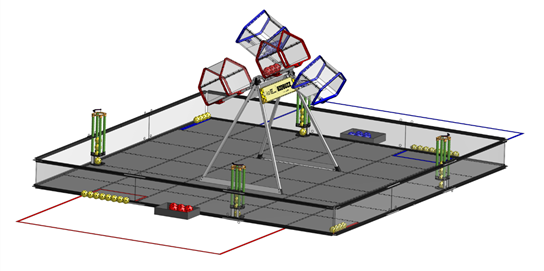
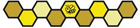

# 8 Game Overview

RTX가 후원하는 BIOBUZZ™에서는 각각 2개 팀으로 구성된 2개의 ALLIANCE가 서로 경쟁하며 POLLEN과 NECTAR를 수집해 자신의 HIVE로 LAUNCH하고 FLOWER에 넣습니다.

MATCH의 첫 30초 동안 ROBOTS는 자율적으로 작동합니다. ROBOTS는 Sensor를 사용해 FLOWER에서 POLLEN을 수집하고 자신의 HIVE의 CELL로 이동하여 LAUNCH할 수 있습니다. 충분한 SCORING ELEMENTS가 CELL로 LAUNCHED되면 HIVE가 기울어집니다. HIVE가 TIPPED될 때마다 점수를 얻고 추가 NECTAR가 해제됩니다.

남은 2분 동안 Human DRIVERS가 ROBOTS를 제어합니다. ROBOTS는 계속 POLLEN과 NECTAR를 수집하고 득점하며 HIVE를 기울여 점수를 얻고 더 많은 NECTAR를 해제합니다.

시간이 끝나갈수록 ALLIANCES는 FLOWER를 POLLEN과 NECTAR로 채우기 위해 노력합니다. 상대보다 먼저 각 FLOWER에 자신의 ALLIANCE NECTAR를 넣어 점수를 얻으며, FLOWER에서 가장 위에 놓인 NECTAR가 자신의 색이면 해당 FLOWER를 소유하여 추가 점수를 얻습니다.

가장 많은 점수를 획득한 ALLIANCE가 MATCH에서 승리하며, 다른 Scoring Achievement를 완료하면 추가 RANKING POINTS를 획득할 수 있습니다.

