# 9 ARENA

ARENA는 BIOBUZZ를 플레이하는 데 필요한 모든 Game Infrastructure를 포함합니다. FIELD, SCORING ELEMENTS, Queue Area, Team Media Area, Event Management에 필요한 모든 장비가 이에 포함됩니다.

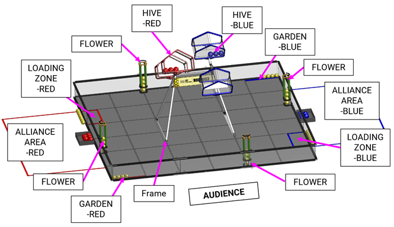

**Figure 9-1 · BIOBUZZ (Queue Area, FIELD Display, Optional Media Area는 그림에 없음)**

## 9.1 Dimensions and Accuracy 

BIOBUZZ FIELD의 규격은 다음 자료에서 확인할 수 있습니다.

* **3D CAD Model** — BIOBUZZ FIELD와 제작 방식을 나타내는 공식 표현입니다. 일반적으로 ±1 in.(±2.5 cm) Tolerance로 치수를 측정할 수 있습니다.
* **Event Field Setup Guide** — FIELD 제작 방법과 Tolerance에 영향을 줄 수 있는 Construction Detail, 주요 치수를 포함합니다.
* **Field Acceptance Checklist**(추후 공개) — Event Staff가 정기적으로 확인할 Controlled Dimension, 관련 Tolerance, Functional Test, Inspection Criteria를 포함합니다.
* **Field Mitigation Guide**(추후 공개) — 이벤트 중 FIELD가 규격을 유지하도록 FIELD STAFF에게 권장되는 Mitigation Measure를 제공합니다.
* Competition Manual의 Illustration은 BIOBUZZ ARENA를 전반적으로 이해하기 위한 것이며 포함된 치수는 Nominal입니다. 별도 명시가 없으면 모두 ±1 in.(±2.5 cm) Tolerance를 가집니다.

BIOBUZZ FIELD Resource 전체 목록은 FIRST Website의 Playing Field Resources Page에 게시됩니다.


ARENA는 Modular 구조이며 시즌 동안 여러 번 조립·사용·분해·운송되어 마모됩니다. 이벤트마다 일관성을 유지하기 위해 노력하지만 서로 다른 장소에서 서로 다른 Event Staff와 Volunteer가 조립하고 지역별 고유한 조건도 있어 작은 차이가 생길 수 있습니다.\
\
ARENA Specification은 공식 경기에서 나타날 수 있는 Variation을 현실적으로 반영하면서 핵심 요소의 일관성을 보장하도록 설계되었습니다. 성공적인 팀은 이러한 Variation에 민감하지 않은 ROBOT을 설계합니다.


## 9.2 FIELD 

BIOBUZZ FIELD는 FIELD Perimeter Wall의 안쪽 면으로 둘러싸인 약 144 in. × 144 in.(365.75 cm × 365.75 cm) 영역입니다. 바닥은 각각 약 24 in. × 24 in. × 0.59 in.(60.95 cm × 60.95 cm × 1.50 cm) 크기의 맞물리는 Soft Foam TILE 36장으로 구성됩니다.

FIELD에는 다음 요소가 설치되거나 주변에 배치됩니다.

* Frame 1개와 그 위에 장착된 HIVE 2개(ALLIANCE당 1개)로 구성된 HIVE Structure 1개
* FLOWER 4개

공식 이벤트는 AndyMark가 제조·판매하는 전체 BIOBUZZ FIELD(am-5850\_Full) 또는 공식 Licensed Equivalent를 사용합니다. Soft Foam TILE은 FIRST Tech Challenge Field Soft Tiles(am-2499) 또는 동등품입니다. 기본 FIELD Perimeter는 AndyMark FIRST Tech Challenge Perimeter Kit(am-0481)이며 이 매뉴얼의 모든 Illustration은 am-0481 버전을 보여줍니다. 유사 기능의 다른 Perimeter도 대회에서 사용될 수 있습니다.

FIRST Championship을 포함한 일부 이벤트는 FIELD를 Platform 또는 Riser 위에 설치하여 FIELD는 높이고 ALLIANCE AREAS는 지면 높이에 둘 수 있습니다. Event Field Setup Guide는 FIELD Perimeter를 선택적으로 고정할 수 있도록 허용합니다. AndyMark Perimeter Kit를 고정하는 이벤트는 Perimeter Strap을 설치할 필요가 없습니다.

이벤트에서 사용하는 FIELD Variant는 지역 Program Delivery Partner가 결정하며 같은 이벤트의 모든 Competition FIELD는 Section 9.1을 준수하고 T404에 따라 서로 일관되어야 합니다.

## 9.3 Areas, Zones, & Markings 

중요한 FIELD Area, Zone, Marking은 아래와 같습니다. “Zone”은 FIELD 내부 공간을, “Area”는 FIELD 외부 공간을 나타냅니다.

별도 명시가 없으면 FIELD의 Line과 Zone 표시에 사용하는 Tape는 폭 1 in.(2.50 cm) 또는 2 in.(5.10 cm)의 ProGaff® Premium Professional Grade Gaffer Tape 또는 이에 준하는 Red/Electric Blue Gaffer Tape를 사용할 수 있습니다. FIELD 밖의 Area는 이벤트에 따라 다른 종류나 폭의 Tape로 표시할 수 있습니다.

공식 Specification에서는 Tape Line을 연속된 Strip으로 표시합니다. 일부 Game에서는 비연속 Segment를 허용하지만 이번 시즌에는 필요하지 않습니다. BIOBUZZ FIELD에서는 어떤 Tape Line도 TILE Seam을 가로지르지 않으며 Specification처럼 연속적으로 부착할 것을 권장합니다.

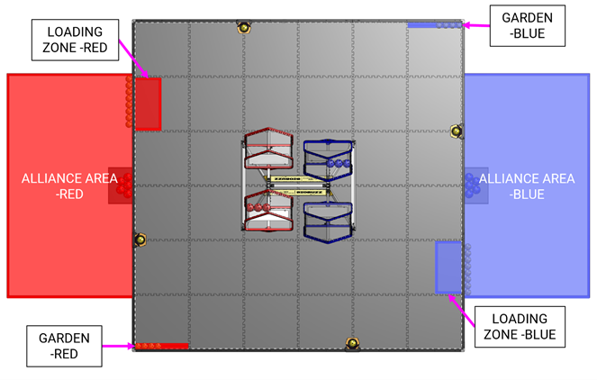

**Figure 9-2 · BIOBUZZ ZONES and AREAS**

* **ALLIANCE AREA** — FIELD 밖 바닥에 ALLIANCE Color Tape를 부착해 만든 약 97 in.(246.40 cm) 폭 × 54 in.(137.15 cm) 깊이의 무한 높이 Volume이며 Tape Line을 포함합니다.
* **LOADING ZONE** — Red 또는 Blue Tape와 인접 FIELD Perimeter로 둘러싸인 약 23 in.(58.40 cm) 폭 × 11 in.(27.95 cm) 깊이의 무한 높이 Volume입니다. Tape Line을 포함하며 인접 ALLIANCE AREA의 ALLIANCE에 속하는 전용 Zone입니다.
* **GARDEN** — Figure 9-2처럼 FIELD의 대각선 반대 Corner에 있는 Blue 또는 Red Tape의 바깥쪽 Edge로 정의되는 약 23 in.(58.40 cm) × 2 in.(5.10 cm) 폭의 무한 높이 Volume입니다.

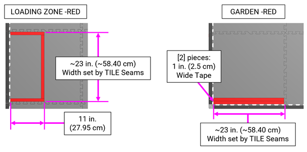

**Figure 9-3 · LOADING ZONE and GARDEN (POLLEN 숨김)**

## 9.4 TILE Coordinates 

TILE Coordinate는 FIELD Setup을 돕기 위해 사용됩니다. Figure 9-4는 TILE Tab이 맞물리는 FIELD의 각 TILE 교차점을 정의하고, Figure 9-5는 각 TILE의 Grid Coordinate System을 정의합니다.

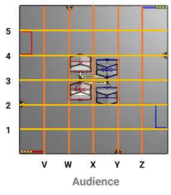

**Figure 9-4 · TILE Seam/Tab-line 위치**

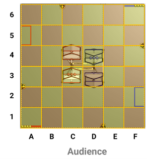

**Figure 9-5 · TILE 위치**

## 9.5 ALLIANCE AREA 

ALLIANCE AREA는 FIELD에 인접한 지정 Red 또는 Blue 영역으로 DRIVE TEAMS가 MATCH 중 위치하는 곳입니다. 주요 Audience Viewing Direction에서 볼 때 Red ALLIANCE AREA가 왼쪽에 오도록 FIELD가 배치됩니다.

이벤트는 ALLIANCE AREA 내부 FIELD Perimeter 근처에 OPERATOR CONSOLE을 놓을 수 있는 낮은 Table, Stand 또는 Stool을 제공할 수 있습니다. 제공된 경우 Head REFEREE, FIELD Supervisor 또는 FTA의 허가 없이 팀이 제거하거나 재배치할 수 없습니다.

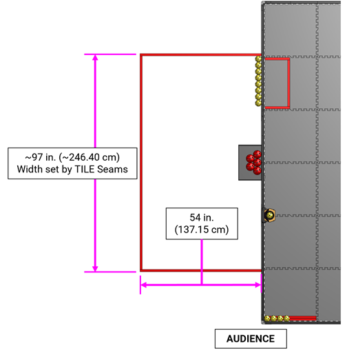

**Figure 9-6 · ALLIANCE AREA**

## 9.6 HIVE Structure 

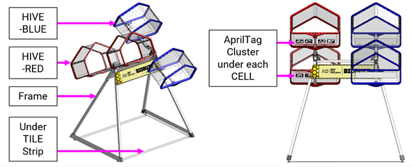

**Figure 9-7 · HIVE Structure**

HIVE Structure는 FIELD 중앙에 위치합니다. Frame은 Red HIVE와 Blue HIVE를 지지합니다. 각 HIVE는 양 끝에 하나씩 총 2개의 CELL로 구성되며, 각 CELL은 NECTAR와 POLLEN을 담을 수 있는 3차원 구조입니다.

각 HIVE는 Pivot에 장착되어 어느 시점이든 한 CELL이 위를 향하도록 기울어질 수 있습니다. HIVE는 Bi-stable 구조로, 위를 향한 CELL에 충분한 POLLEN 또는 NECTAR가 LAUNCHED될 때까지 위치를 유지합니다. 각 CELL의 Bottom Face에는 서로 다른 AprilTag 4개로 구성된 고유한 AprilTag Cluster가 있습니다.

### 9.6.1 Frame

Frame은 TILE 아래 Mounting Strip에 연결되는 두 개의 삼각형 Metal Structure로 구성되며 꼭짓점에서 Crossbar로 연결됩니다. Base 기준 폭은 49.46 in.(125.65 cm), 깊이는 38.95 in.(98.95 cm)이며 이 부분이 가장 넓습니다. Frame은 TILE 위 43.95 in.(111.65 cm) 높이에 Axis가 위치한 Pivot 2개를 지지합니다.

Frame 양쪽에는 BIOBUZZ Logo Panel이 부착되지만 모든 이벤트에 이 Graphic이 있을 필요는 없습니다.

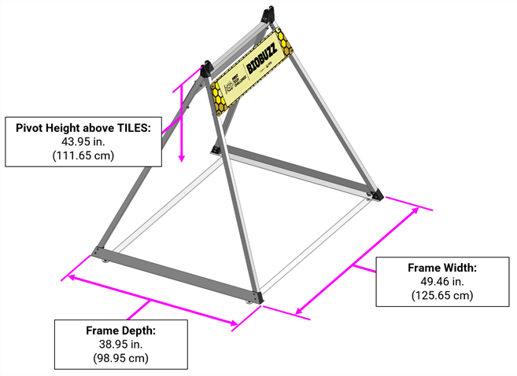

**Figure 9-8 · Frame**

### 9.6.2 HIVE and CELL

각 HIVE는 2개의 CELL과 Pivot에서 회전하는 Connecting Assembly로 이루어진 Bi-stable Structure입니다. 각 HIVE는 같은 색(Red 또는 Blue)의 CELL 2개를 포함하며 Figure 9-9와 같이 약 18.8 in.(47.8 cm) 떨어져 있습니다. Frame 상단의 Pivot을 중심으로 회전하며, 각 위치에서 하나의 CELL이 위를 향하는 두 개의 Stable Position을 가집니다.

CELL Opening은 Figure 9-11과 같이 약 20 in.(50.8 cm) 폭 × 14 in.(35.6 cm) 높이 × 12 in.(30.5 cm) 깊이입니다.

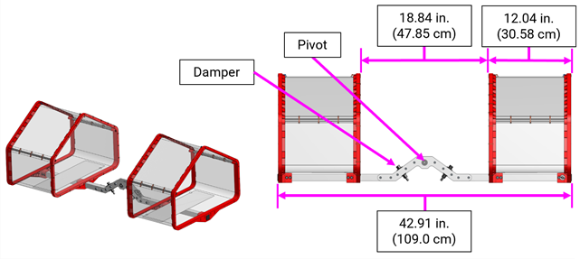

**Figure 9-9 · HIVE Details**

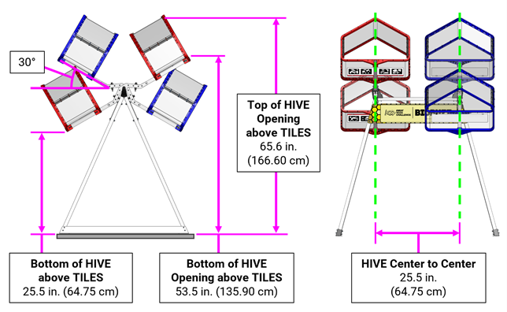

**Figure 9-10 · HIVE and CELL Key Details**

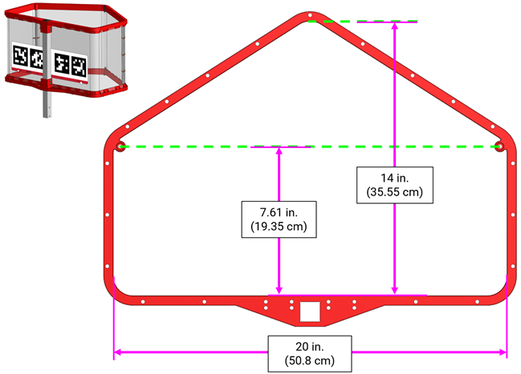

**Figure 9-11 · CELL**

## 9.7 FLOWER 

FLOWER는 FIELD 위의 구조물로 POLLEN과 NECTAR를 위에서 넣을 수 있고 POLLEN은 아래에서 꺼낼 수 있습니다. FIELD Perimeter Wall에 FLOWER 4개가 부착됩니다.

* 각 FLOWER 상단 Opening은 지름 약 4 in.(10.15 cm)이며 TILE 위 약 21.5 in.(54.6 cm)에 위치합니다.
* POLLEN과 NECTAR를 FLOWER 안으로 안내하는 Backstop이 상단에 있으며 높이는 1.25 in.(3.15 cm)입니다.
* ROBOT이 SCORING ELEMENTS를 꺼내는 Retrieval Opening은 하단에 있으며 높이 약 3.55 in.(9.0 cm), 깊이 약 3.57 in.(9.1 cm)입니다.
* TILE 바닥에 놓이는 Lower Ring은 높이 약 0.4 in.(1.0 cm)이며 POLLEN이 놓이는 지름 약 2.79 in.(7.1 cm)의 Hole이 있습니다.

Upper/Middle Ring은 HIPS Pipe 4개로 연결되고, Middle/Lower Ring은 Perimeter Wall 쪽에서 Square Extrusion으로 연결됩니다.

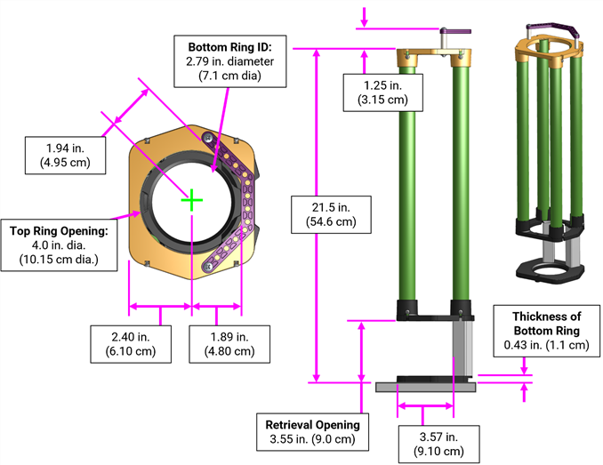

**Figure 9-12 · FLOWER Details**

## 9.8 SCORING ELEMENTS 

BIOBUZZ의 SCORING ELEMENTS는 POLLEN과 NECTAR입니다.

* **POLLEN** — 약 2.8 in.(7.1 cm) 크기의 Yellow Gopher ResisDent™ Polyethylene Ball(am-5851\_yellow)
* **NECTAR** — 약 3.6 in.(9.1 cm) 크기의 Red(am-5852\_red) 및 Blue(am-5852\_blue) Gopher ResisDent™ Polyethylene Ball

BIOBUZZ MATCH에는 총 POLLEN 40개, Red NECTAR 8개, Blue NECTAR 8개가 있습니다. POLLEN과 NECTAR는 완벽한 구형이 아니며 크기에 Variation이 있을 수 있으므로 ROBOT 설계 시 이를 고려해야 합니다.

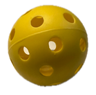

**Figure 9-13 · POLLEN**

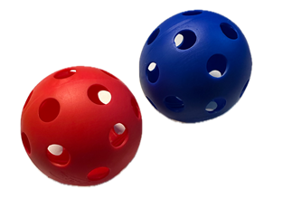

**Figure 9-14 · NECTAR**

## 9.9 AprilTags 

BIOBUZZ의 AprilTag는 ROBOT Navigation과 Targeting을 돕는 36h11 Tag Family의 3.25 in.(8.25 cm) 정사각형 Target입니다.

AprilTag는 하나의 Sticker에 4개를 배치한 AprilTag Cluster로 구성됩니다. 각 AprilTag에는 식별용 “ID” Text Label이 있습니다. Cluster는 Reference Hole을 이용해 정렬하여 CELL에 하나의 Sticker로 부착합니다. 이 Reference Hole을 이용하면 FIELD의 나머지 부분에 대한 AprilTag Cluster의 위치를 측정할 수 있습니다.

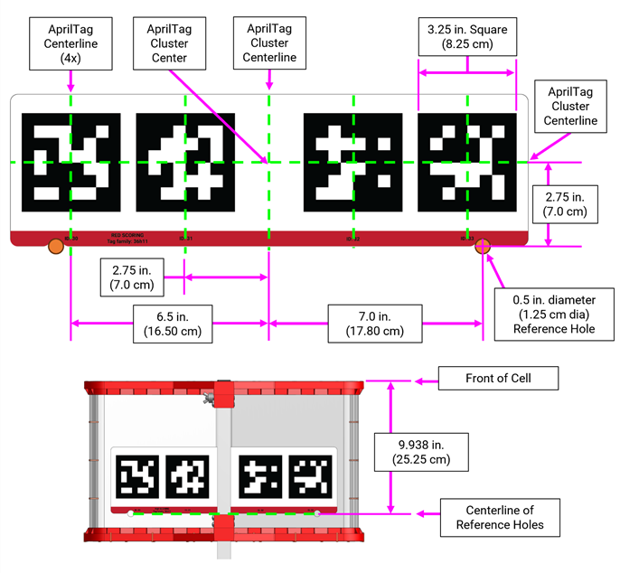

**Figure 9-15 · AprilTag Cluster and Reference Hole Layout**


이 매뉴얼의 이미지는 예시이며 Scale에 맞지 않고 Practice용으로 인쇄하기 위한 것이 아닙니다. 인쇄 가능한 Version은 Playing Field Resources Page를 참고하십시오.


각 AprilTag Cluster는 CELL의 Bottom에 TILE을 향해 아래쪽으로 부착되며 Bottom Edge가 FIELD 중앙을 향하도록 배치됩니다.

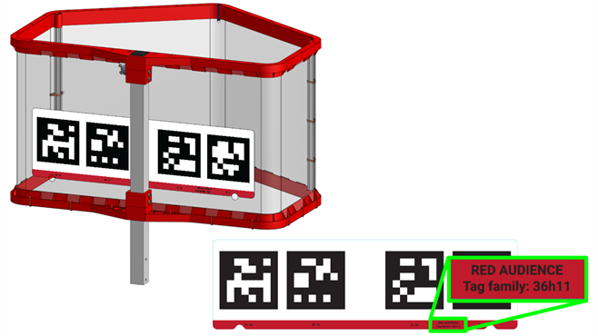

**Figure 9-16 · AprilTag Cluster on CELL**

AprilTag는 Figure 9-17에 표시된 순서로 다음 위치에 있습니다.

* ID 30, 31, 32, 33 — Audience 반대쪽 Red CELL
* ID 34, 35, 36, 37 — Audience 쪽 Red CELL
* ID 38, 39, 40, 41 — Audience 쪽 Blue CELL
* ID 42, 43, 44, 45 — Audience 반대쪽 Blue CELL

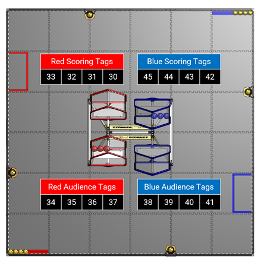

**Figure 9-17 · BIOBUZZ FIELD의 AprilTag 위치**

## 9.10 FIELD STAFF 

FIELD STAFF는 ARENA 안팎에서 MATCH가 효율적이고 공정하며 안전하게, 협력과 Gracious Professionalism®, 그리고 배려의 정신으로 진행되도록 책임지는 자원봉사자입니다.

FIELD STAFF 역할은 충분한 Training과 Certification으로 이벤트를 준비한 지역사회 Volunteer가 맡습니다. 팀이 알고 있어야 하며 이벤트 경험을 더 가치 있게 만드는 Resource로 활용하도록 권장되는 FIELD-side 핵심 역할은 3가지입니다.

* **Head REFEREE** — REFEREES와 Official Scorer를 교육·지휘·감독하고 다른 FIELD STAFF와 협력해 모든 Scoring Process와 Procedure를 관리합니다. MATCH Score, FOUL, YELLOW/RED CARD 결정의 최종 권한을 가집니다.
* **FIRST Technical Advisor (FTA)** — 이벤트가 원활하고 안전하며 FIRST 요건에 맞게 운영되도록 합니다. FIELD, ROBOTS, Game과 관련된 모든 기술 사항에 집중하며 이벤트에 참가하는 모든 팀의 Advocate 역할을 합니다.
* **FIELD Supervisor** — 소규모 이벤트에서는 FTA 또는 Head REFEREE가 겸할 수 있습니다. MATCH의 효율적인 진행, 이벤트 Pace, MATCH Play의 원활한 Flow를 위해 FIELD 활동을 지휘합니다. FIELD 상태를 유지하고 각 MATCH 후 다음 MATCH를 위해 FIELD를 Reset하는 Team을 이끕니다.


각 역할과 다른 FIRST Tech Challenge Volunteer Role에 대한 자세한 내용은 Volunteer Resources를 참고하십시오.


## 9.11 Event Management System 

FIRST Event Management System은 MATCH Score와 기타 Event Input을 관리하는 Software입니다. Computer, Display, REFEREE 및 기타 Volunteer Electronic Device, Wireless Access Point, Ethernet Cable 등 모든 FIELD Electronics를 포함합니다.

시스템은 Table 9-1의 Audio Cue로 MATCH의 주요 시점을 참가자에게 알려줍니다. Audio Cue는 참가자를 위한 편의 기능이며 공식 MATCH Marker가 아닙니다. Audio Cue와 Visual FIELD Timer가 다르면 **Visual FIELD Timer가 최종 기준**입니다.

**Table 9-1 · Audio Cues**

| Event                     | Timer Value | Audio Cue                                                |
| ------------------------- | ----------- | -------------------------------------------------------- |
| MATCH Start               | 2:30        | “This MATCH begins in 3, 2, 1, GO”(선택), “Cavalry Charge” |
| AUTO Ends                 | 2:00        | “Buzzer × 3”                                             |
| AUTO → TELEOP Transition  | 0:08 → 0:01 | “Drivers, pick up your controllers, 3-2-1”               |
| TELEOP Begins             | 2:00        | “3 Bells”                                                |
| FLOWER Ownership Unlocked | 1:00        | \[TBD]                                                   |
| Final 20 Seconds          | 0:20        | “Train Whistle”                                          |
| MATCH End                 | 0:00        | “3-second Buzzer”                                        |
| MATCH Stopped             | N/A         | “Foghorn”                                                |

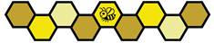
