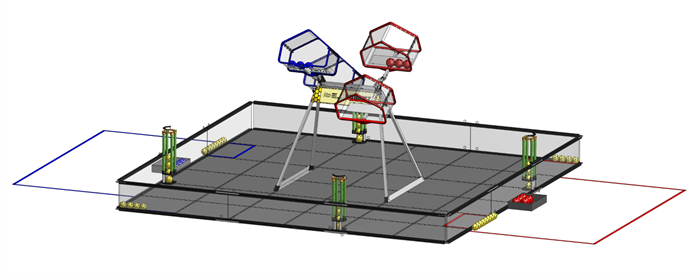
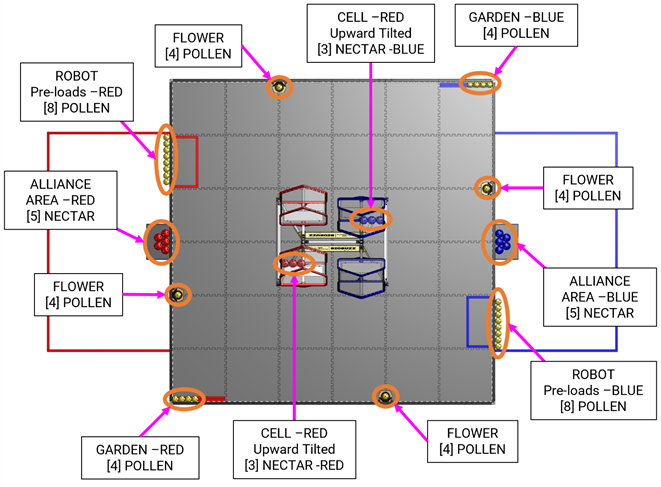
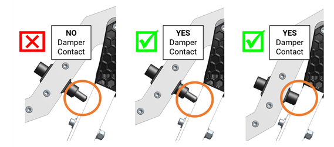
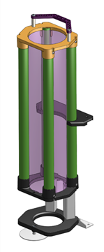
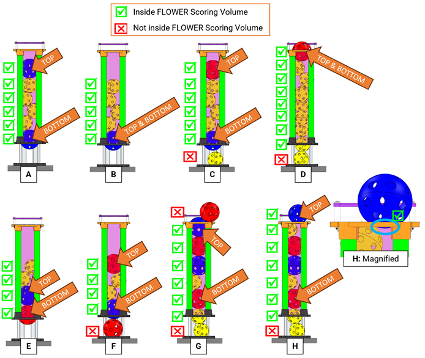
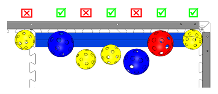
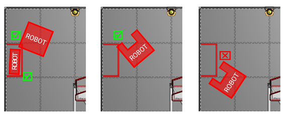
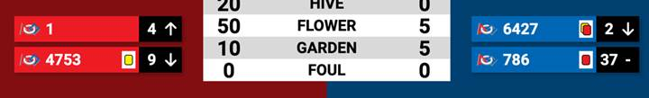
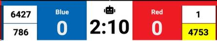
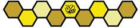

# 10 Game Details {#s-10}

**Figure 10-1 · BIOBUZZ FIELD**

BIOBUZZ에서는 2개의 ALLIANCE(각 ALLIANCE는 2개의 FIRST Tech Challenge 팀으로 이루어진 협력 단위)가 아래에 설명된 세부사항에 따라 준비되고 운영되는 MATCH를 플레이합니다.

## 10.1 MATCH Overview {#s-10-1}

MATCH는 Pre-MATCH Setup, 30초 AUTO Period, AUTO와 TELEOP 사이의 8초 Transition Period, 2분 TELEOP Period, 그리고 Post-MATCH Reset으로 구성됩니다.

MATCH 동안 ROBOTS는 POLLEN과 NECTAR를 수집하여 GARDEN으로 옮기고, FLOWER에 넣고, CELL로 LAUNCH하여 HIVE TIP을 일으키는 등의 활동으로 점수를 획득합니다.

HIVE가 TIPPED될 때마다 ALLIANCE는 ALLIANCE AREA에 처음 배치된 5개의 NECTAR 중 1개를 FIELD에 투입할 수 있습니다. MATCH 종료 60초 전부터는 남아 있는 모든 NECTAR를 투입할 수 있습니다.

ROBOT은 NECTAR를 배치하여 FLOWER의 Ownership을 확보하고 자신의 LOADING ZONE으로 돌아가면서 MATCH를 마무리합니다.

## 10.2 DRIVE TEAM {#s-10-2}

A DRIVE TEAM은 특정 MATCH에서 Team Performance를 책임지는 동일한 FIRST Tech Challenge Team 소속 최대 4명으로 구성됩니다. DRIVE TEAM에는 ALLIANCE가 ROBOT을 돕기 위해 사용할 수 있는 3개의 구체적인 역할이 있으며, DRIVE TEAM Member 중 비-STUDENT는 1명만 허용됩니다.


DRIVE TEAM의 정의와 DRIVE TEAM 관련 규칙의 취지는, 예외적인 상황이 없는 한 DRIVE TEAM이 해당 Team에 소속되어 Event에 도착했고 Event에서 그 Team과 ROBOT의 Performance를 책임지는 사람들로 구성되는 것입니다. 이는 한 사람이 둘 이상의 Team에 소속될 수 있음을 의미합니다.

이 정의의 취지는 Team이 빌려주는 Team, 빌리는 Team 및/또는 그 ALLIANCE의 STRATEGIC Advantage를 위해 다른 Team의 Member를 “adopt”하도록 허용하는 것이 아닙니다. 예를 들어 ALLIANCE Lead가 자신의 DRIVER 중 1명이 ALLIANCE Partner의 DRIVER보다 경험이 많다고 판단하고, 두 Team이 Partner Team이 그 DRIVER를 “adopt”하여 Playoff에서 자신의 DRIVE TEAM Member로 사용하기로 합의하는 경우입니다.

이 정의를 더 엄격하게 만들지 않은 데에는 2가지 주된 이유가 있습니다. 첫째, Team과 Event Volunteer에게 추가적인 행정 부담을 주지 않기 위해서입니다. 예를 들어 Team이 공식 Roster를 제출하고 Queuing에서 DRIVE TEAM의 ARENA 입장 전에 이를 확인하도록 요구하지 않습니다.

둘째, 예외적인 상황에서 Team이 Gracious Professionalism을 보여줄 기회를 제공하기 위해서입니다. 예를 들어 버스가 지연되어 DRIVE COACH에게 DRIVER가 없고, 이웃 Pit Team이 버스가 도착할 때까지 DRIVER를 임시 Team Member로 빌려주어 돕기로 하는 경우입니다.


**Table 10-1 · DRIVE TEAM roles**

<table>
<thead>
<tr>
<th>Role</th>
<th>Description</th>
<th>Max./ DRIVE TEAM</th>
<th>Criteria</th>
</tr>
</thead>
<tbody>
<tr>
<td>DRIVE COACH</td>
<td>a guide or advisor</td>
<td>1</td>
<td>모든 Team Member가 가능하며 Adult일 수도 있음, “DRIVE COACH” Badge 착용 필수</td>
</tr>
<tr>
<td>DRIVER</td>
<td>an operator and controller of the ROBOT</td>
<td rowspan="2">3</td>
<td>STUDENT, “DRIVE TEAM” Badge 착용 필수</td>
</tr>
<tr>
<td>HUMAN PLAYER</td>
<td>a SCORING ELEMENT manager</td>
<td>STUDENT, “DRIVE TEAM” Badge 착용 필수</td>
</tr>
</tbody>
</table>

A STUDENT는 현재 Season의 9월 1일 기준으로 자신의 HOME REGION에서 High School, Secondary School 또는 이에 준하는 교육 단계를 완료하지 않은 사람입니다.

## 10.3 Setup {#s-10-3}

각 MATCH가 시작되기 전에 FIELD STAFF는 Section 10.3.1 SCORING ELEMENTS에 따라 SCORING ELEMENTS를 배치합니다. DRIVE TEAMS는 Section 10.3.4 ROBOTS에 따라 ROBOTS를, Section 10.3.3 OPERATOR CONSOLES에 따라 OPERATOR CONSOLES를 준비합니다. 이후 DRIVE TEAMS는 Section 10.3.2 DRIVE TEAMS에 따라 자신의 위치에 섭니다.

### 10.3.1 SCORING ELEMENTS {#s-10-3-1}

**Figure 10-2 · SCORING ELEMENT staging positions**

각 HIVE는 그림처럼 한 CELL은 아래쪽을 향하고 다른 CELL은 위쪽을 향하도록 기울입니다. 쉽게 기억하려면 FLOWER를 “가리키는” CELL이 아래로 기울어진 CELL입니다. SCORING ELEMENTS는 Figure 10-2와 같이 FIELD에 배치됩니다.

A. POLLEN 40개는 다음과 같이 FIELD에 배치합니다.

i. 4개의 FLOWER 각각에 POLLEN 4개씩(16개)

ii. Red GARDEN에 POLLEN 4개

iii. Blue GARDEN에 POLLEN 4개

iv. 각 ROBOT에 Pre-loaded POLLEN 4개씩(16개) — Section 10.3.4 ROBOTS 참조


Pre-loaded POLLEN은 ROBOT 내부 또는 위에 놓이거나, ROBOT의 Starting Location에서 ROBOT과 접촉하는 TILE 위에 놓인 상태로 MATCH를 시작합니다. MATCH에 참가하지 않는 ROBOT의 Pre-load POLLEN은 LOADING ZONE의 대략 중앙에서 Perimeter Wall에 붙여 놓습니다.



GARDEN의 POLLEN은 ALLIANCE AREA와 가장 가까운 Corner에서 시작하여 Audience 또는 Rear Perimeter Wall과 접촉하도록 한 줄로 배치합니다. 배치에는 약간의 차이가 있을 수 있습니다.


B. Red NECTAR 8개와 Blue NECTAR 8개는 다음과 같이 FIELD에 배치합니다.

i. 해당 색의 Upward-facing CELL 각각에 NECTAR 3개씩(총 6개)

ii. 해당 색의 ALLIANCE AREA 각각에 NECTAR 5개씩(총 10개)


CELL의 NECTAR는 CELL의 Back Wall에 접촉하고 해당 색 ALLIANCE AREA와 가장 가까운 Side를 따라 한 줄로 배치합니다. Volunteer가 배치하는 정확한 위치에는 약간의 차이가 있을 수 있으나 일반적으로 그림과 같이 놓입니다.


Section 15.2 Game Modification에 따라 FIRST Championship과 FIRST Premier Event에서는 SCORING ELEMENTS의 수, 종류, 분포가 조정될 수 있습니다. FIRST Championship의 Game Modification은 Section 1.7.3 Team Updates에 설명된 마지막 정규 Team Update 또는 그 이전에 공개됩니다. FIRST Premier Event의 Game Modification은 Event Organizer가 Event 전에 게시합니다.

### 10.3.2 DRIVE TEAMS {#s-10-3-2}

DRIVE TEAMS는 이전 MATCH의 DRIVE TEAM이 떠난 뒤 ALLIANCE AREA에 들어가 다음 MATCH를 준비합니다. 시작 조건은 아래와 같으며, 이 조건을 방해하거나 지연하는 DRIVE TEAM은 G301 위반 위험이 있습니다.

A. 다가오는 MATCH에 배정된 DRIVE TEAM Member만 있습니다.

B. Initial, Complete Inspection을 통과한 ROBOT의 DRIVE TEAM Member만 있습니다.

C. DRIVE TEAM Member는 지정된 ALLIANCE AREA에 위치합니다. ALLIANCE Member끼리 DRIVE TEAM 위치에 합의하지 못하면 MATCH Schedule에서 “Red 1” 또는 “Blue 1”로 표시된 Team이 Audience에 가장 가까운 위치에 섭니다.

D. DRIVE TEAM Member는 지정된 DRIVE TEAM Badge를 허리 위에 명확히 표시합니다.

E. Playoff MATCH의 경우 ALLIANCE CAPTAIN은 지정된 ALLIANCE CAPTAIN Identifier(예: 모자, Armband)를 명확히 표시합니다.

### 10.3.3 OPERATOR CONSOLES {#s-10-3-3}

DRIVE TEAMS는 ALLIANCE AREA에 위치하는 즉시 OPERATOR CONSOLES를 설치합니다. OPERATOR CONSOLES는 관련 모든 규칙, 특히 Section 12.9 OPERATOR CONSOLE을 준수해야 합니다. OPERATOR CONSOLE Setup을 방해하거나 지연하는 DRIVE TEAM은 G301 위반 위험이 있습니다.

A. AUTO 동안 OpMode를 실행하려는 DRIVE TEAM은 DRIVER STATION App에서 30초 Timer가 활성화된 OpMode를 선택해야 합니다.

B. 그렇지 않은 DRIVE TEAM은 DRIVER STATION App에서 TELEOP OpMode를 선택해야 합니다.

C. 선택한 OpMode는 DRIVER STATION App의 “INIT” 버튼을 눌러 초기화해야 합니다.

### 10.3.4 ROBOTS {#s-10-3-4}

DRIVE TEAMS는 G304에 따라 ROBOT을 배치합니다. ROBOT Setup 요구사항을 방해하거나 지연하는 DRIVE TEAM은 G301 위반 위험이 있습니다.

ROBOT은 Pre-loaded POLLEN 4개와 접촉한 상태로 MATCH를 시작해야 합니다. POLLEN은 ROBOT의 내부 또는 위에 둘 수 있고, Starting Location에서 ROBOT과 접촉하는 TILE 위에 둘 수도 있습니다.

ROBOT이 MATCH 시작 전에 DISABLED되면 FIELD STAFF와 협의하여 FIELD에서 제거할 수 있습니다. ROBOT이 DISABLED되었거나 MATCH에 없더라도 Section 3.3.1 Inspection에 따라 Inspection을 통과했고 최소 1명의 STUDENT DRIVE TEAM Member가 ALLIANCE AREA에 있으면 Qualification MATCH Point 또는 Playoff MATCH Point를 받을 자격이 있습니다.

ROBOT 배치 순서가 어느 한쪽 또는 양쪽 ALLIANCE에 중요하면 Setup 전에 Head REFEREE 또는 Designee에게 알리고, Head REFEREE가 ALLIANCE에 번갈아 ROBOT을 배치하도록 지시합니다. 배치 순서는 다음과 같습니다.

1. 첫 번째 Red ROBOT
2. 첫 번째 Blue ROBOT
3. 두 번째 Red ROBOT
4. 두 번째 Blue ROBOT

Qualification MATCH에서는 Red 1 또는 Blue 1로 배정된 ROBOT이 자신의 ALLIANCE에서 먼저 배치합니다. Playoff MATCH에서는 ALLIANCE Lead가 자신의 ALLIANCE에서 어느 ROBOT을 먼저 배치할지 결정합니다.

## 10.4 MATCH Periods {#s-10-4}

각 MATCH의 첫 번째 Period는 30초(0:30)의 Autonomous Period(AUTO)입니다. AUTO 동안 ROBOTS는 DRIVER의 Control 또는 Input 없이 작동합니다.

AUTO와 TELEOP 사이에는 Section 10.5 Scoring에서 설명한 Scoring 목적의 8초 Transition Period가 있습니다.

각 MATCH의 세 번째 Period는 2분(2:00)의 Teleoperated Period(TELEOP)입니다. TELEOP 동안 DRIVERS가 ROBOTS를 원격으로 조작하여 점수를 획득합니다. 자세한 MATCH Timing은 Table 9-1을 참고하십시오.

## 10.5 Scoring {#s-10-5}

ALLIANCES는 MATCH 전체에서 Table 10-2에 표시된 여러 Action을 완료하여 보상을 받습니다.

ALLIANCES는 MATCH Point와 RANKING POINTS(RP)를 통해 MATCH Performance에 대한 보상을 받으며, 이는 Section 13.6.3 Qualification Ranking에서 Team Ranking에 사용되는 값을 높입니다.

모든 Achievement는 MATCH 전체에서 갱신됩니다. Scoring Achievement는 다음과 같이 평가됩니다.

A. HIVE TIP 평가는 MATCH 전체에서 이루어지며 MATCH 종료 후 모든 SCORING ELEMENTS와 ROBOTS가 정지할 때까지 계속됩니다.

B. TELEOP 시작 전에 완료된 HIVE TIP은 AUTO의 일부로 평가됩니다.

C. CELL에 남아 있는 POLLEN과 NECTAR는 MATCH 종료 후 모든 SCORING ELEMENTS와 ROBOTS가 정지한 뒤 평가됩니다.

D. FLOWER 안에서 득점된 SCORING ELEMENTS는 MATCH 전체에서 평가되며, 최종 평가는 TELEOP 종료 후 모든 SCORING ELEMENTS와 ROBOTS가 정지한 뒤 이루어집니다.

E. GARDEN Scoring은 TELEOP 종료 후 모든 ROBOTS와 SCORING ELEMENTS가 정지한 뒤 평가됩니다.

F. LEAVE와 AUTO PARK는 AUTO 종료 시 평가됩니다.

G. TELEOP PARK는 MATCH 종료 시 평가됩니다.


Scoring은 Human Volunteer가 평가하고 점수를 부여합니다. Live Score의 지연 또는 오류는 ARENA FAULT로 간주하지 않습니다(Section 13.2 MATCH Replays 참조). Team은 Criteria 충족 여부가 명확하고 모호하지 않도록 하는 것이 좋습니다.

MATCH 시작 전, AUTO-to-TELEOP Transition Period 중, 그리고 MATCH가 0:00에 끝난 후에 만들어진 Achievement는 Penalty 대상이 될 수 있습니다.


### 10.5.1 HIVE Scoring Criteria {#s-10-5-1}

**HIVE TIP**

HIVE는 다음 두 조건을 모두 충족하면 TIPPED로 간주합니다.

A. 한 Stable State에서 다른 Stable State로 이동하여 Downwards-facing CELL이 Upwards-facing CELL이 되고,

B. 그 후 이전에는 Frame과 접촉하지 않던 HIVE의 Damper가 Frame과 접촉하기 시작합니다.

**Figure 10-3 · HIVE damper and frame**


HIVE는 Bi-stable로 설계되어 대부분의 상황에서 한 Stable State에서 다른 Stable State로 이동했는지가 명확합니다. 구체적인 HIVE TIP Criteria가 제공되어 있지만 Volunteer가 Damper가 Frame과 접촉하는 정확한 순간을 감시할 것으로 기대하지 않습니다. 
 
Team은 HIVE가 기울어지는 동안 Downward-facing CELL에 LAUNCH하면 움직임을 방해하여 TIP이 성립하지 않을 수 있음을 알아야 합니다. 정상 Gameplay에서는 드물지만 이런 상황에서는 Volunteer에게 TIP이 성립했음이 명확하도록 LAUNCHING을 잠시 멈춰야 할 수 있습니다. 
 
Upward-facing CELL에 LAUNCH하는 것이 HIVE TIP을 얻을 수 있는 유일한 허용 방법입니다. ROBOTS는 G417을 따라야 하며 다른 방법으로 HIVE TIP을 방해하거나 일으킬 수 없습니다.


**POLLEN and NECTAR remaining in CELL**

MATCH 종료 시 Upward-facing CELL에 남아 있는 POLLEN 및/또는 NECTAR는 해당 ALLIANCE의 점수가 됩니다.

### 10.5.2 FLOWER Scoring Criteria {#s-10-5-2}

NECTAR와 POLLEN은 FLOWER Scoring Volume, 즉 CAD Reference 10-4에서 보라색으로 강조된 Top Ring과 Middle Ring 사이의 Volume에 최소 일부라도 들어가 있으면 득점합니다.

**CAD Reference 10-4 · FLOWER scoring volume**


G410에 따라 FLOWER Scoring은 MATCH 종료 1분 전이 되기 전에는 시작할 수 없습니다. 1분 전보다 일찍 만들어진 Achievement도 점수 자체는 인정되지만 Penalty 대상이 됩니다.

SCORING ELEMENT를 FLOWER 위쪽으로 넣는 것이 유일하게 허용되는 Scoring 방법입니다. ROBOTS는 FLOWER와 상호작용할 때 G418을 따라야 합니다.


**Bottom NECTAR Bonus**

FLOWER에서 Scoring Criteria를 충족하는 NECTAR 중 가장 아래에 자신의 색 NECTAR가 있는 ALLIANCE가 점수를 얻습니다.

**FLOWER Owner**

FLOWER에서 Scoring Criteria를 충족하는 NECTAR 중 가장 위에 자신의 색 NECTAR가 있는 ALLIANCE가 해당 FLOWER를 소유합니다. 해당 FLOWER를 어느 ALLIANCE가 POLLEN 및/또는 NECTAR를 넣었는지와 관계없이, 그 FLOWER의 Scoring Criteria를 충족하는 모든 POLLEN과 NECTAR에 대해 Owner ALLIANCE가 점수를 얻습니다.

**Figure 10-5 · FLOWER Ownership**

### 10.5.3 GARDEN Scoring Criteria {#s-10-5-3}

GARDEN Point를 얻으려면 POLLEN 또는 NECTAR가 GARDEN Zone에 최소 일부라도 들어가 있어야 합니다.

- GARDEN은 ALLIANCE SPECIFIC이며 어느 ALLIANCE가 POLLEN 또는 NECTAR를 넣었는지와 관계없이 GARDEN과 같은 색 ALLIANCE가 점수를 얻습니다.
- GARDEN은 Protected Zone이 아니며, 어느 ALLIANCE든 MATCH 동안 어느 GARDEN에서든 SCORING ELEMENT를 제거할 수 있습니다.
- 어느 ALLIANCE의 NECTAR든, 그리고 POLLEN은 들어가 있는 GARDEN의 색과 같은 ALLIANCE에 점수가 부여됩니다.

**Figure 10-6 · GARDEN Scoring**

### 10.5.4 ROBOT Scoring Criteria {#s-10-5-4}

**LEAVE**

LEAVE Point를 얻으려면 ROBOT이 Perimeter Wall과 더 이상 접촉하지 않도록 이동해야 합니다.

**PARK**

PARK Point를 얻으려면 ROBOT이 LOADING ZONE에 최소 일부라도 들어가도록 이동해야 합니다.

**Figure 10-7 · LOADING ZONE PARK Examples**

### 10.5.5 Point Values {#s-10-5-5}

**Table 10-2 · BIOBUZZ Point Values**

<table><thead><tr><th colspan="2"></th><th colspan="2">MATCH 포인트</th><th rowspan="2">랭킹 포인트(RP)</th></tr><tr><th colspan="2"></th><th>AUTO</th><th>TELEOP</th></tr></thead><tbody><tr><td colspan="2">LEAVE</td><td>3</td><td>–</td><td>–</td></tr><tr><td colspan="2">PARK</td><td>5</td><td>5</td><td>–</td></tr><tr><td rowspan="2">HIVE</td><td>HIVE TIP</td><td>20</td><td>20</td><td>–</td></tr><tr><td>CELL에 남아 있는 POLLEN 및/또는 NECTAR</td><td>–</td><td>2</td><td>–</td></tr><tr><td rowspan="2">FLOWER</td><td>최하단 NECTAR 보너스</td><td>–</td><td>5</td><td>–</td></tr><tr><td>소유한 FLOWER 안의 POLLEN 및/또는 NECTAR</td><td>–</td><td>2</td><td>–</td></tr><tr><td>GARDEN</td><td>GARDEN 안의 POLLEN 및/또는 NECTAR</td><td>–</td><td>1</td><td>–</td></tr><tr><td colspan="4">SWARM RP – 획득한 LEAVE + PARK 합산 점수가 기준값 이상</td><td>1</td></tr><tr><td colspan="4">POLLINATOR 1 RP – TIP 횟수가 기준값 이상</td><td>1</td></tr><tr><td colspan="4">POLLINATOR 2 RP – TIP 횟수가 기준값 이상</td><td>1</td></tr><tr><td>WIN</td><td colspan="3">상대보다 더 많은 MATCH 포인트로 MATCH를 종료</td><td>3</td></tr><tr><td>TIE</td><td colspan="3">상대와 같은 MATCH 포인트로 MATCH를 종료</td><td>1</td></tr></tbody></table>

**Table 10-3 · BIOBUZZ RP thresholds**

<table><thead><tr><th>RP 유형</th><th>FIRST Championship</th><th>Regional Championships</th><th>기타 모든 Event*</th></tr></thead><tbody><tr><td>SWARM RP</td><td>TBA</td><td>TBA</td><td>16점</td></tr><tr><td>POLLINATOR 1 RP</td><td>TBA</td><td>TBA</td><td>TIP 4회</td></tr><tr><td>POLLINATOR 2 RP</td><td>TBA</td><td>TBA</td><td>TIP 7회</td></tr></tbody></table>


Regional Championships와 FIRST Championship의 RP Threshold는 Team Updates를 통해 발표됩니다.

\* FIRST Premier Events는 Team에게 제공하려는 Experience에 가장 적합하도록 자체 Threshold를 설정할 수 있습니다.


## 10.6 Violations {#s-10-6}

FIRST Tech Challenge는 Rule 평가와 Violation 부여와 관련하여 Duration과 Action을 설명하기 위해 3개의 용어를 사용합니다. 이 용어는 일반적인 Benchmark를 설명하기 위한 Guideline이며, REFEREE가 해당 시간 동안 Count를 제공하도록 의도된 것은 아닙니다.

- **MOMENTARY** — 약 3초보다 짧은 Duration
- **CONTINUOUS** — 약 10초보다 긴 Duration
- **REPEATED** — 한 MATCH 안에서 두 번 이상 발생하는 Action

FIRST Tech Challenge는 Section 1.5 Competition Integrity Contract (CIC)에 설명된 Competition Spirit에 어긋나는 특정 유형의 Violation을 설명하기 위해 **STRATEGIC**이라는 용어를 사용합니다.

- **STRATEGIC** — Competitive Advantage를 얻기 위한 목적으로 수행된 Action

일부 Rule은 Action이 STRATEGIC으로 판단되면 해당 Action을 금지하거나 더 큰 Violation을 부여합니다(예: Scoring Action을 방해하거나 가능하게 하는 행동). 여기에는 고의적인 Action 또는 예상 가능한 결과를 무시한 Reckless Action이 포함됩니다. 우연하거나 예측 불가능한 상황은 STRATEGIC일 수 없습니다.


일반적으로 다음 중 하나가 발생하면 REFEREES는 STRATEGIC Violation 여부를 판단하기 위해 Team을 더 면밀히 검토할 수 있습니다.

A. 한 MATCH에서 개별적으로는 Accident 또는 Unforeseeable로 볼 수 있는 동일 Violation에 대해 여러 Warning이 주어진 경우, 또는

B. 여러 MATCH에 걸쳐 개별적으로는 Accident 또는 Unforeseeable로 볼 수 있는 동일 Violation에 대해 Team이 여러 VERBAL WARNING을 받은 경우

우연히 발생한 상황을 이후 Team이 의도적으로 자신의 이익에 사용하면 STRATEGIC으로 판단합니다.


별도 명시가 없으면 모든 Penalty는 Rule Violation의 각 Instance마다 부여되며, 하나의 Action이 여러 Rule을 동시에 위반할 수 있습니다. Penalty 설명은 Table 10-4에 있습니다. Game Rules Section 전체의 Rule은 REFEREE가 인지한 상황을 기준으로 판정합니다.

**Table 10-4 · Rule violations**

<table><thead><tr><th>Penalty</th><th>Description</th></tr></thead><tbody><tr><td>VERBAL WARNING</td><td>Event Staff 또는 Head REFEREE가 부여하는 Warning</td></tr><tr><td>MINOR FOUL</td><td>상대 ALLIANCE의 MATCH Point 총점에 5점을 추가</td></tr><tr><td>MAJOR FOUL</td><td>상대 ALLIANCE의 MATCH Point 총점에 20점을 추가</td></tr><tr><td>YELLOW CARD</td><td>심각한 ROBOT 또는 Team Member Behavior나 Rule Violation에 대해 Head REFEREE가 부여하는 Warning. 같은 Tournament Phase에서 Subsequent YELLOW CARD를 받으면 RED CARD가 됨</td></tr><tr><td>RED CARD</td><td>심각한 ROBOT 또는 Team Member Behavior나 Rule Violation에 대해 Head REFEREE가 부여하며 해당 Team이 MATCH에서 DISQUALIFIED되는 Penalty</td></tr><tr><td>DISABLED</td><td>REFEREE가 Team에게 ROBOT을 정지하도록 지시하여 모든 Output을 비활성화하고 MATCH의 남은 시간 동안 ROBOT을 작동 불가능하게 만드는 상태</td></tr><tr><td>DISQUALIFIED</td><td>Qualification MATCH에서 MATCH Point 0점 및 RANKING POINT 0점을 받거나, Playoff MATCH에서 해당 ALLIANCE가 MATCH Point 0점을 받게 되는 Team 상태</td></tr></tbody></table>

### 10.6.1 YELLOW and RED CARDS {#s-10-6-1}

이 문서 전체에 명시된 Rule Violation 외에도 FIRST Tech Challenge에서는 Section 1.5 Competition Integrity Contract (CIC)에 설명된 Behavioral/Ethical Guideline을 위반하는 Team 및 ROBOT Behavior를 다루기 위해 YELLOW CARD와 RED CARD를 사용합니다.

Head REFEREE는 다음을 부여할 수 있습니다.

- Warning으로 YELLOW CARD
- Escalation Guidelines(추후 공개)에 따라 CIC를 위반하는 Behavior에 RED CARD

RED CARD는 MATCH DISQUALIFICATION을 초래합니다. YELLOW CARD 또는 RED CARD를 받은 Team은 아래에 명시된 예외를 제외하고 이후 MATCH에 YELLOW CARD 상태를 Carry합니다.

Section 13.2 MATCH Replays에 따라 YELLOW 또는 RED CARD를 발생시킨 Action이 ARENA FAULT의 결과라고 판단되면 해당 CARD는 철회됩니다.

YELLOW CARDS는 누적됩니다. 두 번째 YELLOW CARD는 자동으로 RED CARD로 전환됩니다. 한 MATCH에서 두 번째 YELLOW CARD를 받는 경우를 포함하여 추가 YELLOW CARD를 받는 Subsequent Incident가 발생하면 Team은 RED CARD를 받습니다. YELLOW CARD 또는 RED CARD를 받은 Team은 아래 예외를 제외하고 이후 MATCH에 YELLOW CARD 상태를 Carry합니다.

Audience Display MATCH Result Screen에는 YELLOW CARD, 두 번째 YELLOW CARD 또는 RED CARD가 Figure 10-8처럼 표시됩니다. YELLOW CARD는 노란색 Rectangle, 두 번째 YELLOW CARD는 노란색 Rectangle 위의 빨간색 Rectangle, RED CARD는 빨간색 Rectangle으로 표시됩니다.

**Figure 10-8 · Example MATCH results graphic showing YELLOW and RED CARD indicators**

MATCH가 순서와 다르게 진행되는 경우 Subsequent MATCH란 원래 예정 시각이나 MATCH 번호와 관계없이 시간상 나중에 실제로 진행되는 MATCH를 의미합니다.

Team이 YELLOW 또는 RED CARD를 받은 뒤에는 Replay를 포함한 모든 Subsequent MATCH의 Audience Display에서 Team Number가 Yellow Background로 표시되어 Team, REFEREES, Audience가 해당 Team이 YELLOW CARD를 Carry하고 있음을 알 수 있습니다.

**Figure 10-9 · Example in-MATCH audience screen showing YELLOW CARD indicators**

모든 YELLOW CARDS와 G301 VERBAL WARNINGS는 Practice, Qualification 및 Division Playoff MATCHES가 끝날 때 초기화됩니다. Head REFEREE가 부여한 다른 VERBAL WARNINGS는 Practice MATCHES 이후 초기화되며, 별도 명시가 없으면 Qualification MATCHES부터 Subsequent Tournament Phase까지 유지됩니다.

### 10.6.2 YELLOW and RED CARD application {#s-10-6-2}

YELLOW 및 RED CARDS는 다음 기준으로 적용됩니다.

**Table 10-5 · YELLOW and RED CARD application**

<table><thead><tr><th>Time YELLOW or RED CARDS earned</th><th>MATCH to which CARD is applied</th></tr></thead><tbody><tr><td>Qualification MATCHES 이전</td><td>Qualification MATCHES 시작 전에는 REFEREES가 FIELD에 없을 수 있습니다. Event Staff의 의견을 바탕으로 Head REFEREE는 특히 심각한 Behavior에 대해 Qualification MATCHES 이전에 받은 VERBAL WARNING 또는 YELLOW CARD를 첫 Qualification MATCH까지 유지하도록 선택할 수 있습니다.</td></tr><tr><td>Qualification MATCHES 중</td><td>Team의 현재(또는 방금 완료한) 비-SURROGATE MATCH에 적용합니다. SURROGATE MATCH에서는 CARD를 Team의 이전 Qualification MATCH에 적용합니다.</td></tr><tr><td>Qualification MATCHES 종료 후 Playoff MATCHES 시작 전</td><td>ALLIANCE의 첫 Playoff MATCH에 적용합니다.</td></tr><tr><td>Playoff MATCHES 중</td><td>ALLIANCE의 현재(또는 방금 완료한) MATCH에 적용합니다.</td></tr></tbody></table>


MATCH Result가 게시되었거나 Head REFEREE 또는 Designee가 Team이 ROBOT을 회수해도 된다고 표시한 시점 중 더 늦은 시점이 지나면 해당 MATCH는 더 이상 Current MATCH가 아닙니다.

YELLOW 및 RED CARD 적용 예시는 Section 10.6.4 Violation Details를 참고하십시오.


### 10.6.3 YELLOW and RED CARDS during Playoff MATCHES {#s-10-6-3}

Playoff MATCHES에서 YELLOW 및 RED CARDS는 위반 Team에만 적용되는 대신 위반 Team의 전체 ALLIANCE에 적용됩니다. ALLIANCE가 YELLOW CARD 2개를 받으면 전체 ALLIANCE에 RED CARD가 부여되고 해당 MATCH에서 DISQUALIFICATION됩니다.

### 10.6.4 Violation Details {#s-10-6-4}

이 Manual에는 여러 형태의 Violation 문구가 사용됩니다. 아래는 대표적인 Violation 예와 그 Violation을 어떻게 평가하는지에 대한 설명입니다. 아래 예시는 가능한 모든 Violation 조합을 나타내는 것이 아니라 대표적인 조합입니다.

**Table 10-6 · Violation examples**

<table><thead><tr><th>Example Violation</th><th>Expanded Interpretation</th></tr></thead><tbody>
<tr><td>MINOR FOUL</td><td>위반 발생 시 위반 ALLIANCE에 MINOR FOUL 1개를 부여합니다.</td></tr>
<tr><td>MAJOR FOUL and YELLOW CARD per instance.</td><td>위반 발생 시 위반 ALLIANCE에 MAJOR FOUL 1개를 부여합니다. MATCH 종료 후 위반 Team에 YELLOW CARD를 부여합니다.</td></tr>
<tr><td>MINOR FOUL per SCORING ELEMENT.</td><td>Rule Violation에 사용된 SCORING ELEMENT 수와 동일한 수의 MINOR FOUL을 위반 ALLIANCE에 부여합니다.</td></tr>
<tr><td>MAJOR FOUL per instance. MAJOR FOUL per instance and YELLOW CARD per MATCH if REPEATED.</td><td>한 MATCH에서 처음 위반하면 Violation Instance마다 MAJOR FOUL을 부여합니다. 두 번째 문장의 REPEATED 조건이 충족되어 ROBOT이 같은 MATCH에서 위반을 반복하면 추가 MAJOR FOUL을 부여하고 MATCH 종료 후 위반 Team에 YELLOW CARD를 부여합니다.  해당 MATCH에서 이 Rule에 대한 추가 위반이 없다고 가정하면 ALLIANCE는 MAJOR FOUL 2개와 YELLOW CARD 1개를 받습니다. 이후 같은 MATCH에서 추가 위반이 발생하면 MAJOR FOUL 수는 증가하지만 이 Rule로 인해 받는 YELLOW CARD 수는 증가하지 않습니다.</td></tr>
<tr><td>MAJOR FOUL and an additional MAJOR FOUL for every 3 seconds in which the situation is not corrected</td><td>위반 발생 시 위반 ALLIANCE에 MAJOR FOUL 1개를 부여하고 REFEREE가 Count를 시작합니다. Count 중단 Criteria가 충족될 때까지 계속하며 해당 시간 동안 3초마다 추가 MAJOR FOUL을 부여합니다.  이 유형의 Rule을 15초 동안 위반한 ROBOT은 다른 Rule을 동시에 위반하지 않았다고 가정할 때 총 MAJOR FOUL 6개를 받습니다.</td></tr>
<tr><td>VERBAL WARNING. MAJOR FOUL and YELLOW CARD per MATCH, if STRATEGIC.</td><td>일반적인 위반에는 위반 Team에 VERBAL WARNING을 부여합니다. REFEREES가 위반을 STRATEGIC으로 판단하면 위반 ALLIANCE에 MAJOR FOUL을 부여하고 MATCH 종료 후 위반 Team에 YELLOW CARD를 부여합니다.</td></tr>
<tr><td>MAJOR FOUL per instance of violation. MAJOR FOUL and YELLOW CARD if REPEATED.</td><td>첫 위반에는 위반 Team에 MAJOR FOUL을 부여합니다. 같은 Team이 같은 MATCH에서 Subsequent Violation을 하여 “if REPEATED” 조건이 충족되면 추가 MAJOR FOUL을 부여합니다. 이것이 MATCH에서 해당 Rule의 유일한 두 위반이라면 MATCH 종료 후 두 번째 위반에 대해 YELLOW CARD를 부여합니다.  총합은 MAJOR FOUL 2개와 YELLOW CARD 1개입니다.</td></tr>
<tr><td>VERBAL WARNING. YELLOW CARD if subsequent violations occur during the event.</td><td>첫 위반에는 위반 Team에 VERBAL WARNING을 부여합니다. 같은 Event Phase 또는 이후 Event Phase의 MATCH에서 동일 Rule의 추가 위반이 발생하면 각 Subsequent Violation 뒤 MATCH 종료 후 위반 Team에 YELLOW CARD를 부여합니다.</td></tr>
<tr><td>VERBAL WARNING. MAJOR FOUL and YELLOW CARD per instance, if STRATEGIC. MAJOR FOUL and RED CARD per instance, if STRATEGIC and either CONTINUOUS or opponent ROBOT is unable to drive.</td><td>일반적인 위반에는 위반 Team에 VERBAL WARNING을 부여합니다. REFEREES가 STRATEGIC으로 판단하면 위반 ALLIANCE에 MAJOR FOUL을 부여하고 MATCH 종료 후 Team에 YELLOW CARD를 부여합니다.  위반이 STRATEGIC이고 상대 ROBOT이 Unable to Drive이거나 Entanglement가 10초 이상 지속되면 위반 ALLIANCE에 MAJOR FOUL을 부여하고 MATCH 종료 후 Team에 RED CARD를 부여합니다. 하나의 Violation Instance에서는 MAJOR FOUL 1개와 CARD 1개만 받을 수 있지만, 한 MATCH에서 여러 Violation Instance가 발생하면 여러 MAJOR FOUL과 CARD를 받을 수 있습니다.</td></tr>
</tbody></table>

## 10.7 Head REFEREE {#s-10-7}

T401에 따라 Head REFEREE는 Event 중 ARENA에서 최종 권한을 갖습니다. FIRST Personnel, FTA, Event Director 또는 기타 Event Staff 등 추가 Source의 의견을 받을 수 있지만 Head REFEREE의 판정은 최종입니다. Head REFEREE를 포함한 어떤 Event Staff도 어떤 상황에서도 어떤 Source의 MATCH Video, Photo, Artistic Rendering 등을 판정에 사용하지 않습니다.

## 10.8 Other Logistics {#s-10-8}

### 10.8.1 Practice MATCH Participation {#s-10-8-1}

FTA, LRI 또는 Head REFEREE가 ROBOT이 안전하지 않거나 ARENA를 손상시킬 가능성이 있다고 판단하면 해당 Team의 Practice MATCH 참가를 금지할 수 있습니다.

### 10.8.2 SCORING ELEMENT Logistics {#s-10-8-2}

FIELD 밖으로 나온 POLLEN은 FIELD STAFF가 가장 빠르고 안전한 기회에 가장 가까운 편리한 위치로 FIELD에 다시 투입합니다.

FIELD 밖으로 나온 NECTAR는 Section 11.4.6 Human에 따라 재투입할 수 있도록 해당 ALLIANCE의 DRIVE TEAM에게 반환합니다. FIELD STAFF가 POLLEN을 FIELD에 다시 투입하거나 NECTAR를 DRIVE TEAM에 돌려주는 데 합리적인 지연이 발생한 MATCH에는 ARENA FAULT를 선언하지 않습니다.

Section 13.2 MATCH Replays에 설명된 ARENA 운영 Error인 ARENA FAULT는 MATCH가 다음 상태로 우연히 시작한 경우 선언하지 않습니다.

- 손상된 SCORING ELEMENTS
- 잘못된 수의 SCORING ELEMENTS
- 잘못된 위치에 배치된 SCORING ELEMENTS

손상된 SCORING ELEMENTS는 다음 MATCH Reset까지 교체하지 않습니다. DRIVE TEAMS는 MATCH 시작 전에 누락되거나 잘못 배치되었거나 손상된 SCORING ELEMENTS를 FIELD STAFF에게 알려야 합니다.

### 10.8.3 FIELD Mitigation {#s-10-8-3}

MATCH 중 FIELD STAFF는 Field Mitigation Guide(추후 공개)의 단계에 따라 일부 FIELD Issue를 완화할 수 있습니다.

### 10.8.4 FIELD Reset {#s-10-8-4}

MATCH가 끝나고 Head REFEREE 또는 Designee가 FIELD와 FIELD STAFF가 준비되었다고 판단하면 DRIVE TEAMS에게 ROBOT을 정지하도록 신호합니다. 이 신호로 FIELD Reset이 시작되며 DRIVE TEAMS는 ROBOT을 회수합니다.

FIELD Reset 동안 방금 끝난 MATCH의 ROBOTS와 OPERATOR CONSOLES를 FIELD에서 제거하고, Subsequent MATCH의 ROBOTS와 OPERATOR CONSOLES를 DRIVE TEAMS가 FIELD에 반입하며, FIELD STAFF가 ARENA Element를 Reset합니다.

