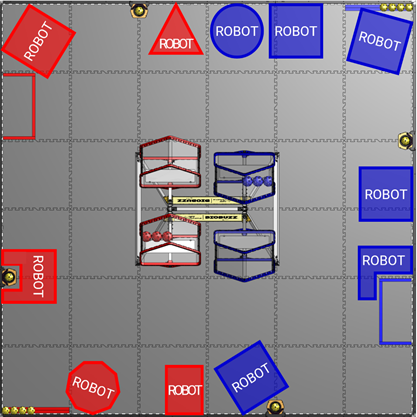
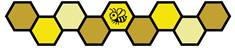

# 11 Game Rules (G) {#s-11}

## 11.1 Personal Safety {#s-11-1}


#### G101 \*Humans, MATCH 중 FIELD에 들어가지 마십시오. {#rule-G101}

Team Member는 MATCH 중 FIELD 안으로 들어갈 수 없습니다.

**위반:** VERBAL WARNING.

> 취지는 Team Member가 FIELD Perimeter 밖에 머물며 Section 11.4.6에서 허용된 경우 외에는 MATCH에 영향을 주지 않는 것입니다. FIELD에 발을 들이거나 몸의 큰 부분을 FIELD 위로 내미는 것은 위반입니다. MATCH에 영향을 주지 않는 Arm Pointing, Waving, Leaning은 위반이 아닙니다.



#### G102 \*ARENA Element와 상호작용할 때 주의하십시오. {#rule-G102}

Team Member는 ARENA Element와 관련하여 다음 행동을 할 수 없습니다.

A. 올라가기(climbing on)

B. 매달리기(hanging from)

C. Human Intervention 없이는 원래 형태로 돌아오지 않도록 Manipulate하기

D. 손상시키기

**위반:** VERBAL WARNING.

> DRIVE TEAM Member는 MATCH 중 언제든 FIELD Perimeter를 지지(brace)할 수 있습니다. FIELD Perimeter를 원래 위치에서 움직이는 것은 G102.C 위반으로 간주합니다.


## 11.2 Conduct {#s-11-2}


#### G201 \*좋은 사람이 되십시오. {#rule-G201}

모든 Team은 FIRST Tech Challenge Event에서 모든 사람에게 예의를 지키고 Team 및 Event Equipment를 존중해야 합니다. 자세한 내용은 FIRST Code of Conduct, FIRST Core Values 및 Section 1.4.2 Framework of Behaviors의 나머지 내용을 참고하십시오.

**위반:** VERBAL WARNING. Event 중 Subsequent Violation이 발생하면 YELLOW CARD.

> 특히 경멸적인 행동은 개인의 ARENA 퇴장, Team DISQUALIFICATION으로 이어질 수 있으며 Escalation Guidelines(추후 공개)에 설명된 추가 Escalation 대상이 될 수 있습니다.



#### G202 \*Competition Integrity Contract(CIC)를 따르십시오. {#rule-G202}

BIOBUZZ를 플레이할 때 팀은 모든 MATCH에서 규칙과 Section 1.5 Competition Integrity Contract (CIC)에 설명된 CIC를 따라야 합니다.

이 규칙을 위반하는 행동의 예는 다음을 포함하되 이에 한정되지 않습니다.

A. 규칙의 정신을 의도적으로 위반하는 행동

B. MATCH를 고의로 포기하거나(throwing MATCHES), 의도적으로 RP를 놓치거나, Ranking을 조작하기 위해 자신의 능력보다 낮게 플레이하는 행동

C. 다른 팀에게 MATCH를 고의로 포기하거나, 의도적으로 RP를 놓치거나, Ranking을 조작하기 위해 능력보다 낮게 플레이하도록 요구하는 행동

D. 다른 팀에게 자신의 MATCH에 나오지 말라고 요구하는 행동

E. 상대방의 주의를 흐트러뜨리거나, 방해하거나, 조롱하는 행동

F. ARENA 운영을 방해하는 행동

**위반:** VERBAL WARNING. 이벤트 중 이후 위반이 발생하면 YELLOW 또는 RED CARD.

> 이 규칙은 게임을 플레이하고 규칙을 지키려는 ALLIANCE가 특정 MATCH에서 팀별로 구체적이고 때로는 비전형적인 역할을 계획하거나 수행하여 ALLIANCE에 기여하는 전략을 금지하기 위한 것이 아닙니다. 
>  
> FIRST에서는 진실성을 갖고 경기하는 것이 필수입니다. YELLOW 또는 RED CARD는 위반의 심각성과 MATCH에 미친 영향에 따라 Head REFEREE의 재량으로 부여됩니다.



#### G203 \*자신의 MATCH에 참석하십시오. {#rule-G203}

Initial Complete Inspection을 통과한 ROBOT의 팀은 각 배정 Qualification MATCH마다 DRIVE TEAM Member 최소 1명이 ARENA에 와서 참가해야 합니다.

**위반:** 현재 MATCH에서 DISQUALIFIED.

> ROBOT이 참가할 수 없으면 Lead Queuer에게 알려야 합니다. 불가피한 사정이 있으면 FIELD STAFF와 Accommodation 가능 여부를 논의하십시오.



#### G204 \*다른 팀을 해쳐 이득을 얻으려 하지 마십시오. {#rule-G204}

상대 ALLIANCE가 규칙을 위반하도록 명확히 강제하는 행동은 FIRST Tech Challenge의 정신에 어긋나며 허용되지 않습니다. 이런 방식으로 강제된 위반은 대상 ALLIANCE에 Penalty를 부여하지 않습니다.

**위반:** Instance마다 MAJOR FOUL. REPEATED이면 Instance마다 MAJOR FOUL 및 MATCH당 YELLOW CARD. 강제로 규칙을 위반한 ALLIANCE에는 Penalty를 부여하지 않습니다.

> 이 규칙은 표준적인 Game Play와 일치하는 전략에는 적용되지 않습니다. 대상 팀이 Penalty를 피할 기회가 거의 또는 전혀 없는 의도적인 행동이어야 합니다. 
>  
> 
> **A.** MATCH 종료 65초 전, Blue ROBOT이 FLOWER에 NECTAR를 득점하려고 정렬해 있을 때 Red ROBOT이 의도적으로 충돌하여 Blue ROBOT이 NECTAR를 일찍 떨어뜨려 G410을 위반하게 하는 경우. 
>  
> 
> **B.** Blue DRIVE TEAM Member가 NECTAR를 FIELD에 투입하는 동안 Red ROBOT이 Blue LOADING ZONE을 통과하면서 Blue NECTAR가 LOADING ZONE의 TILE에 닿기 전에 튕겨내어 G426을 위반하게 하는 경우.



#### G205 \*심각하거나 예외적인 위반. {#rule-G205}

규칙에 열거된 범위를 넘어서는 Egregious Behavior 또는 이벤트 중 어떤 규칙이나 절차의 이후 반복 위반은 금지됩니다.

이 매뉴얼에 명시되어 REFEREE가 목격한 규칙 위반 외에도 Head REFEREE는 이벤트 중 언제든 심각한 ROBOT 행동이나 Team Member 행동에 YELLOW 또는 RED CARD를 부여할 수 있습니다.

지속적인 위반은 FIRST Headquarters에 보고됩니다. FIRST Headquarters는 Event Staff와 협력하여 Award 심사 대상 제외 또는 Event 퇴장을 포함한 추가 Escalation 필요 여부를 결정합니다.

규칙 위반으로 얻는 이득이 Penalty보다 크다는 이유로 규칙을 의도적으로 위반하는 것은 FIRST의 정신에 어긋나며 Egregious Behavior의 예입니다. 예를 들어 Escalation Path가 없는 규칙을 누적 이득이 누적 Penalty보다 크다는 이유로 여러 번 위반하는 경우입니다. 또한 Section 10.6.1에 따라 CARD가 초기화되기 직전 또는 이벤트의 마지막이 될 수 있는 MATCH에서 YELLOW CARD만 발생하는 규칙을 의도적으로 위반하는 경우(예: 팀의 마지막 Qualification MATCH, Lower Bracket MATCH)는 더 엄격하게 검토되며 RED CARD로 이어질 가능성이 높습니다.

추가 세부 내용은 Section 10.6.1 YELLOW and RED CARDS를 참고하십시오.

**위반:** YELLOW 또는 RED CARD.

> 이 규칙의 의도는 Head REFEREE가 이벤트를 원활하게 운영하고 모든 참가자의 안전을 최우선으로 유지하는 데 필요한 유연성을 제공하는 것입니다. 
>  
> Head REFEREE는 규칙 위반 한 번 또는 동일 규칙의 여러 위반에 대해 YELLOW 또는 RED CARD를 부여할 수 있습니다. 팀은 이 매뉴얼의 어떤 규칙도 YELLOW 또는 RED CARD로 Escalate될 수 있음을 알아야 합니다. 이벤트에서 모든 규칙과 위반에 대한 최종 권한은 Head REFEREE에게 있습니다.


## 11.3 Pre-MATCH {#s-11-3}


#### G301 \*MATCH를 지연시키지 마십시오. {#rule-G301}

DRIVE TEAM Member는 MATCH 시작을 상당히 지연시킬 수 없습니다. 팀의 행동이 지연으로 간주되기 전에 다음 두 조건이 모두 충족되어야 합니다.

A. 예상 MATCH 시작 시간이 지났고,

B. DRIVE TEAM이 ARENA에 접근할 수 있는 상태여야 합니다.

Head REFEREE가 팀이 MATCH Ready(G303)가 아니며 동시에 빠르게 MATCH Ready가 되기 위한 Good Faith Effort도 하지 않는다고 판단해야 Significant Delay가 성립합니다.

> **Qualification MATCH:** 예상 시작 시각은 Schedule에 표시된 시각 또는 같은 FIELD의 이전 MATCH 종료 약 3분 후 중 더 늦은 시각입니다. 
>  
> 
> **Playoff MATCH:** Schedule에 표시된 시각 또는 어느 ALLIANCE든 이전 MATCH 후 8분 중 더 늦은 시각입니다. 
>  
> 
> Back-to-back MATCH에서는 T406이 적용되어 더 긴 최소 휴식 시간이 주어질 수 있습니다. 
>  
> 
> DRIVE TEAM Member 1명이 উপস্থিত하고 ROBOT이 MATCH에 참가하지 않는다고 FIELD STAFF에게 알린 팀은 MATCH Ready로 간주되며 이 규칙을 위반하지 않습니다.

**위반:** VERBAL WARNING. 같은 Tournament Phase에서 이후 위반 시 예정된 다음 MATCH에 MAJOR FOUL. Playoff MATCH에서는 VERBAL WARNING이 전체 ALLIANCE에 부여됩니다.

VERBAL WARNING/MAJOR FOUL이 부여된 뒤 2분 이내에 Team/ALLIANCE가 MATCH Ready가 되지 않고 Head REFEREE가 DRIVE TEAM의 Good Faith Effort도 없다고 판단하면 위반 팀의 ROBOT은 DISABLED됩니다.

> 이 규칙은 두 ALLIANCE가 각 MATCH를 준비할 공정한 시간을 제공하고, 불가피한 사정으로 늦는 DRIVE TEAM에게 여유를 주기 위한 것입니다. 팀은 ARENA 운영을 방해하지 말고 Head REFEREE와 FIELD STAFF에게 상태를 적극적으로 알려야 합니다. 
>  
> 
> FIELD STAFF도 준비되지 않았거나 참석하지 않은 팀이 빠르게 준비되기 위해 Good Faith Effort를 하고 있다면 기다리기 위해 성실히 노력합니다. VERBAL WARNING/MAJOR FOUL이 부여되면 Head REFEREE는 2분 Timer를 시작하고 지연 중인 DRIVE TEAM에게 Timer 상태를 알려주기 위해 노력합니다. 
>  
> 
> Good Faith Effort는 ROBOT의 능력을 크게 바꾸는 작업이 아니라 ROBOT을 MATCH Ready 상태로 전환하는 작업이어야 합니다. 허용되는 예는 다음과 같습니다. 
> 
> **A.** ROBOT을 적극적으로 수정하지 않은 채 안전하게 FIELD 쪽으로 이동하는 것 
> 
> **B.** STARTING CONFIGURATION 요건을 맞추기 위해 Tape 또는 Cable Tie로 빠른 수정 작업을 하는 것 
> 
> **C.** DRIVER STATION Device가 Boot되기를 기다리는 것 
> 
> **D.** FTA를 포함한 FIELD Technical Staff와 합리적인 시간 안에 문제를 해결하기 위해 적극적으로 작업하는 것 
> 
> **E.** DRIVER STATION과 ROBOT CONTROLLER의 통신을 확인하기 위한 MOMENTARY “wiggle test”. 이 Test 중 ROBOT은 주행하거나 Pre-loaded POLLEN과의 접촉을 제외하고 SCORING ELEMENT와 상호작용해서는 안 됩니다.



#### G302 \*FIELD에 가져오는 물품을 제한하십시오. {#rule-G302}

ROBOT과 OPERATOR CONSOLE 외에 MATCH에서 사용하기 위해 FIELD로 가져오는 물품은 팀의 지정 ALLIANCE AREA 안에 들어가고 DRIVE TEAM Member가 착용하거나 들고 있거나, Accommodation 용품이어야 합니다. Accommodation 예로는 목발, Cushion, Kneeling Mat, 높이 12 in.(30.5 cm) 이하이며 사람이 올라서도록 설계되고 구르거나 접히지 않게 잠기는 Single-step Stool 등이 있습니다.

위 조건을 충족하더라도 장비는 다음과 같이 사용할 수 없습니다.

A. 정상적인 ARENA 운영을 방해하거나 Safety Hazard를 유발하는 방식

B. TILE 위 6 ft. 6 in.(~198 cm)보다 높게 연장되는 방식

C. 의학적으로 필요한 장비를 제외하고 ARENA 밖의 사람 또는 물체와 통신하는 방식

D. FIELD STAFF 또는 관중의 시야를 가리는 방식

E. 다른 팀의 Remote Sensing 기능을 Jam하거나 방해하는 방식

G302.B는 6 ft. 6 in.를 MOMENTARY하게 초과하는 경우와 PPE 또는 Hat, Headband 등 합리적인 장식 의류를 착용한 사람에게 예외가 적용됩니다.

**위반:** 상황이 해결될 때까지 MATCH를 시작하지 않습니다. MATCH 중 발견되거나 부적절하게 사용되면 VERBAL WARNING. 이벤트 중 이후 위반 시 YELLOW CARD.

> Pre-MATCH ROBOT Setup/Alignment를 돕는 Alignment Device를 FIELD에 가져오는 것은 위반이 아닙니다. 다만 사용 때문에 G301을 위반할 정도로 MATCH 시작이 지연되어서는 안 됩니다. 
>  
> 
> 좁은 ALLIANCE AREA에서 Safety Hazard로 간주될 수 있는 장비의 예에는 Ladder 또는 대형 Signaling Device 등이 있습니다. 
>  
> 
> Wireless Communication을 비활성화한 물품은 G302.C를 충족합니다. 
>  
> 
> Remote Sensing 방해의 예에는 FIELD AprilTag를 모방하거나 MATCH 중 FIELD에 Bright Light 또는 Laser Pointer를 비추는 행동 등이 포함됩니다.



#### G303 \*FIELD의 ROBOT은 MATCH를 플레이할 준비가 되어 있어야 합니다. {#rule-G303}

ROBOT은 다음 MATCH 시작 요건을 모두 충족해야 합니다.

A. Human, ARENA Element 또는 다른 ROBOT에 Hazard를 주지 않을 것

B. Inspection/Re-inspection 관련 요건을 포함하여 Section 3.3 MATCH Eligibility Rules의 모든 요건을 충족할 것

C. Team이 제공한 Item 중 FIELD에 남겨지는 유일한 Item일 것

D. 올바른 ALLIANCE Color를 나타내는 ROBOT SIGNS를 갖출 것(R402 참조)

**위반:** 빠르게 해결할 수 있으면 모든 요건을 충족할 때까지 MATCH를 시작하지 않습니다. 빠른 해결이 아니면 DISABLED되며, Head REFEREE 재량으로 ROBOT Re-inspection이 요구될 수 있습니다. G303.B를 준수하지 않는 ROBOT이 MATCH에 참가하면 RED CARD.

> 위 항목 중 여러 사항을 평가할 때 Head REFEREE는 LRI와 협의할 가능성이 높습니다.



#### G304 \*ROBOT을 FIELD에 올바르게 배치하십시오. {#rule-G304}

ROBOT은 FIELD에서 다음 요건을 모두 충족하도록 배치해야 합니다.

A. 자신의 ALLIANCE Side에 완전히 포함될 것 — Red는 FIELD Column A, B, C / Blue는 D, E, F (Figure 9-4)

B. 어떤 FIELD Element에도 Attach, Entangle 또는 Suspend되지 않을 것

C. FIELD Perimeter Wall에 접촉할 것

D. FLOWER와 접촉하거나 FLOWER Scoring Volume 안에 있지 않을 것

E. LOADING ZONE 안에 있지 않을 것

F. STARTING CONFIGURATION 안에 있을 것(R102, R103 참조)

G. Section 10.3.1에 설명된 정확히 4개의 POLLEN Pre-load와 접촉할 것

H. OpMode Initialization 완료 후 완전히 Motionless할 것

**위반:** 빠른 해결이 가능하면 모든 요건이 충족될 때까지 MATCH를 시작하지 않습니다. 빠른 해결이 아니면 DISABLED 또는 FIELD에서 제거됩니다.

> G304.A는 ROBOT이 FIELD Perimeter 안에 완전히 포함되어야 하며 FIELD Perimeter Wall 밖으로 Overhang할 수 없음을 의미합니다. 
>  
> 각 ROBOT은 ROBOT 내부/위 또는 ROBOT과 접촉하는 TILE 위에 놓인 POLLEN 4개와 접촉한 상태로 시작해야 합니다. MATCH에 나타나지 않은 ROBOT의 POLLEN은 LOADING ZONE에서 Perimeter Wall에 붙여 배치합니다.
> 
> 
> 
> **Figure 11-1 · 허용되는 ROBOT Starting Location 예**



#### G305 \*OpMode를 선택하십시오. {#rule-G305}

DRIVER STATION App에서 OpMode를 선택하고 INIT 버튼으로 초기화해야 합니다. AUTO OpMode이면 30초 AUTO Timer를 활성화해야 합니다.

**위반:** 해결 전 MATCH 시작 안 함. OpMode Initialize가 불가능하거나 빠르게 해결되지 않으면 DISABLED.

> AUTO를 사용하지 않더라도 모든 팀은 OpMode를 선택하고 INIT해야 합니다. AUTO가 없는 팀은 BasicOpMode Sample과 Auto-loading 기능으로 TELEOP를 자동 Queue하는 방법을 고려할 수 있습니다.


## 11.4 In-MATCH {#s-11-4}

### 11.4.1 AUTO {#s-11-4-1}


#### G401 \*AUTO 중 ROBOT과 상호작용하지 마십시오. {#rule-G401}

MATCH 시작 Countdown이 시작된 순간부터 AUTO 종료까지 DRIVE TEAM Member는 ROBOT 또는 OPERATOR CONSOLE과 직접 또는 간접적으로 상호작용할 수 없습니다. 다음은 예외입니다.

A. MATCH 시작 시점의 MOMENTARY Margin 안에서 (▶) Start 버튼을 누르는 것

B. Team 재량 또는 T402에 따른 Head REFEREE 지시에 따라 (■) Stop 버튼을 누르는 것

C. Personal Safety 또는 OPERATOR CONSOLE Safety를 위한 행동

**위반:** VERBAL WARNING. STRATEGIC이면 MAJOR FOUL 및 MATCH당 YELLOW CARD.

> AUTO OpMode를 실행하지 않기로 한 Team은 OpMode를 Start할 필요가 없습니다. 
>  
> G401.A의 취지는 Human Factor에 따른 약간의 Variation을 고려하면서 Team이 AUTO를 제시간에 시작하도록 하는 것입니다.



#### G402 AUTO에서 상대를 방해하지 마십시오. {#rule-G402}

AUTO 중 상대 ALLIANCE의 AUTO를 방해할 수 없습니다. Red는 FIELD Column A/B/C, Blue는 D/E/F에 Priority를 갖습니다.

**위반:** MATCH당 MAJOR FOUL. STRATEGIC이면 MAJOR FOUL + MATCH당 YELLOW CARD.

> AUTO 중 상대 Side로 이동하는 것은 STRATEGIC으로 보일 수 있는 Risky Strategy입니다. 다른 Object에 튕겨 상대 Side로 간 SCORING ELEMENT는 보통 Penalty 대상이 아닙니다.


### 11.4.2 TELEOP {#s-11-4-2}


#### G403 \*AUTO와 TELEOP 사이 ROBOT은 정지해야 합니다. {#rule-G403}

AUTO→TELEOP Transition 동안 ROBOT 또는 MECHANISM의 Powered Movement는 허용되지 않습니다.

**위반:** VERBAL WARNING. STRATEGIC이면 MAJOR FOUL + MATCH당 YELLOW CARD.

> Inertia, Gravity, Actuator De-energizing에 따른 움직임은 Powered Movement가 아닙니다. Transition 중 AUTO Stop, TELEOP Init/Start는 가능하지만 INIT가 Actuator를 움직이게 한다면 TELEOP 시작까지 기다려야 합니다.



#### G404 \*TELEOP 종료 시 ROBOT은 정지해야 합니다. {#rule-G404}

TELEOP 종료 후 Head REFEREE 또는 Designee가 Team에게 ROBOT을 회수해도 된다고 신호할 때까지 ROBOT에는 Powered Movement가 없어야 합니다.

**위반:** VERBAL WARNING. STRATEGIC이면 MAJOR FOUL 및 MATCH당 YELLOW CARD.

> DRIVE TEAM은 DRIVER STATION App의 (■) Stop 버튼을 누르거나 MATCH Period 종료 시 ROBOT Operation을 중단하고 Controller를 내려놓아 ROBOT이 더 이상 Control되고 있지 않음을 명확하게 보여주는 것이 좋습니다. 
>  
> Inertia, Gravity 또는 Actuator De-energizing 등에 의한 움직임은 Powered Movement로 간주하지 않습니다.


### 11.4.3 SCORING ELEMENT {#s-11-4-3}


#### G405 \*SCORING ELEMENT를 FIELD 안에 유지하십시오. {#rule-G405}

ROBOT은 직접 또는 FIELD Element/다른 ROBOT에 튕기는 방식으로 SCORING ELEMENT를 고의로 FIELD 밖으로 Eject할 수 없습니다.

**위반:** SCORING ELEMENT당 MAJOR FOUL.

> Scoring Attempt 또는 ROBOT-to-ROBOT Interaction 결과로 밖으로 나간 것은 Deliberate Ejection으로 보지 않습니다.



#### G406 \*ARENA를 손상시키거나 어지럽히지 마십시오. {#rule-G406}

ROBOT과 DRIVE TEAM Member는 ARENA의 어떤 부분도 어지럽히거나 손상시킬 수 없습니다.

**위반:** VERBAL WARNING. STRATEGIC이면 MAJOR FOUL 및 MATCH당 YELLOW CARD. ROBOT이 손상을 일으켰고 Head REFEREE가 추가 손상 가능성이 있다고 판단하면 DISABLED.

ROBOT이 이후 MATCH에 참가하기 전에 Sharp Edge 제거, 손상 유발 MECHANISM 제거 및/또는 Re-inspection 등의 Corrective Action이 요구될 수 있습니다.

> 이 규칙의 의도는 DRIVE TEAM Member와 ROBOT이 FIELD Element와 SCORING ELEMENT를 포함한 ARENA에 상당한 수리 또는 광범위한 Cleanup이 필요하여 ARENA 운영을 방해할 정도의 부정적 영향을 주지 않도록 하는 것입니다. R201에는 Inspection에서 중점 확인하는 관련 ROBOT Feature 예가 있습니다. 
>  
> 
> SCORING ELEMENT는 ROBOT과 Human이 다루면서 Scratch, Marking, Fatigue에 따른 손상 등 합리적인 Wear and Tear가 예상됩니다. 그러나 반복적으로 홈을 파거나(gouging), 조각을 뜯어내거나, SCORING ELEMENT에 표시를 남기는 행동은 위반입니다.



#### G407 동시에 4개를 초과하지 마십시오. {#rule-G407}

ROBOT은 동시에 4개보다 많은 SCORING ELEMENT를 CONTROL할 수 없습니다.

**위반:** VERBAL WARNING. STRATEGIC이면 MAJOR FOUL 및 MATCH당 YELLOW CARD.

> 이 규칙의 의도는 ROBOT이 한 번에 최대 4개의 SCORING ELEMENT만 CONTROL하며 MATCH를 플레이하도록 하는 것입니다. MATCH 중 어느 때든 5개 이상을 CONTROL하는 ROBOT은 STRATEGIC 여부를 검토받습니다. 
>  
> 
> **STRATEGIC으로 판단될 가능성이 높은 예:** 
> 
> A. ROBOT이 6개 이상의 SCORING ELEMENT를 집어 CONTROL한 뒤 Scoring Location으로 이동하는 경우 
> 
> B. 한 MATCH에서 ROBOT이 5개 이상의 SCORING ELEMENT를 MOMENTARY보다 길게 CONTROL하는 상황이 여러 번 발생하는 경우 
>  
> 
> **STRATEGIC으로 판단될 가능성이 낮은 예:** 
> 
> C. ROBOT이 MOMENTARY하게 5개를 CONTROL했지만 빠르게 “reverse”하여 최소 하나의 SCORING ELEMENT를 대략 원래 상태로 돌려놓는 경우 
>  
> 
> 팀은 의도하지 않았거나 고의적인 4개 초과 CONTROL을 방지하도록 ROBOT을 설계할 것을 권장합니다. 예를 들어 SCORING ELEMENT가 ROBOT 위에 우연히 걸리는 것을 막는 Guard 또는 4개를 초과해 Intake하지 못하게 하는 System을 사용할 수 있습니다. 
>  
> 
> 다음 상호작용은 “CONTROL”이 아니며 위반이 아닙니다. 
> 
> D. “Bulldozing” — FIELD를 이동하는 ROBOT의 경로에 있던 SCORING ELEMENT와 우연히 접촉하는 것 
> 
> E. “Deflecting” — SCORING ELEMENT가 ROBOT에 부딪혀 튕겨 들어오거나 나가는 것 
> 
> F. ROBOT이 LAUNCH한 뒤 더 이상 ROBOT과 접촉하지 않는 SCORING ELEMENT



#### G408 상대 NECTAR를 CONTROL하지 마십시오. {#rule-G408}

ROBOT은 상대 ALLIANCE의 NECTAR를 CONTROL할 수 없습니다.

**위반:** VERBAL WARNING. STRATEGIC이면 MATCH당 YELLOW CARD.



#### G409 SCORING ELEMENT를 Catch하지 마십시오. {#rule-G409}

TIPPED HIVE에서 나온 SCORING ELEMENT가 해당 ROBOT 외의 다른 것에 먼저 접촉하기 전까지 ROBOT은 이를 Catch하거나 Deflect할 수 없습니다.

**위반:** VERBAL WARNING. STRATEGIC이면 MATCH당 YELLOW CARD.

> 이 규칙의 의도는 TIPPED HIVE에서 쏟아진 POLLEN과 NECTAR가 ROBOT이 수집하기 전에 TILE 바닥에 닿도록 하는 것입니다. HIVE 아래에 우연히 있던 ROBOT이 SCORING ELEMENT를 뜻하지 않게 받는 것까지 처벌하려는 것은 아닙니다. 
>  
> 
> 팀은 SCORING ELEMENT를 우연히 Catch하지 않도록 ROBOT을 설계할 것을 권장합니다. 예를 들어 ROBOT 위에 SCORING ELEMENT가 걸리지 않도록 Guard를 둘 수 있습니다. 이런 Feature는 Catching Strategy가 아님을 REFEREE에게 더 명확히 보여줍니다. 
>  
> 
> **STRATEGIC으로 판단될 가능성이 높은 예:** 
> 
> A. ROBOT이 HIVE 아래에 REPEATEDLY 정지하여 TIP을 기다리고 떨어지는 SCORING ELEMENT를 모으는 경우 
> 
> B. ROBOT 상단의 MECHANISM을 넓게 펼쳐 HIVE 아래를 지나며 떨어지는 SCORING ELEMENT를 Catch하는 경우 
> 
> C. HIVE에서 떨어지는 여러 SCORING ELEMENT가 ROBOT에 맞아 다른 것에 닿기 전에 유리한 Vector로 움직이도록 REPEATEDLY 위치를 잡는 경우 
>  
> 
> **STRATEGIC으로 판단될 가능성이 낮은 예:** 
> 
> D. ROBOT이 HIVE 아래를 지나가다가 평평한 표면에 POLLEN 1~2개가 떨어지는 경우 
> 
> E. 더 이상 작동하지 않는 ROBOT이 HIVE 아래에 정지해 있어 SCORING ELEMENT가 위에 쌓이는 경우



#### G410 NECTAR는 마지막 1분에만 FLOWER에 넣을 수 있습니다. {#rule-G410}

ROBOT은 MATCH의 마지막 60초가 되기 전에는 NECTAR를 FLOWER Scoring Volume에 넣을 수 없습니다.

**위반:** NECTAR당 MAJOR FOUL.

> FLOWER Scoring Volume의 자세한 내용은 Section 10.5.2 FLOWER Scoring Criteria를 참고하십시오. 
>  
> Primary FIELD Timer Display가 MATCH에 60초가 남았음을 나타내는 기준입니다. 
>  
> Team은 REFEREE가 NECTAR를 너무 일찍 FLOWER에 넣지 않았음을 명백하고 모호하지 않게 판단할 수 있도록 하는 것이 좋습니다.



#### G411 \*SCORING ELEMENT를 독점하지 마십시오. {#rule-G411}

ALLIANCE는 상대 ALLIANCE가 SCORING ELEMENT에 접근하는 것을 STRATEGIC하게 막을 수 없습니다.

**위반:** MAJOR FOUL + MATCH당 YELLOW CARD.

> 자신의 NECTAR/POLLEN을 Scoring에 사용하는 것은 위반이 아닙니다. 관련 Element를 FIELD의 제한된 부분에 몰아두거나 ROBOT으로 상대 접근을 적극 차단하는 것은 위반입니다. GARDEN은 Protected Zone이 아닙니다.


### 11.4.4 ROBOT {#s-11-4-4}


#### G412 \*ROBOT은 Control 아래 있어야 합니다. {#rule-G412}

ROBOT은 MATCH 중 다음 방식으로 Human 또는 ARENA Element에 과도한 Hazard를 주어서는 안 됩니다.

A. ROBOT 또는 ROBOT이 CONTROL하는 것(예: SCORING ELEMENT)이 FIELD 밖의 어떤 것을 방해하거나 FIELD 밖 Human과 접촉하는 경우

B. ROBOT Operation 자체가 위험한 경우

**위반:** DISABLED 및 VERBAL WARNING. Event 중 Subsequent Violation이 발생하면 MATCH당 YELLOW CARD.

> ARENA 주변에서 ROBOT과 가까운 위치에서 작업할 수 있는 REFEREES 및 기타 FIELD STAFF를 주의하십시오.
> 
> 
> 
> 위반 사례에는 다음이 포함되지만 이에 한정되지 않습니다.
> 
> 
> 
> A. FIELD 밖에서 심하게 휘두르는 행동
> 
> 
> 
> B. DRIVER STATION Stand를 넘어뜨리는 행동
> 
> 
> 
> C. FIELD Timer Display를 움직이거나 손상시키는 행동
> 
> 
> 
> D. FIELD 밖에 있는 FIELD STAFF 또는 DRIVE TEAM Member와 접촉하는 행동
> 
> 
> 
> DRIVER STATION Stand, FIELD 밖의 Floor, 또는 FIELD 바깥쪽의 FIELD Wall Perimeter와 같은 FIELD 밖 ARENA Element와 ROBOT이 접촉하는 것은 이 규칙 위반이 아닙니다.



#### G413 \*지시받으면 ROBOT을 정지하십시오. {#rule-G413}

T402에 따라 REFEREE가 DISABLE을 지시하면 DRIVE TEAM Member는 DRIVER STATION App의 Stop 버튼을 누르고 Controller를 내려놓아야 합니다.

**위반:** VERBAL WARNING. STRATEGIC이면 RED CARD.



#### G414 \*ROBOT은 식별 가능해야 합니다. {#rule-G414}

Head REFEREE가 판단하기에 ROBOT의 Team Number와 ALLIANCE Color가 불분명한 상태가 되어서는 안 됩니다.

**위반:** VERBAL WARNING. STRATEGIC이면 YELLOW CARD.

> Team은 정상 Gameplay 중 ROBOT SIGN이 쉽게 떨어지거나 가려지지 않도록 매우 잘 보이는 위치에 견고하게 부착할 것을 권장합니다. 
>  
> ROBOT이 Subsequent MATCH에 참가하기 전에 ROBOT SIGN 수정과 같은 Corrective Action이 요구될 수 있습니다.



#### G415 \*ARENA와의 상호작용에 주의하십시오. {#rule-G415}

SCORING ELEMENT를 제외하고 ROBOT은 ARENA Element와 다음과 같이 상호작용할 수 없습니다.

A. Grab

B. Grasp

C. Attach

D. Entangle

E. Suspend

**위반:** VERBAL WARNING. STRATEGIC이면 MATCH당 YELLOW CARD. Head REFEREE가 Damage 가능성이 있다고 판단하면 DISABLED.

> 문제가 되는 MECHANISM 제거 및/또는 Re-inspection 같은 Corrective Action이 Subsequent MATCH 참가 전에 요구될 수 있습니다. 
>  
> Alignment를 돕기 위해 FLOWER를 일부 감싸는 Concave Shape의 ROBOT은 이 규칙 위반이 아닙니다.



#### G416 ROBOT Construction Limit을 지키십시오. {#rule-G416}

ROBOT은 MATCH 중 R105의 제한을 위반할 수 없습니다. ROBOT은 다음을 할 수 없습니다.

A. R105.A 또는 R105.B의 Expansion Limit을 초과하도록 확장

B. R105.C에 따라 Part를 고의로 Detach

**위반:** VERBAL WARNING. STRATEGIC이면 Instance당 MAJOR FOUL.

> ROBOT은 MATCH 시작 후 STARTING CONFIGURATION 밖으로 움직이는 Part를 가질 수 있지만, Extension은 R105의 Expansion Limit 안에 있어야 하며 COMPONENT를 고의로 Detach해서는 안 됩니다.



#### G417 HIVE Structure를 간섭하지 마십시오. {#rule-G417}

ROBOT은 Upward-facing CELL에 SCORING ELEMENT를 LAUNCH하는 방법 외에는 어떤 방식으로도 HIVE의 움직임을 Manipulate할 수 없습니다.

**위반:** VERBAL WARNING. STRATEGIC이면 MAJOR FOUL 및 MATCH당 YELLOW CARD.

> HIVE는 Upward-facing CELL에 POLLEN과 NECTAR를 LAUNCH하는 방법으로만 TIP이 일어나도록 설계되고 의도되었습니다. 그 밖의 방식으로 HIVE와 상호작용하여 TIP을 일으키거나, 일으킬 가능성이 있거나, TIP을 방해하는 것은 위반입니다. 
>  
> 
> **STRATEGIC으로 판단될 가능성이 높은 ROBOT 행동:** 
> 
> A. HIVE Frame에 고속으로 충돌 
> 
> B. 짧은 시간 동안 HIVE Frame에 여러 번 충돌 
> 
> C. CELL의 외부 Bottom, Side 또는 Top Face에 NECTAR/POLLEN을 의도적으로 LAUNCH 
> 
> D. 상대 HIVE에 NECTAR/POLLEN을 LAUNCH하여 TIP을 방해 
> 
> E. HIVE에 직접 접촉하거나 CONTROL 중인 SCORING ELEMENT를 통해 간접적으로 접촉 
> 
> F. Warning 이후 REPEATED되는 행동 
>  
> 
> **STRATEGIC으로 판단될 가능성이 낮은 행동:** 
> 
> G. POLLEN을 줍는 과정에서 ROBOT이 우연히 HIVE Frame에 부딪힘 
> 
> H. Upward-facing CELL로 POLLEN/NECTAR를 LAUNCH하려다 빗나가 CELL의 Bottom, Side 또는 Top에 맞음



#### G418 FLOWER를 간섭하지 마십시오. {#rule-G418}

ROBOT은 다음 예외 외에는 FLOWER에 SCORING ELEMENT를 넣거나 FLOWER에서 SCORING ELEMENT를 제거할 수 없습니다.

A. POLLEN과 NECTAR는 FLOWER의 위쪽으로만 넣을 수 있습니다.

B. POLLEN만 FLOWER의 아래쪽에서 제거할 수 있습니다.

**위반:** VERBAL WARNING. STRATEGIC이면 MAJOR FOUL 및 MATCH당 YELLOW CARD.

> FLOWER는 POLLEN과 NECTAR가 Top Ring의 위쪽을 통해서만 들어가고, Middle Ring 아래에서는 POLLEN만 제거되도록 설계되었습니다. 그 밖의 방식으로 SCORING ELEMENT를 Scoring하거나 제거하는 것은 위반입니다. 다만 허용된 Scoring Action을 시도하는 과정의 FLOWER 접촉까지 금지하려는 것은 아닙니다. 
>  
> 
> **위반이 아닌 ROBOT 행동:** 
> 
> A. SCORING ELEMENT를 넣거나 제거하려는 과정에서 FLOWER에 접촉 
> 
> B. 득점하려는 과정에서 FLOWER 안의 득점된 POLLEN/NECTAR에 접촉 
> 
> C. FLOWER로 주행하면서 안의 POLLEN/NECTAR에 접촉 
>  
> 
> **STRATEGIC으로 판단될 가능성이 높은 행동:** 
> 
> D. FLOWER 측면을 통해 POLLEN을 끌어내려 함 
> 
> E. FLOWER를 잡고 흔듦 
> 
> F. MECHANISM으로 NECTAR를 Middle Ring 밖으로 강제로 밀어냄 
> 
> G. Perimeter Wall에 고속으로 의도적으로 충돌하여 FLOWER에서 SCORING ELEMENT를 떨어뜨림 
> 
> H. NECTAR를 FLOWER Pipe 옆에 의도적으로 들어 올려 FLOWER Scoring Criteria를 충족시킴 
>  
> 
> **STRATEGIC으로 판단될 가능성이 낮은 행동:** 
> 
> I. TILE의 POLLEN을 줍다가 FLOWER에 충돌해 POLLEN 하나가 FLOWER 위로 빠져나옴 
> 
> J. 다른 POLLEN을 Scoring하려다 이미 득점된 POLLEN을 밀어냄


### 11.4.5 Opponent Interaction {#s-11-4-5}

G419와 G420은 상호 배타적입니다. 하나의 ROBOT-to-ROBOT Interaction이 둘 이상을 위반하면 가장 강한 Penalty 하나만 적용합니다.


#### G419 \*상대 ROBOT을 손상시키지 마십시오. {#rule-G419}

ROBOT은 상대 ROBOT을 손상시키거나 기능적으로 Impair할 수 없습니다.

**위반:** VERBAL WARNING. STRATEGIC이면 Instance마다 MAJOR FOUL 및 YELLOW CARD. STRATEGIC이며 상대 ROBOT이 Unable to Drive이면 Instance마다 MAJOR FOUL 및 RED CARD.

> BIOBUZZ는 상호작용이 매우 많은 Game이며 Defensive/High-contact Gameplay가 포함될 수 있습니다. 이 규칙은 상대를 STRATEGIC하게 손상시키는 것을 금지하고 심각한 ROBOT 손상을 줄이기 위한 것이므로 팀은 ROBOT을 Robust하게 설계해야 합니다. 
>  
> 
> 정상 Gameplay 중 노출되거나 보호되지 않은 COMPONENT/MECHANISM의 손상 또는 기능 저하는 일반적으로 위반으로 보지 않습니다. 예: 
> 
> A. 노출되거나 보호되지 않은 Main Power Switch(R603 참조) 
> 
> B. 노출되거나 보호되지 않은 Wiring 
> 
> C. 섬세하게 제작된 MECHANISM(예: Intake) 
>  
> 
> 불안정하거나 불리한 자세의 상대 ROBOT과 상호작용할 때에는 상대를 손상시키지 않으려 한다는 점이 명백하고 모호하지 않도록 해야 합니다. 
>  
> 
> **STRATEGIC으로 판단될 가능성이 높은 예:** 
> 
> D. 상대 ROBOT을 고속으로 Ram하거나 REPEATEDLY 충돌하여 손상을 일으킴 
>  
> 
> **다른 ROBOT의 기능을 저하시키는 예:** 
> 
> E. COMPONENT 작동에 필요한 ROBOT CHASSIS 내부 Wiring을 분리 
> 
> F. 상대 ROBOT Battery를 분리 — ROBOT이 더 이상 Drive할 수 없으므로 RED CARD가 명확히 적용되는 예 
> 
> G. 합리적으로 잘 보호된 상대 ROBOT의 Power Switch에 접촉하여 전원을 끔 — 역시 ROBOT이 더 이상 Drive할 수 없으므로 RED CARD가 명확히 적용되는 예 
>  
> 
> MATCH 종료 후 Head REFEREE는 MATCH 중 이 규칙의 위반 여부를 확인하기 위해 ROBOT을 육안 검사할 수 있으며, 손상을 확인할 수 없다면 Violation을 철회할 수 있습니다. 
>  
> 
> **“Unable to drive”**란 해당 Incident 때문에 DRIVER가 합리적인 시간 안에 원하는 위치로 더 이상 주행할 수 없는 상태를 의미합니다. 예를 들어 ROBOT이 원만 그리며 움직이거나 극도로 느리게만 움직일 수 있다면 Unable to Drive로 간주합니다.



#### G420 \*상대를 Tip하거나 Entangle하지 마십시오. {#rule-G420}

ROBOT은 상대 ROBOT에 Attach하거나, 상대 ROBOT을 Tip Over하거나, Entangle할 수 없습니다.

**위반:** VERBAL WARNING. STRATEGIC이면 Instance마다 MAJOR FOUL 및 YELLOW CARD. STRATEGIC이며 CONTINUOUS이거나 상대 ROBOT이 Unable to Drive이면 Instance마다 MAJOR FOUL 및 RED CARD.

> **STRATEGIC으로 판단될 가능성이 높은 예:** 
> 
> A. Wedge 형태의 MECHANISM을 사용하여 상대 ROBOT을 넘어뜨림 
> 
> B. 이미 넘어졌다가 스스로 바로 세우려는 상대 ROBOT과 Frame-to-frame 접촉하여 다시 넘어뜨림 
> 
> C. 상대 ROBOT이 기울기 시작한 뒤 REFEREE가 보기에 피할 수 있었던 접촉을 하여 상대를 넘어뜨림 
>  
> 
> 정상적인 ROBOT-to-ROBOT Interaction의 의도하지 않은 결과로 발생한 Tipping, 예를 들어 단 한 번의 Frame-to-frame Hit로 ROBOT이 넘어지는 것은 REFEREE가 보기에 STRATEGIC 위반이 아닙니다. 
>  
> 
> **“Unable to drive”**는 Incident 때문에 DRIVER가 합리적인 시간 안에 원하는 위치로 주행할 수 없는 상태입니다. 예를 들어 원만 그리거나 극도로 느리게만 움직일 수 있다면 Unable to Drive입니다.



#### G421 \*PIN은 3-Count 제한입니다. {#rule-G421}

ROBOT은 상대 ROBOT을 3초보다 길게 PIN할 수 없습니다. 직접 접촉 또는 FIELD Element에 밀어 붙이는 것과 같은 간접(Transitive) 접촉으로 상대 ROBOT의 움직임을 막으면 PINNING입니다.

PIN Count는 다음 중 하나가 충족되면 종료됩니다.

A. ROBOT들이 서로 최소 2 ft.(~61 cm) 떨어진 상태를 3초보다 길게 유지

B. 어느 ROBOT이든 PIN이 시작된 위치에서 2 ft. 이상 이동한 상태를 3초보다 길게 유지

C. PINNING ROBOT이 오히려 PINNED됨

G421.A에서는 ROBOT들이 2 ft. 떨어지는 순간 PIN Count가 Pause되고, PIN이 끝나거나 PINNING ROBOT이 다시 2 ft. 안으로 들어올 때까지 Pause됩니다. 다시 2 ft. 안으로 들어오면 Count가 Resume됩니다.

G421.B에서는 어느 ROBOT이든 PIN 시작 위치에서 2 ft. 이동하면 PIN Count가 Pause되고, PIN이 끝나거나 두 ROBOT 모두 다시 2 ft. 안으로 돌아올 때까지 Pause됩니다. 두 ROBOT이 다시 범위 안으로 들어오면 Count가 Resume됩니다.

**위반:** Instance마다 MAJOR FOUL 및 상황이 시정되지 않는 매 3초마다 추가 MAJOR FOUL.


### 11.4.6 Human {#s-11-4-6}


#### G422 \*DRIVE TEAM은 ALLIANCE AREA에 머무르십시오. {#rule-G422}

MATCH가 시작된 뒤 DRIVE TEAM Member는 지정된 ALLIANCE AREA를 떠날 수 없습니다.

**위반:** VERBAL WARNING. STRATEGIC이면 Instance당 MINOR FOUL.

> 이 규칙의 취지는 DRIVE TEAM Member가 MATCH 중 Competitive Advantage를 얻기 위해 배정된 ALLIANCE AREA를 떠나는 것을 막는 것입니다. 예를 들어 더 나은 시야를 얻기 위해 FIELD의 다른 위치로 이동하거나 FIELD 안으로 손을 뻗는 행동입니다. 정상 MATCH Play 중 AREA Plane을 단순히 넘는 것은 위반이 아닙니다. 
>  
> DRIVE TEAM은 MATCH 중 ALLIANCE AREA 안 어디에든 있을 수 있습니다. ALLIANCE AREA 안에 머무른 채 손이 닿는 범위에 있는, FIELD 밖으로 나온 자신의 ALLIANCE NECTAR를 회수할 수 있습니다. 
>  
> Safety와 관련된 경우에는 예외가 허용됩니다.



#### G423 \*DRIVE COACH와 다른 팀은 Controller를 만지지 마십시오. {#rule-G423}

MATCH가 시작되면 DRIVE COACH 또는 다른 팀의 Member는 OPERATOR CONSOLE의 Gamepad를 다룰 수 없습니다.

**위반:** VERBAL WARNING. STRATEGIC이면 MAJOR FOUL 및 MATCH당 YELLOW CARD.

> 종교 휴일, 주요 시험, 교통 문제 등 큰 충돌로 인한 불가피한 사정이 있으면 FIELD STAFF와 Accommodation 가능 여부를 논의해야 합니다. 
>  
> 
> 원한다면 DRIVE COACH는 DRIVERS를 다음 방식으로 도울 수 있습니다. 
> 
> A. DRIVER STATION Device를 들기 
> 
> B. DRIVER STATION Device Troubleshooting 
> 
> C. DRIVER STATION App에서 OpMode 선택 
> 
> D. DRIVER STATION App의 INIT 버튼 누르기 
> 
> E. DRIVER STATION App의 (▶) Start 버튼 누르기 
> 
> F. DRIVER STATION App의 (■) Stop 버튼 누르기



#### G424 \*DRIVE COACH는 SCORING ELEMENT를 만지지 마십시오. {#rule-G424}

Safety 목적을 제외하고 DRIVE COACH는 SCORING ELEMENT에 접촉할 수 없습니다.

**위반:** VERBAL WARNING. STRATEGIC이면 Instance당 MINOR FOUL.



#### G425 \*DRIVE TEAM은 손이 닿는 범위를 주의하십시오. {#rule-G425}

MATCH 시작 후 DRIVE TEAM Member는 직접 또는 간접적으로 다음 행동을 할 수 없습니다.

A. ROBOT에 접촉

B. ROBOT 또는 TILE과 접촉 중인 SCORING ELEMENT에 접촉

C. SCORING ELEMENT Scoring을 방해

D. FIELD Element에 접촉

**위반:** VERBAL WARNING. STRATEGIC이면 MAJOR FOUL 및 MATCH당 YELLOW CARD.

> Hand-held Controller, 늘어진 Wire, Clothing 및 ALLIANCE AREA 안의 다른 물체도 DRIVE TEAM Member가 ROBOT에 간접 접촉하게 할 수 있으며 위반입니다. Safety와 관련된 경우에는 예외가 적용됩니다. 
>  
> 
> G425.A와 G425.B의 Penalty는 DRIVE TEAM Member와 ROBOT 중 어느 쪽이 접촉을 시작했는지와 관계없이 DRIVE TEAM Member에게 적용됩니다. 
>  
> 
> Scoring 방해의 예는 다음을 포함하되 이에 한정되지 않습니다. 
> 
> A. ROBOT이 FLOWER에 Scoring하지 못하도록 막는 행동 
> 
> B. FLOWER에서 NECTAR/POLLEN을 Descore하기 위해 Perimeter Wall을 의도적으로 치거나 흔드는 행동



#### G426 Human은 NECTAR를 너무 일찍 FIELD에 넣을 수 없습니다. {#rule-G426}

DRIVE TEAM Member는 다음 경우를 제외하고 NECTAR를 FIELD에 투입할 수 없습니다.

A. 자신의 ALLIANCE Color에 해당하는 HIVE가 TIPPED될 때마다 해당 ALLIANCE를 위해 NECTAR 1개를 투입할 수 있음

B. MATCH에 60초 이하가 남으면 남은 모든 NECTAR를 투입할 수 있음

위 두 조건 중 먼저 충족되는 조건을 적용합니다.

**위반:** NECTAR당 MINOR FOUL.

> Primary FIELD Timer가 MATCH에 60초가 남았음을 나타내는 기준입니다. 
>  
> DRIVE TEAM은 ALLIANCE AREA에 남아 있는 NECTAR가 잘 보이도록 하고, REFEREE가 너무 일찍 NECTAR를 투입하지 않았음을 명백하고 모호하지 않게 판단할 수 있도록 하는 것이 좋습니다.



#### G427 Human은 LOADING ZONE을 통해서만 NECTAR를 넣으십시오. {#rule-G427}

NECTAR는 다음 조건을 모두 충족하는 경우에만 FIELD에 투입할 수 있습니다.

A. Tool을 사용하지 않고,

B. 해당 색 ALLIANCE의 DRIVE TEAM Member가 투입하며,

C. NECTAR가 ROBOT 또는 FIELD Element에 접촉하기 전에 LOADING ZONE 안의 TILE에 먼저 접촉해야 합니다.

**위반:** NECTAR당 MINOR FOUL.

> 이 규칙의 의도는 DRIVE TEAM Member가 자신의 NECTAR만 LOADING ZONE을 통해 FIELD에 넣도록 하는 것입니다. 투입 방식에 제한이 많지는 않지만 경쟁상 이점을 얻기 위해 이 규칙의 경계를 시험해서는 안 됩니다. 
>  
> 
> Human이 HIVE 또는 FLOWER에 직접 Scoring하는 것은 절대 허용되지 않으며 G202 위반 대상입니다. 
>  
> 
> DRIVE TEAM Member가 FIELD 밖으로 나온 POLLEN 또는 상대 ALLIANCE NECTAR를 가지게 되면 Section 10.8에 따라 가장 가까운 FIELD STAFF에게 전달하여 FIELD에 다시 투입하도록 해야 합니다. 
>  
> 
> NECTAR를 투입할 때 DRIVE TEAM Member는 G425를 위반하지 않도록 TILE과 접촉 중인 다른 SCORING ELEMENT를 만지지 않아야 합니다.



#### G428 Human은 SCORING ELEMENT를 FIELD에서 제거하지 마십시오. {#rule-G428}

DRIVE TEAM Member는 SCORING ELEMENT를 FIELD에서 제거할 수 없습니다.

**위반:** SCORING ELEMENT당 MINOR FOUL.

> SCORING ELEMENT가 TILE과 접촉하고 있거나, ROBOT, FIELD Element 또는 다른 SCORING ELEMENT의 안에 있거나 및/또는 위에 있는 경우 해당 SCORING ELEMENT는 **FIELD 위에 있는 것으로 간주**합니다.


