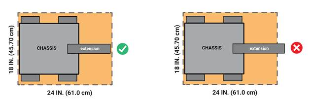
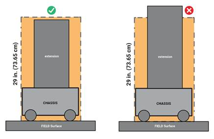
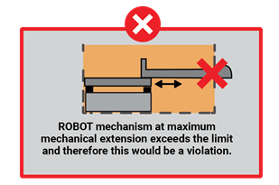
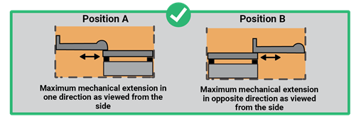
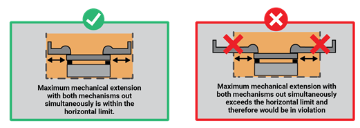
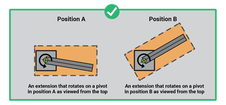
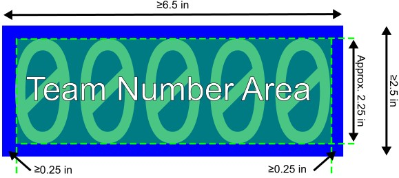
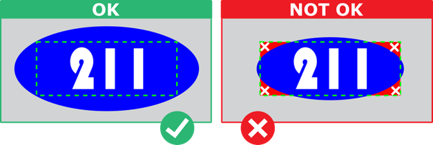
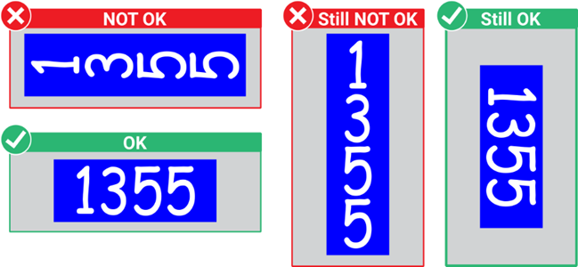

# 12 ROBOT Construction Rules (R)

아래 규칙은 합법적인 부품과 재료, 그리고 그러한 부품과 재료를 ROBOT에 어떻게 사용할 수 있는지를 명확히 규정합니다. ROBOT은 현재 시즌의 Game을 플레이하기 위해 FIRST Tech Challenge 팀이 제작한 Electromechanical Assembly이며, Game에 능동적으로 참여하는 데 필요한 기본 System, 즉 Power, Communication, Control, FIELD에서의 Movement를 포함합니다.

이 규칙 구조에는 Safety, Reliability, Parity, 합리적인 Design Challenge 제공, Professional Standard 준수, Competition에 미치는 영향 등 여러 이유가 있습니다.

또 다른 목적은 ROBOT의 모든 Energy Source와 Active Actuation System(예: Battery, Motor, Servo 및 Controller)이 잘 정의된 선택지 안에서 사용되도록 하는 것입니다. 이를 통해 모든 팀이 동일한 Actuation Resource에 접근할 수 있고 INSPECTOR가 부품의 합법성을 정확하고 효율적으로 판단할 수 있습니다.


이 Section의 ROBOT Construction Rules는 Inspection 대상이 되는 ROBOT의 제작 상태에만 적용됩니다. MATCH 중의 Game Play 규칙과 위반 결과는 Section 11 Game Rules (G)에 설명되어 있습니다.


ROBOTS는 COMPONENT와 MECHANISM으로 구성됩니다.

* **COMPONENT** — 손상·파괴하거나 기본 기능을 바꾸지 않고는 더 이상 분해할 수 없는 가장 기본 구성의 부품
* **MECHANISM** — ROBOT에서 특정 기능을 제공하도록 COMPONENT를 조립한 것. 손상 없이 개별 COMPONENT로 분해하고 다시 조립할 수 있습니다.

이 Section의 여러 규칙은 Commercial-Off-The-Shelf(**COTS**) Item을 언급합니다. COTS Item은 모든 팀이 구매할 수 있도록 VENDOR가 일반적으로 판매하는 표준품(즉, Custom Order가 아닌 부품)이어야 합니다. COTS로 간주되려면 Software 설치 또는 수정의 예외를 제외하고 COMPONENT 또는 MECHANISM이 변경·개조되지 않은 상태여야 합니다.

더 이상 상업적으로 판매되지 않더라도 VENDOR가 처음 공급한 상태와 기능적으로 동일한 Item은 COTS로 간주합니다.


**예 1:** 팀이 RoboPanels Corp.에서 ROBOT Panel 2개를 구입했습니다. 하나는 보관하고, 다른 하나에는 무게를 줄이기 위해 “lightening holes”를 뚫었습니다. 첫 번째 Panel은 여전히 COTS이지만 두 번째 Panel은 수정되었으므로 FABRICATED ITEM입니다.\
 

**예 2:** 팀이 Wheels-R-Us Inc.에서 일반 판매되는 Drive Module의 공개 Blueprint를 구해 지역 Machine Shop “We-Make-It, Inc.”에 복제품 제작을 의뢰했습니다. 제작된 부품은 We-Make-It, Inc.의 표준 재고로 일반 판매되는 제품이 아니므로 COTS가 아닙니다.\
 

**예 3:** 팀이 전문 Publication에 공개된 Design Drawing을 사용해 ROBOT용 Gearbox를 제작했습니다. Design Drawing 자체는 COTS로 간주되어 Gearbox를 제작하기 위한 “raw material”처럼 사용할 수 있지만 완성된 Gearbox는 FABRICATED ITEM이며 COTS가 아닙니다.\
 

**예 4:** 비기능적인 Label Marking만 추가한 COTS Part는 여전히 COTS지만, 특정 장치용 Mounting Hole을 추가한 COTS Part는 FABRICATED ITEM입니다.\
 

**예 5:** 단종된 COTS Gearbox가 원래 공급 상태와 기능적으로 동일하다면 사용할 수 있습니다.


**VENDOR**는 COTS Item을 제공하는 합법적인 Business Source이며 다음 모든 기준을 충족해야 합니다.

A. 미국 내 VENDOR는 Federal Tax Identification Number를 가지고 있어야 합니다. 미국 외 VENDOR는 자국 정부가 해당 국가에서 합법적으로 영업할 수 있는 Business임을 확인하는 동등한 Registration 또는 License를 보유해야 합니다.

B. FIRST 팀 또는 여러 팀이 “wholly owned subsidiary” 형태로 소유한 조직이어서는 안 됩니다. 팀과 VENDOR 양쪽에 관련된 개인이 일부 있을 수는 있지만 팀과 VENDOR의 Business/Activity는 완전히 분리될 수 있어야 합니다.

C. 일반 제품(즉 FIRST 전용 제품이 아닌 제품)을 적절한 기간 안에 출고할 수 있도록 충분한 재고 또는 생산 능력을 유지해야 합니다. 전 세계 공급망 혼란이나 1,000개 FIRST 팀이 동시에 같은 부품을 주문하는 것 같은 비정상적인 상황에서는 대형 VENDOR도 Backorder 때문에 지연될 수 있으며, 평소보다 높은 주문량에 따른 이런 지연은 허용됩니다.

이 C 기준은 VENDOR이면서 Fabricator이기도 한 업체의 Custom-built Item에는 적용되지 않을 수 있습니다.


예를 들어 VENDOR가 팀의 Drive System Tread로 사용할 Flexible Belting을 판매한다고 합시다. VENDOR가 표준 재고 Belting을 Custom Length로 절단하고 Loop 형태로 Welding하여 2주 뒤 배송한다면 완성된 Tread는 FABRICATED ITEM이며 2주의 제작·배송 기간도 허용됩니다. 또는 팀이 직접 Tread를 제작할 수 있습니다.\
 

반면 COTS 요건을 충족하려면 VENDOR는 Shelf Stock의 Belting 길이를 영업일 기준 5일 이내에 팀에 발송하고 절단부 Welding은 팀이 하도록 하면 됩니다.


D. 모든 FIRST Tech Challenge 팀이 제품을 구매할 수 있어야 합니다. 특정 일부 팀만 이용할 수 있도록 공급을 제한해서는 안 됩니다.


이 정의의 목적은 가능한 한 폭넓게 합법적인 Source 사용을 허용하는 동시에, 임시로 만든 조직이 특정 일부 팀에 Special-purpose Product를 제공하여 적용 가능한 Cost Accounting Rule을 우회하는 것을 막는 것입니다.

FIRST는 팀이 가능한 한 폭넓은 합법적 Source에서 COTS Item을 선택하고 가장 좋은 가격과 Service를 제공하는 곳에서 구입할 수 있기를 바랍니다. 동시에 짧은 Build Season 동안 부품 공급 지연이 ROBOT 완성에 영향을 줄 수 있으므로 VENDOR는 제품, 특히 FIRST 전용 Item을 합리적인 시간 안에 제공할 수 있어야 합니다.

선택한 VENDOR는 이상적으로 효과적인 Distribution Channel을 갖추는 것이 좋습니다. FIRST Tech Challenge Event는 항상 집 근처에서 열리는 것이 아니므로, 부품이 고장 났을 때 현지에서 Replacement Material을 구할 수 있는지가 중요할 수 있습니다.


**FABRICATED ITEM**은 ROBOT에서 최종적으로 사용될 형태의 일부 또는 전부가 되도록 Altered, Built, Cast, Constructed, Concocted, Created, Cut, Heat-treated, Machined, Manufactured, Modified, Painted, Produced, Surface-coated 또는 기타 방식으로 만들어진 COMPONENT 또는 MECHANISM입니다.


어떤 Item(일반적으로 Raw Material)은 COTS도 아니고 FABRICATED ITEM도 아닐 수 있습니다. 예를 들어 20 ft.(\~610 cm) 길이 Aluminum을 보관 또는 운반을 위해 Team이 5 ft.(\~152 cm) 조각으로 잘랐다면, VENDOR에서 받은 상태가 아니므로 COTS는 아니지만 ROBOT에서 사용할 최종 형태를 향해 가공하기 위해 자른 것이 아니므로 FABRICATED ITEM도 아닙니다.


Inspection에서 합법 부품의 제한을 규정한 Rule(예: Motor, Servo, Current Limit, COTS Electronics)에 대해 Item의 합법성을 증명하도록 Documentation, 즉 이 Manual의 관련 Rule Reference를 요구받을 수 있습니다.

부품의 합법성에 질문이 있으면 customerservice@firstinspires.org로 문의하여 공식 판정을 받으십시오. 향후 FIRST Tech Challenge 시즌에 포함할 Alternate Part/Device 승인을 요청할 때에도 같은 절차를 사용하십시오.

## 12.1 General ROBOT Design 

FIRST Tech Challenge는 접촉이 많고 강도 높은 Gameplay를 포함할 수 있습니다. 규칙은 의도적인 ROBOT 손상을 제한하지만 ROBOT 간 Interaction 자체는 허용되며 예상됩니다. 팀은 ROBOT을 Robust하게 설계해야 합니다.


#### R101 \*이 ROBOT은 여러분 팀의 ROBOT이어야 합니다. 

ROBOT과 그 MAJOR MECHANISMS는 이벤트에 등록되어 있고 MATCH에 참가하거나 Judged Award 심사에 사용할 해당 FIRST Tech Challenge 팀이 제작해야 합니다.

**MAJOR MECHANISM**은 다음 Game Challenge 중 최소 하나를 수행하기 위해 COMPONENT 및/또는 MECHANISM을 조립한 Group입니다: ROBOT Movement, SCORING ELEMENT Manipulation, FIELD Element Manipulation, 또는 다른 ROBOT의 도움 없이 Scorable Task 수행.

> 이 규칙은 ROBOT과 MAJOR MECHANISM이 그 팀에 의해 제작되어야 함을 요구하지만 다른 팀의 도움(예: 부품 Fabrication, Construction 지원, Software 작성, Game Strategy 개발, COMPONENT/MECHANISM 제공)을 금지하거나 억제하기 위한 것은 아닙니다.
>
> 일반적으로 MAJOR MECHANISM으로 보지 않으므로 이 규칙의 적용을 받지 않는 예는 다음과 같습니다.
>
> A. Gearbox Assembly
>
> B. MAJOR MECHANISM의 일부인 COMPONENT 또는 MECHANISM
>
> C. COTS Item
>
> 이 규칙의 취지는 ROBOT이 현재 Team Member의 경험을 대표하는 결과물이어야 한다는 것이며, 외부 Organization이나 Company가 완성형 Solution을 통째로 제공하는 것을 막기 위한 것입니다. R301과 R303도 참고하십시오.



#### R102 \*STARTING CONFIGURATION은 18-inch Cube로 제한됩니다. 

STARTING CONFIGURATION(MATCH를 시작할 때의 물리적 ROBOT 상태)에서 ROBOT의 모든 부분은 완전히 정지해 있어야 하고, ROBOT 전체는 18 in.(45.70 cm) 폭 × 18 in.(45.70 cm) 길이 × 18 in.(45.70 cm) 높이 Volume 안에 완전히 들어가야 합니다.

> ROBOT이 Section 3.3 MATCH Eligibility Rules에 따라 교체 가능한 MECHANISM을 사용하는 경우 팀은 모든 Configuration이 이 규칙과 R105를 충족함을 보여줄 준비가 되어 있어야 합니다.
>
> Pre-loaded SCORING ELEMENT는 시작 크기 제한 Volume 밖으로 나가도 됩니다.



#### R103 \*STARTING CONFIGURATION 유지에 ROBOT의 힘을 사용할 수 있습니다. 

STARTING CONFIGURATION에서 ROBOT은 완전히 Self-supported여야 합니다. 즉 Sizing Tool의 옆면이나 윗면에 힘을 가해서는 안 됩니다. 다음 방법을 단독 또는 조합하여 사용할 수 있습니다.

A. 전원이 꺼진 상태에서 Mechanical Means로 유지

B. Servo와 Motor를 원하는 정지 위치로 Pre-position하는 OpMode Initialization. OpMode는 STARTING CONFIGURATION을 유지하기 위해 Motor와 Servo가 위치를 유지하도록 제어할 수 있습니다.

> Inspection 중 또는 MATCH 시작 대기 중 STARTING CONFIGURATION을 유지해야 하는 시간은 몇 분이 될 수 있으므로 Thermal Failure 가능성을 줄여야 합니다. 예를 들어 Motor를 Hard Stop에 계속 Stall시키는 방식은 피하십시오. Inspection 중 구동 중인 ROBOT을 사용할 때에는 INSPECTOR에게 ROBOT이 Live 상태임을 알리십시오.



#### R104 \*ROBOT 무게 제한은 없습니다. 

BIOBUZZ를 플레이하는 FIRST Tech Challenge ROBOT에는 명시적인 Weight Limit이 없습니다.

> 공식 무게 제한은 없지만 팀은 ROBOT Weight가 다음 요소 등에 미치는 영향을 고려해야 합니다.
>
> * FIELD TILE Damage
> * Battery Consumption
> * ROBOT Transportation
> * Overall ROBOT Performance



#### R105 ROBOT은 하나의 Assembly로 유지되어야 하며 Expansion Limit이 있습니다. 

MATCH가 시작된 뒤 ROBOT은 STARTING CONFIGURATION 밖으로 확장할 수 있지만 초기 STARTING CONFIGURATION을 기준으로 다음 Sizing Constraint를 항상 지켜야 합니다.

A. MATCH 시작 후 fully expanded 상태에서도 항상 18 in.(45.70 cm) × 24 in.(61.0 cm) × 높이 29 in.(73.65 cm) Sizing Volume 안에 있어야 합니다(G416 참조).

B. Software 없이 Mechanical Constraint만으로 이 제한 안에 들어가도록 해야 합니다.

C. COMPONENT를 의도적으로 분리하도록 설계할 수 없습니다.

Sizing Limit Volume은 FIELD Surface를 기준으로 정의하며 29 in.(73.65 cm) 치수는 언제나 FIELD Surface에서 수직 높이가 되도록 Orientation이 고정됩니다.

**Figure 12-1 · Expansion Limit – Top View**

**Figure 12-2 · Expansion Limit – Side View**

> Sizing Limit Volume은 FIELD Surface를 기준으로 정의되며, 29 in.(73.65 cm) 치수는 항상 FIELD Surface 위의 수직 높이가 되도록 Orientation이 고정됩니다.
>
> ROBOT은 정상 Gameplay에서 사용하는 “stable” Configuration(예: 모든 Wheel이 TILE에 접촉하는 상태)을 기준으로 측정합니다. FIELD Interaction 때문에 ROBOT이 약간 기울어진 경우, Stable Configuration으로 되돌렸을 때 Sizing Volume 안에 있다면 이 규칙 위반이 아닙니다.
>
> 팀은 INSPECTOR에게 ROBOT이 어떤 Configuration에서도 Sizing Volume 밖으로 나가지 않음을 보여줄 준비가 되어 있어야 합니다. Inspection 중 ROBOT의 최대 Mechanical Extension을 보여주어야 합니다. Software로 MATCH 중 Extension Position을 제한하더라도 Mechanically Sizing Limit을 넘을 수 있다면 위반입니다.
>
> 
>
> **Figure 12-3 · Expansion Limit – Sizing Limit Violation**
>
> 하나의 MECHANISM이 ROBOT 양쪽으로 확장될 수 있더라도 최대 Mechanical Extension에서 전체 치수가 Limit을 넘지 않는다면 허용됩니다.
>
> 
>
> **Figure 12-4 · Expansion Limit – Allowable Extension**
>
> Mechanical Link가 없는 여러 MECHANISM이 ROBOT 양쪽으로 동시에 확장될 수 있고, 최대 Mechanical Extension에서 전체 Horizontal Dimension이 Limit을 넘는다면 허용되지 않습니다.
>
> 
>
> **Figure 12-5 · Expansion Limit – Simultaneous Extension**
>
> Horizontal Plane에서 Pivot을 중심으로 회전하는 Extension은 이동 경로의 어느 지점에서도 전체 치수가 Limit을 넘지 않는다면 허용됩니다.
>
> 
>
> **Figure 12-6 · Expansion Limit – Rotating Extension**


## 12.2 Fair Play & Damage Prevention 


#### R201 \*ROBOT은 ARENA를 손상시키거나 어지럽힐 위험이 없어야 합니다. 

ROBOT은 ARENA 안의 어떤 것에도 Mess를 만들 위험이나 Hazard를 주어서는 안 됩니다.

> 이 규칙의 취지는 팀이 ARENA Damage를 피하고 Cleanup이 필요한 Material Release 가능성을 최소화하도록 ROBOT을 설계하게 하는 것입니다. 이런 문제는 Damage 및/또는 MATCH Delay로 이어질 수 있습니다.
>
> SCORING ELEMENT는 ROBOT이 다루면서 Scratch나 Marking 같은 합리적인 Wear and Tear가 예상됩니다. 그러나 SCORING ELEMENT를 Gouge하거나 조각을 뜯어내거나 반복적으로 Marking하는 행동은 이 규칙과 G406 위반입니다.

> **Damage Risk가 있는 ROBOT Feature 예:**
>
> A. TILE Floor를 손상시키는 것으로 알려진 Traction Device
>
> B. 노출된 Sharp Edge 또는 Sharp Protrusion이 있는 COMPONENT
>
> C. 접촉하는 물체를 긁는 Abrasive Surface
>
> **Mess를 만들 위험이 있는 Feature 예:**
>
> D. ROBOT 작동 중 튀거나 떨어질 수 있을 정도로 Lubricant를 과도하게 사용하는 경우
>
> E. Sand, Coffee Bean, Kitty Litter, Glitter, Ball Bearing 같은 Loose Ballast를 포함하여 MATCH 중 FIELD에 떨어질 수 있을 정도로 충분히 고정되지 않은 COMPONENT
>
> F. Liquid 또는 Gel Material
>
> G. Tire Sealant
>
> H. Graphite Powder를 포함한 기타 Lubricant



#### R202 \*ROBOT과 OPERATOR CONSOLE은 Safety와 Fair Play를 고려해 설계하십시오. 

ROBOT 및 OPERATOR CONSOLE 부품은 Hazardous Material로 만들어져서는 안 되며, Unsafe Condition을 만들거나 다른 ROBOT 또는 FIELD STAFF의 운영을 방해해서는 안 됩니다.

> 위반 가능성이 있는 예는 다음을 포함하되 이에 한정되지 않습니다.
>
> A. DRIVE TEAM Member의 시야를 제한할 목적으로만 설계되거나 사용되는 Shield, Curtain 또는 기타 Device
>
> B. Distracting하거나 MATCH Sound를 모방할 정도로 큰 Audio Device
>
> C. Vision System, Acoustic Range Finder, Sonar, Infrared Proximity Detector 등 다른 ROBOT의 Remote Sensing을 방해하기 위해 특별히 의도된 Device 또는 Decoration. 36h11 AprilTag를 사용하거나 매우 유사하게 모방한 ROBOT Imagery도 포함됩니다.
>
> D. Flammable Gas 또는 Flame/Pyrotechnics를 만들기 위한 Device
>
> E. Liquid Mercury 또는 Lead 같은 Hazardous Material
>
> F. High Intensity Light Source. Targeting을 위해 아주 짧은 시간만 켜야 하며 추가 Inspection 대상이 될 수 있고 Head REFEREE 및/또는 LRI 재량으로 비활성화 또는 수정 요구를 받을 수 있습니다.
>
> G. Animal-based Material
>
> H. 상대 ROBOT을 손상시키거나 뒤집도록 설계된 Device
>
> I. 불필요한 Entanglement Risk를 만드는 Device 또는 Condition
>
> J. 5Hz보다 빠르게 Flash하는 Decorative/Functional Lighting. 추가 Inspection 대상이 될 수 있고 Head REFEREE 및/또는 LRI가 비활성화 또는 수정 요구할 수 있습니다.
>
> K. 목록에 없더라도 Safe/Fair Play의 Rule Spirit을 위반하는 기타 Item



#### R203 \*ROBOT은 전원 없이도 FIELD에서 빠르게 제거할 수 있어야 합니다. 

ROBOT은 전원이 꺼진 상태에서 ROBOT 안의 SCORING ELEMENT를 제거하고 ROBOT을 FIELD Element에서 분리하여 꺼낼 수 있도록 설계되어야 합니다.

> 일부 Event에서는 FIELD Reset 중 ROBOT Power 사용(예: ROBOT을 FIELD Edge로 주행)을 허용할 수 있지만, ROBOT은 이것이 필요하지 않도록 설계되어야 합니다.



#### R204 \*바닥을 잡지 마십시오. 

ROBOT은 FIELD Surface를 Grab하거나 Generated Airflow로 Downward Suction을 만들어 Downforce를 증가시키도록 설계된 MECHANISM을 사용할 수 없습니다.


## 12.3 Fabrication 


#### R301 \*COTS MECHANISM은 허용되지만 제한이 있습니다. 

Game Task를 완료하도록 Purpose-built된 COTS MAJOR MECHANISM은 금지됩니다. 예외는 다음과 같습니다.

A. 각 개별 부품이 다른 Rule을 위반하지 않는 COTS Drive CHASSIS

B. 공식 FIRST Tech Challenge StarterBots의 일부로 만들어진 COTS MAJOR MECHANISM

> COTS Part는 Game Task를 수행하고 Challenge를 해결하는 ROBOT MECHANISM을 팀이 설계·제작하도록 돕기 위한 것이지 Game Objective를 바로 완료하는 Purpose-built Solution을 제공하기 위한 것이 아닙니다.
>
> VENDOR가 공개된 Purpose-built Solution을 그대로 “build to print” 방식으로 제작·판매하는 것은 이 규칙의 정신에 어긋납니다.



#### R302 \*합법적인 COTS Part와 Raw Material은 수정할 수 있습니다. 

다른 규칙을 위반하지 않는 한 허용된 Raw Material과 합법적인 COTS Part는 Drilling, Cutting, Painting 등으로 수정할 수 있습니다.

> Raw Material은 완성되지 않은 Building Stock을 의미하며 다음을 포함하되 이에 한정되지 않습니다.
>
> A. Sheet Stock
>
> B. Extruded Shape
>
> C. Metal, Plastic, Rubber, Wood
>
> D. Magnet



#### R303 \*COTS는 Single DoF여야 합니다. 

COTS COMPONENT와 MECHANISM은 Mechanical Degree of Freedom(DoF)이 1개를 초과할 수 없습니다.

**허용되는 Single-DoF COTS 예:**

A. Linear Slide Kit

B. Linear Actuator Kit

C. Single-speed(Non-shifting) Gearbox

D. Pulley

E. Turntable

F. Lead Screw

G. Single-DoF Gripper

**이 규칙의 허용 예외:**

H. Ratcheting Device(Wrench, Bearing 등)

I. Holonomic Wheel(Omni 또는 Mecanum)

J. Dead-wheel Odometry Kit

K. Misaligned COMPONENT 사이 Motion을 전달하는 Item(Universal Joint, Flexible Shaft Coupler 등)

L. Variable Angle로 Structure를 연결하는 Item(Ball Joint Linkage, Rod End 등)

> 이 규칙의 취지는 Multiple-DoF COTS COMPONENT를 조립하기 위해서만 특별히 설계된 Highly Specialized Individual COMPONENT도 금지하는 데까지 확장됩니다.
>
> Single-DoF MECHANISM의 일반적인 판단 기준은 System의 한 COMPONENT(예: Input)의 Orientation과 Position만 알면 MECHANISM 내 각 COMPONENT의 Orientation과 Position을 대체로 예측할 수 있는지 여부입니다.
>
> **예 1:** Mecanum Drivetrain은 공통 Structure(CHASSIS)에 부착된 4개의 독립 Drive Module로 구성됩니다. 각 Module은 Mecanum Wheel 자체 DoF는 예외로 두면 Single DoF이며 전체 MECHANISM도 Single DoF입니다.\
>  
>
> **예 2:** 허용되는 Dead-wheel Odometry Module은 보통 Forward/Backward Motion을 제공하는 1-DoF Wheel과 별도의 Rotational 또는 Vertical Motion을 제공하는 Spring Force를 함께 사용하여 2-DoF System이 됩니다. 이 경우는 규칙의 명시적 예외입니다.\
>  
>
> **예 3:** 한 Actuator가 2개의 Jaw를 동시에 움직이거나 두 Actuator가 각각 Jaw 하나씩을 움직이는 Simple Gripper Claw는 대체로 Single DoF입니다. 하지만 Wrist처럼 추가 Twisting/Bending Action을 제공하는 Actuator가 통합되면 COTS MECHANISM에서 금지되는 추가 DoF가 생깁니다.



#### R304 \*Custom Software, Design, Part는 시즌 간 재사용할 수 있습니다. 

Kickoff 이전에 만들어진 ROBOT Software, Design, FABRICATED ITEM의 사용이 허용됩니다.



#### R305 \*SCORING ELEMENT는 ROBOT 제작에 사용할 수 없습니다. 

현재 시즌 SCORING ELEMENT 또는 그 Replica를 ROBOT 제작의 일부로 사용할 수 없습니다.


## 12.4 ROBOT SIGN Rules 

ROBOT SIGN은 ROBOT에 부착하는 필수 Assembly입니다. ROBOT SIGN은 FIELD STAFF가 ROBOT의 Team Number와 ALLIANCE Affiliation을 동시에 식별할 수 있게 합니다. 이 규칙은 다음 목표를 고려해 작성되었습니다.

* FIELD STAFF가 ROBOT의 Team Number와 ALLIANCE를 최대한 쉽게 식별
* ROBOT SIGN 제작 자체가 Design Challenge가 되는 정도를 최소화
* ROBOT Identification 표시 방식의 일관성 향상

Template ROBOT SIGN은 US Letter 및 A4 Size로 제공됩니다.


#### R401 \*ROBOT당 ROBOT SIGN은 최소 2개. 

ROBOT SIGN은 ROBOT의 최소 2개 서로 다른 위치에 설치해야 합니다. 두 위치는 서로 반대쪽 Surface 또는 인접 Surface에 있어야 하며, 서로 최소 90° 떨어져 있어야 합니다. FIELD STAFF가 볼 수 있는 모든 ROBOT Surface(ROBOT Top 포함)를 ROBOT SIGN 위치로 사용할 수 있습니다. ROBOT SIGN은 다음을 충족해야 합니다.

A. Robust Material로 제작

B. 폭 최소 6.5 in.(16.5 cm)

C. 높이 최소 2.5 in.(6.4 cm)

D. ROBOT Structure/Frame이 지지

> FIELD STAFF가 MATCH 전·중·후 최소 12 ft.(3.65 m) 거리에서 쉽게 ROBOT SIGN을 볼 수 있도록 하기 위한 규칙입니다. MATCH Play의 충격을 견딜 정도로 Robust해야 하지만 특정 Material 기준은 없습니다. 팀은 사용 가능한 재료로 성실하게 제작해야 합니다.

**Figure 12-7 · Team Number ROBOT SIGN Sizing**



#### R402 \*ROBOT SIGN은 ALLIANCE를 표시해야 합니다. 

각 ROBOT SIGN에는 MATCH Schedule에서 배정된 ALLIANCE Color를 나타내는, 최소 6.5 in. × 2.5 in.(16.50 cm × 6.35 cm) 크기의 Solid Red 또는 Blue Opaque Background Rectangle이 있어야 합니다. ROBOT에 설치했을 때 보이는 Marking은 다음을 제외하고 금지됩니다.

A. R403에서 요구되는 표시

B. 소량의 Hook-and-loop Tape, Hard Fastener 또는 Functional Equivalent

C. Corner, Fold, Cutout에서 드러나는 좁은 다른 색 영역

D. Template 용도로만 사용하는 좁은 Background Marking

E. ALLIANCE Color를 비추거나 드러내기 위해 전원을 사용하거나 어떤 Power Source에도 의존해서는 안 됨

> Reversible 또는 Configurable ROBOT SIGN은 이 규칙에서 허용한 부분 외에는 반대 ALLIANCE Color가 FIELD STAFF에게 보이도록 해서는 안 됩니다.

**Figure 12-8 · Minimum sized ALLIANCE rectangle**



#### R403 \*ROBOT SIGN의 Team Number. 

Team Number는 Figure 12-7, Figure 12-9, Figure 12-10처럼 ROBOT SIGN에 표시·배치해야 하며 추가로 다음을 충족해야 합니다.

A. Solid Opaque White Arabic Number(예: 1,2,3,4)로 구성되고 높이는 약 2.25 in.(5.70 cm)

B. 숫자 주변에 약 0.25 in.(0.60 cm) 이상의 Background Margin

C. 숫자를 세로로 쌓아 배치하면 안 됨

D. Robust Material 사용

E. 숫자를 비추거나 드러내기 위해 전원을 사용하거나 Power Source에 의존하면 안 됨

> 이벤트에서 완전히 합법적인 ROBOT SIGN을 준비하지 못했고 Color Printer 등 적법한 Sign을 만들 방법도 없다면 Head REFEREE는 해당 이벤트에서 사용할 대체 Sign을 승인할 수 있습니다. Team Number는 MATCH 충격을 견딜 수 있도록 노력해야 하며, 현장 재료가 제한적이면 Plain Paper에 Handwriting한 대체 Sign이 허용될 수 있습니다.\
>  
>
> 금지 예: Edge-lit Engraved Plastic에서만 보이는 Team Number, LED Display Number.

**Figure 12-9 · Legal number for team 21001 playing on the blue ALLIANCE**

**Figure 12-10 · Team number orientation examples for team 1355 playing on the blue ALLIANCE**


## 12.5 Motors & Actuators 


#### R501 \*특정 Motor만 허용됩니다. 

허용되는 Motor Actuator는 Table 12-1에 있는 것만입니다.

**Table 12-1 · Motor allowances**

| Motor Name                               | Part Numbers Available | Notes                         |
| ---------------------------------------- | ---------------------- | ----------------------------- |
| AndyMark NeveRest 12V DC                 | am-3104, am-3104b      |                               |
| AndyMark NeveRest Hex 12V DC             | am-3104c               |                               |
| goBILDA Yellow Jacket 520x Series 12V DC | 5201-0002-0026, etc.   | 5201, 5202, 5203, 5204 series |
| goBILDA 5000 Series 12V DC               | 5000-0002-4008, etc.   |                               |
| Modern Robotics / MATRIX 12V DC          | 5000-0002-0001         | Discontinued                  |
| NFR Products Yuksel 12V DC               | NFR-600-100-000        |                               |
| REV Robotics HD Hex 12V DC               | REV-41-1291            |                               |
| REV Robotics Core Hex 12V DC             | REV-41-1300            |                               |
| Studica Robotics Maverick 12V DC         | 75001                  |                               |
| SWYFT Robotics SWYFT Spike Motor         | SR-MOTOR-DC-01         |                               |
| TETRIX MAX 12V DC                        | 739530, 39530          | Discontinued                  |
| TETRIX MAX TorqueNADO 12V DC             | W44260                 |                               |
| WATTOS Stingray 12V DC                   | WDM12                  |                               |

COTS Computing Device에 Factory-installed된 Vibration/Autofocus Motor(예: Smartphone의 Rumble Motor)는 해당 Device의 일부로만 사용하고 제거·재사용할 수 없습니다. 이 Motor는 R503의 Motor 수에 포함하지 않습니다.

COTS Sensor에 Integral된 Motor(예: LIDAR, Scanning Sonar)는 Mounting을 위한 수정 외에 Device가 수정되지 않았다면 허용되며 R503의 Motor 수에 포함하지 않습니다.

> 향후 Competition Manual Update에서 허용 Motor List가 추가될 수 있습니다.
>
> 많은 합법적인 Gearmotor는 전체 Assembly 기준 Label로 판매됩니다. 이 Motor는 제공된 Gearbox와 함께 또는 Gearbox 없이 사용할 수 있고, 호환되는 다른 Gearbox와도 사용할 수 있습니다.



#### R502 \*Servo 사용에는 제한이 있습니다. 

Servo Actuator는 아래 요건을 충족해야 합니다. Servo는 최종적으로 사용하는 Power Regulation Device(R505)와 호환되어야 하며, 추가 Servo Position Output Interface(예: 4th Wire Position Feedback)를 포함할 수 있습니다.

**Table 12-2 · Servo Requirements at 6V**

| Actuator Class | Mechanical Output Power | Stall Current | Example Servos (including, but not limited to)                                                                                                                                                                                                                            |
| -------------- | ----------------------- | ------------- | ------------------------------------------------------------------------------------------------------------------------------------------------------------------------------------------------------------------------------------------------------------------------- |
| Servo          | ≤ 8 watts @6V           | ≤ 4 amps @6V  | 
AndyMark High-Torque Servos (am-4954) Axon MAX+ Servo DSSERVO 35KG Coreless (DS3235MG) FEETECH Digital Servo (FT5335M-FB) goBILDA Dual Mode Servo (2000-0025-0003) REV Robotics Smart Servo (REV-41-1097) Studica Multi-Mode Smart Servo (75002)
 |
| Linear Servo   | N/A                     | ≤ 1 amp @6V   | 
Actuonix Micro Linear Servo (P8-100-252-12-R) Hitec Linear Servo (HLS12-3050-6V) Studica Linear Servo RC Actuator (75014)
                                                                                                                                    |

**Mechanical Output Power = 0.25 × (Stall Torque in N·m) × (No Load Speed in rad/s)**

> Servo는 합법적으로 사용하기 위해 Mechanical Output Power와 Stall Current의 두 요건을 모두 충족해야 합니다. Inspection Quick Reference에서 사전 승인된 Servo 목록을 확인할 수 있으며, 목록에 없는 Servo는 Team이 Servo Specification을 입증하는 Documentation을 제공할 수 있어야 합니다. Output Power 준수 여부는 공식 Online Calculator를 사용해 확인할 수 있습니다.
>
> Manufacturer가 6V Specification을 제공하지 않는 경우 6V를 초과하는 전압에서 제공된 Specification을 사용할 수 있습니다. Stall Current는 Software 또는 VENDOR Adjustable Limit과 관계없이 지정 전압에서 Device가 낼 수 있는 최대 Stall Current입니다.
>
> 사용할 Power Regulation Device가 Servo의 Operating Voltage Range 안에 있는지도 확인해야 합니다. REV Control Hub/Expansion Hub는 Servo에 5V를 제공하고, goBILDA Servo Power Injector, REV Servo Power Module, Studica Servo Power Block, REV Servo Hub는 6V를 제공합니다. 6\~8.4V DC만 지원하는 Servo는 5V 공급 시 정상 작동하지 않을 수 있습니다.



#### R503 \*ROBOT은 Motor 8개, Servo 8개로 제한됩니다. 

ROBOT은 모든 Configuration에서 사용하는 모든 MECHANISM을 합쳐 R501/R502의 허용 목록에서 Motor 최대 8개, Servo 최대 8개만 사용할 수 있습니다.

> 한 Event에서 Configuration에 따라 서로 다른 MECHANISM을 교체해 사용하더라도 모든 Motor와 Servo의 총합은 이 제한 이하여야 합니다.



#### R504 \*명시적으로 허용된 경우 외에는 Actuator를 수정하지 마십시오. 

Motor 또는 Servo의 Integral Mechanical/Electrical System은 수정할 수 없습니다. 다음 예외는 허용됩니다.

A. ROBOT 및 구동 부품에 물리적으로 연결하기 위한 Mounting Bracket 및/또는 Output Shaft/Interface(Pinion Gear 포함) 수정

B. 필요한 길이로 Electrical Lead를 줄이고 Connector 또는 추가 Wiring으로의 Splice 추가(R609 준수). 순수 Electrical Enclosure는 기능적으로 동일한 Replacement로 교체 가능

C. Manufacturer가 명시한 Servo 수정(예: Soft Limit 설정, Continuous Rotation Modification)

D. Device Purpose, Connectivity, Functional Performance 등을 나타내는 Label. 단 Device 식별용 Original Marking을 가리면 안 됨

E. Electrical Terminal에 Insulation 추가

F. Original Performance/Specification이 변하지 않는 Repair

G. Manufacturer가 권장하는 Maintenance



#### R505 \*모든 Actuator는 승인된 Device를 통해 Control/Power되어야 합니다. 

R501에서 허용된 COTS Computing Device의 Integral Servo/Fan/Motor를 제외하면 모든 Actuator Control Signal은 Power Regulating Device에서 나와야 합니다. ROBOT에서 Actuator에 사용할 수 있는 Power Regulating Device는 다음뿐입니다.

**Table 12-3 · Power Regulators and Limits**

| Power Regulating Device                      | Part Number               | Load Limit per Device |
| -------------------------------------------- | ------------------------- | --------------------- |
| goBILDA 6V Servo Power Injector              | 3125-0001-0001            | 2 Servos per Port     |
| REV Control Hub or Expansion Hub Motor Ports | REV-31-1153 / REV-31-1595 | 2 Motors per Port     |
| REV Control Hub or Expansion Hub Servo Ports | REV-31-1153 / REV-31-1595 | 2 Servos per Port     |
| REV Servo Power Module                       | REV-11-1144               | 2 Servos per Port     |
| REV Robotics Servo Hub                       | REV-11-1855               | 2 Servos per Port     |
| REV SPARKmini                                | REV-31-1230               | 2 Motors per Device   |
| Studica Servo Power Block                    | 75005                     | 2 Servos per Port     |



#### R506 \*Relay, Electromagnet, Electrical Solenoid Actuator 사용은 금지됩니다. 

추가 Relay, Electromagnet, Electrical Solenoid Actuator 또는 관련 System을 이용한 Electromechanical Actuation은 금지됩니다. Relay와 Electromagnet 자체의 사용도 금지됩니다.


## 12.6 Power Distribution 


#### R601 \*ROBOT에는 Main Battery가 정확히 1개만 있어야 합니다. 

ROBOT은 승인된 12V NiMH Main Battery를 정확히 1개만 사용해야 합니다. 이 Battery는 Competition 중 ROBOT Control System과 Actuation을 위한 유일한 Electrical Energy Source이며 다음 예외 외에는 Manufacturer 상태 그대로여야 합니다.

A. Fuse는 R610에 따라 설치되는 동등한 COTS In-line 20A ATM Mini Blade Fuse로 교체 가능

B. 기존 Connector는 Anderson Powerpole, XT30 또는 동등한 Power Rating의 Connector로 교체 가능

허용되는 ROBOT Main Power Battery Pack은 다음과 같습니다.

**Table 12-4 · Legal ROBOT Main Power Battery Packs**

| Battery Pack                      | Part Number    | Notes                       |
| --------------------------------- | -------------- | --------------------------- |
| AndyMark Flat Pack Battery DC 12V | am-5290        |                             |
| goBILDA 12V NiMH Nested Battery   | 3100-0012-0020 |                             |
| Matrix 12V 3000mAh NiMH           | 14-0014        | “Modern Robotics”로 표시될 수 있음 |
| REV 12V Slim Battery              | REV-31-1302    |                             |
| Studica 12V 3000mAh NiMH          | 70025          |                             |
| TETRIX MAX 12V 3000mAh NiMH       | W39057         | Formerly 739023             |
| WATTOS 12V Battery                | WT-NMH1230     |                             |

> 여러 VENDOR가 유사 형태 Battery를 판매하지만, FIRST Tech Challenge Event에서 사용할 수 있는 것은 위 Manufacturer와 Part Number뿐입니다. R602에 나열된 Self-contained Device에는 별도 Battery를 사용할 수 있습니다.



#### R602 \*기타 Battery는 Self-contained Peripheral Device와 LED에만 허용됩니다. 

100Wh 이하(3.7V 기준 27,000mAh), Port당 최대 5V/5A 또는 USB-PD 사용 시 12V/5A 출력의 COTS USB Battery Pack과 Camera(예: GoPro-style Camera)처럼 Self-contained Device에 Integral된 Battery는 다음 조건에서 사용할 수 있습니다.

A. ROBOT Actuator에 Power를 공급하지 않을 것

B. ROBOT Control System에서 Control Signal을 받는 Device에는 사용하지 않을 것. 즉 COTS USB Battery Pack은 ROBOT Power System과 Electrical Isolation 상태여야 합니다.

B의 예외:

i. Powered USB Hub

ii. ROBOT CONTROLLER Smartphone

> REV Control Hub 또는 Expansion Hub에서 Signal을 받는 모든 Device는 Main ROBOT Battery로 Powered되어야 합니다.



#### R603 \*ROBOT Battery는 Main Power Switch를 통해 연결하십시오. 

ROBOT Battery Pack에서 ROBOT의 모든 Power Regulating Device로 공급되는 Power는 정확히 1개의 Main Power Switch가 Control해야 합니다(R602 예외 제외). 다음 조건을 모두 충족해야 합니다.

A. 승인된 Power Switch 중 하나를 사용

**Table 12-5 · Legal Power Switches**

| Power Switch                         | Part Number    |
| ------------------------------------ | -------------- |
| AndyMark FTC Power Switch w/ Bracket | am-4969        |
| goBILDA Floodgate Power Switch       | 3103-0005-0001 |
| REV Switch Cable and Bracket         | REV-31-1387    |
| Studica On/Off Power Switch Kit      | 70182          |
| TETRIX R/C Switch Kit                | W39129         |
| WATTOS Power Switch Kit              | WTS-SW1220     |

B. 팀이 접근 가능하고 High-speed Moving Part 및 Pinch Hazard에서 떨어진 위치에 Mount/Locate할 것

C. Main Power Switch 이후의 12V Line에는 Secondary Power Switch를 사용할 수 있음

> Main Power Switch의 구체적 위치 요구사항은 없지만 High-speed Moving Part와 Pinch Hazard에서 명확히 떨어진 곳에 두는 것이 좋습니다. Removable Panel 뒤에 설치할 수 있습니다. ROBOT-to-ROBOT Contact로 인한 오작동이나 Damage를 막도록 보호된 위치에 설치하는 것이 좋습니다.



#### R604 \*Fuse는 지시대로 사용하고 수정하지 마십시오. 

Device Manufacturer가 지정한 방식으로 Fuse를 사용해야 합니다. Competitive Advantage를 얻기 위해 Fuse를 수정하거나 더 높은 Trip Point의 Fuse로 교체하거나 Self-resetting Fuse로 바꾸어서는 안 됩니다.



#### R605 \*ROBOT Frame을 Current Path로 사용하면 안 됩니다. 

모든 Wiring과 Electrical Device는 ROBOT Frame과 Electrical Isolation되어야 합니다. ROBOT Frame을 Current Carrying Path로 사용할 수 없습니다. Control System Electronics를 ROBOT Frame에 Electrical Grounding하는 것은 다음 조건을 모두 충족할 때만 허용됩니다.

A. 승인된 Grounding Strap/Cable 사용

**Table 12-6 · Legal ROBOT Grounding Straps**

| Grounding Strap                    | Part Number  |
| ---------------------------------- | ------------ |
| AndyMark Resistive Grounding Strap | am-4648a     |
| REV Resistive Grounding Strap      | REV-31-1269  |
| Swyft Grounding Cable              | SR-Ground-01 |

B. Strap/Cable은 XT30 Connector가 있는 완전한 COTS COMPONENT에 직접 연결하고, Resistive Terminal을 통해 ROBOT Frame에도 직접 연결해야 함

C. ROBOT COMPONENT 또는 MECHANISM이 ROBOT Frame을 FIELD에 Electrical Ground하도록 설계되어서는 안 됨

> Grounding Strap 설치에 대한 추가 정보는 공식 ROBOT Wiring Guide를 참고하십시오.



#### R606 \*ROBOT CONTROLLER와 ROBOT Electrical System은 Inspection 가능해야 합니다. 

ROBOT Electrical COMPONENT는 Inspection 접근성을 고려해 Mount해야 합니다.

A. 모든 Power Regulating Device(R505), 관련 Wiring, Fuse를 Inspection 중 볼 수 있게 할 수 있어야 함

B. ROBOT CONTROLLER Device는 Diagnostic Light 또는 해당되는 경우 Device Screen을 Inspection 중 볼 수 있도록 Mount

> “Visible for inspection”은 STARTING CONFIGURATION이나 일반 MATCH 중 항상 보여야 한다는 뜻은 아닙니다. 필요 시 Inspection 과정에서 볼 수 있게 만들 수 있으면 됩니다.
>
> 정상 MATCH Play에서 사용하는 모든 ROBOT Configuration에서도 Diagnostic Light가 보이도록 하는 것을 강력히 권장합니다. MATCH 중 Diagnostic LED가 보이지 않으면 FIELD STAFF가 팀을 충분히 지원하기 어려울 수 있습니다.



#### R607 \*CUSTOM CIRCUIT은 LED 전용이 아니면 5V보다 높은 Regulated Power를 제공할 수 없습니다. 

R501의 Actuator 또는 R505의 Power Regulation Device가 아닌 모든 Active Electrical Item은 CUSTOM CIRCUIT으로 간주합니다. CUSTOM CIRCUIT은 LED만을 Powered하는 경우를 제외하고 5V를 초과하는 Regulated Output Voltage를 제공할 수 없습니다. Unregulated Battery Voltage를 Pass-through하는 것은 허용됩니다.



#### R608 \*모든 Power Regulating Device는 승인된 Port와 방식으로 연결·Powered해야 합니다. 

모든 Power Regulating Device(R505)는 Manufacturer Instruction에 따라 Powered되어야 하며 Table 12-7의 요구사항을 충족해야 합니다.

**Table 12-7 · Power Regulation Device Power Requirements**

| Power Regulating Device             | Part Number               | Method of Powering                                     |
| ----------------------------------- | ------------------------- | ------------------------------------------------------ |
| goBILDA 6V Servo Power Injector     | 3125-0001-0001            | Device의 XT30 Connector를 통해 ROBOT Main Battery에서만 Power |
| REV Control Hub / REV Expansion Hub | REV-31-1153 / REV-31-1595 | Device의 XT30 Connector를 통해 ROBOT Main Battery에서만 Power |
| REV Servo Power Module              | REV-11-1144               | Screw Terminal 사용, ROBOT Main Battery에서만 Power         |
| REV Robotics Servo Hub              | REV-11-1855               | Power Terminal 사용, ROBOT Main Battery에서만 Power         |
| REV SPARKmini                       | REV-31-1230               | Power Input 사용, ROBOT Main Battery에서만 Power            |
| Studica Servo Power Block           | 75005                     | JST-VH Power Connector 사용, ROBOT Main Battery에서만 Power |



#### R609 \*적절한 굵기의 Wire를 사용하십시오. 

모든 Circuit은 적절한 굵기의 Insulated Wire로 Wiring해야 합니다.

**Table 12-8 · Wire sizing requirements**

| Application                                                                                                                                         | Minimum Wire Size           |
| --------------------------------------------------------------------------------------------------------------------------------------------------- | --------------------------- |
| 
12V Main Battery Power Motor Power (별도 표기 제외) 11–20A Fuse Protected Circuit
                                                            | 18 AWG (19 SWG 또는 1 mm²)    |
| 
Motor Power – TETRIX MAX 12V DC Motors, REV Robotics Core Hex (REV-14-1300) PWM / Servo LEDs (5V / 12V) ≤10A Fuse Protected Circuit
 | 22 AWG (22 SWG 또는 0.5 mm²)  |
| Signal Level Circuit (Continuous ≤1A이고 Source가 >1A를 공급할 수 없는 Circuit: I2C, DIO, Analog, Encoder, RS485 등을 포함하되 이에 한정되지 않음)                          | 28 AWG (29 SWG 또는 0.08 mm²) |

합법적인 COTS Device에 원래 Integral되어 있던 Wire 또는 Manufacturer가 Device와 함께 포함·판매한 Wire는 Device의 일부로 간주되어 기본적으로 합법이며 이 규칙에서 제외됩니다.

> 가능하면 Wire Gauge가 명확히 표시된 Wire를 사용하십시오. Label이 없는 Wiring을 사용하면 요구 굵기를 충족함을 Wire Sample 및 Specification 등으로 입증할 준비가 되어 있어야 합니다. 여러 가는 Wire를 Parallel로 묶어 더 굵은 Wire 하나와 동등하다고 간주할 수 없습니다.



#### R610 \*특정 Bus에는 지정된 Wire Color를 사용하십시오. 

12V Main Power Bus와 +5V Auxiliary Bus Wire는 전체 길이에 걸쳐 Color-code되어야 합니다.

A. Positive(+12VDC / +5V Aux): Red, Yellow, White, Brown 또는 Black-with-stripe

B. Negative(Common/GND): Black 또는 Blue

> 이 규칙은 Motor Wiring, Signal-level Wiring(Encoder/Sensor Wire), Servo Cable/Extension 또는 Manufacturer가 합법 Device에 원래 부착한 Wire 등에는 적용되지 않습니다.



#### R611 \*Powered USB Hub는 승인된 Source에서만 Energy를 받아야 합니다. 

ROBOT에서 사용하는 Powered USB Hub는 다음 중 하나로만 Powered할 수 있습니다.

A. R602에 따른 승인된 COTS USB Battery Pack

B. REV Expansion Hub 또는 Control Hub의 5V Auxiliary Power Port



#### R612 \*Critical Power Path를 수정하지 마십시오. 

CUSTOM CIRCUIT은 다음 사이의 Power 또는 Control Pathway를 직접 변경할 수 없습니다.

A. ROBOT Battery ↔ Main Power Switch

B. Main Power Switch ↔ Power Regulating Device(R603)

C. Power Regulating Device(R607) ↔ Power Regulating Device

D. Power Regulating Device ↔ Actuator

> ROBOT Electrical System에 연결된 High-impedance Voltage Monitoring 또는 Low-impedance Current Monitoring Circuit은 Power Path에 미치는 영향이 무시할 수 있다면 허용됩니다.
>
> Power Path 변경에는 Boost(DC Step-up), Buck(DC Step-down) Converter로 Voltage를 바꾸거나 Main Battery의 자연스러운 Variable DC Voltage를 Constant DC Voltage로 바꾸는 행동 등이 포함됩니다. R505에서 허용된 Device 외에 Actuator Control Signal 또는 Power를 수정하는 Device(예: goBILDA Servo Travel Tuner)는 금지됩니다.



#### R613 \*Power Regulation Device 사이의 Power를 혼용하지 마십시오. 

Power Regulating Device(R505)의 Power 사용 시 다음을 준수해야 합니다.

A. Sensor, Encoder 및 기타 Device는 자신이 연결된 Power Regulation Device에서만 Powered되어야 합니다. CUSTOM CIRCUIT 또는 두 번째 Hub 같은 외부 Source로 Powered하지 마십시오.

B. 특정 Port의 Power는 정확히 그 Port에 Plug된 Device에만 사용해야 합니다. 다른 Port로 Cross-wire하거나 여러 Port의 Power를 하나의 Power Bus/Line으로 합치면 안 됩니다.

C. 승인된 Servo Power Module/Injector의 6V Power는 Servo에만 사용해야 합니다.

D. REV Hub의 +5V Aux Port는 USB를 제외하고 다른 Power Regulation Device에 연결되지 않은 Device를 Powered하는 데 사용할 수 있습니다.


## 12.7 Control, Command & Signals System 


#### R701 \*하나의 ROBOT CONTROLLER로 ROBOT을 제어하십시오. 

ROBOT은 Programmable ROBOT CONTROLLER 1개를 통해 제어해야 합니다. ROBOT CONTROLLER는 ROBOT Actuator Control의 유일한 Source이며 다음 중 하나로 구성됩니다.

A. REV Control Hub (REV-31-1595)

B. REV Expansion Hub (REV-31-1153)에 연결된 Smartphone Android Device

A 또는 B에 더하여 ROBOT에는 다음이 허용됩니다.

C. 추가 REV Expansion Hub(REV-31-1153) 최대 1개

> Control System Device Software는 항상 최신 상태로 유지할 것을 권장합니다. Release Announcement와 최신 Software Version은 FIRST Tech Challenge Firmware Update Page를 확인하십시오.\
>  
>
> Android Software는 Manufacturer와 Update에 따라 Variation이 크므로 REV Control Hub만 공식적으로 지원되는 ROBOT CONTROLLER Device입니다. Smartphone 등 Unsupported Device를 선택하는 팀은 Compatibility, Functionality, Performance를 직접 Test하고 검증할 책임이 있습니다.



#### R702 \*팀은 Coprocessor Software를 임의로 변경할 수 없습니다. 

이 규칙에서 명시적으로 허용되지 않는 한 Coprocessor의 Software 수정은 허용되지 않습니다. Manufacturer가 Binary Form으로 제공하는 Firmware Update는 Manufacturer 지시에 따라 적용할 수 있습니다.

FTC SDK에서 Native Support하는 Programmable Vision Coprocessor는 예외이며 Reprogramming이 허용됩니다. 지원되는 Programmable Vision Coprocessor는 Table 12-9에 있습니다.

**Table 12-9 · Supported programmable vision coprocessors**

| Device                        | Part Number |
| ----------------------------- | ----------- |
| Limelight Vision Limelight 3A | LL\_3A      |

> **예 1:** Adafruit BNO055 Absolute Orientation Sensor는 Onboard ARM Cortex-M0 Coprocessor로 Sensor Data를 처리하고 Composite Output을 만듭니다. Manufacturer가 User Modification을 의도하지 않은 Software가 들어 있으므로 허용됩니다.\
>  
>
> **예 2:** SparkFun Optical Tracking Odometry Sensor는 Laser와 IMU를 Onboard Microcontroller로 처리합니다. SparkFun이 Advanced User를 위한 Source Code/Toolchain을 제공하지만 이 Rule에 따라 Team Modification은 허용되지 않습니다. Manufacturer 제공 Firmware Update 적용은 허용됩니다. Device 자체는 허용됩니다.\
>  
>
> **예 3:** Digital Chicken Labs OctoQuad FTC Edition은 Raspberry Pi Pico Coprocessor를 사용하는 8-channel Encoder/PWM Interface입니다. Team이 Software를 바꾸거나 자체 Software로 대체할 수 없습니다. Manufacturer가 Binary로 제공하는 Update는 적용할 수 있으며 Device는 허용됩니다.\
>  
>
> **예 4:** Optical Flow Sensor는 Vision Coprocessor를 사용하는 Sensor 예이며 R702의 다른 Coprocessor와 동일하게 취급됩니다. 허용됩니다.\
>  
>
> **예 5:** DFRobot HuskyLens와 Charmed Labs Pixy2는 Configurable하지만 Programmable하지 않은 Vision Coprocessor 예이며 R702의 다른 Coprocessor와 동일하게 취급되어 허용됩니다.\
>  
>
> **예 6:** OpenMV Cam, Luxonis OAK-1, LimeLight Vision Limelight 3G는 금지된 Programmable Vision Coprocessor 예입니다.



#### R703 \*ROBOT CONTROLLER로 사용하는 Smartphone Android Device는 USB로 REV Expansion Hub에 연결해야 합니다. 

Smartphone Android Device를 ROBOT CONTROLLER로 사용하는 경우 Integrated USB Port를 통해 REV Expansion Hub에 연결해야 하며, USB Cable(USB OTG Cable 포함) 및/또는 USB Hub(Powered/Unpowered, Hub에 OTG 통합 여부 무관)의 어떤 조합도 사용할 수 있습니다.



#### R704 \*지정된 방식으로 Network와 Bandwidth를 사용하십시오. 

팀과 ROBOT은 Fair Play를 가능하게 하고 다른 팀이나 ARENA 운영을 방해하지 않도록 Wi-Fi Network와 Bandwidth를 사용해야 합니다.

A. Official Tool이 제공하는 방식 외에는 ROBOT과 통신하거나 ROBOT 내부에서 통신하기 위한 다른 Wireless Communication을 사용할 수 없습니다.

B. ROBOT Network를 방해해서는 안 됩니다. 모든 Communication Signal은 ROBOT CONTROLLER Wi-Fi Network를 사용해 ROBOT CONTROLLER Device 또는 DRIVER STATION Device에서만 시작되어야 하며, 다른 Device는 해당 Network에 연결·간섭·변경을 시도해서는 안 됩니다.

C. MATCH 중 Programming Laptop 및 DRIVER STATION Device가 아닌 다른 Device는 ROBOT CONTROLLER Wi-Fi Network에서 연결 해제되어 있어야 합니다.

D. ROBOT CONTROLLER Wi-Fi Network에 접근하는 Software는 Wi-Fi를 통한 Continuous Data Streaming을 제한해야 합니다. FTC Driver Station Application을 통해 ROBOT Control Data, Debugging Data, Telemetry만 ROBOT과 주고받을 수 있습니다. FTC Dashboard, FTControl Panels 등 Third-party Plugin/Tool이 제공하는 추가 Logging/Streaming Service는 금지됩니다. Continuous Video Stream도 금지됩니다.

E. 일부 Event는 팀에 Wi-Fi Band/Channel을 지정할 수 있습니다. Event Staff 요청 시 당일 Competition에서 지정 Frequency Band/Channel을 사용해야 합니다.



#### R705 \*Device를 Team Number에 맞게 설정하십시오. 

ROBOT CONTROLLER, DRIVER STATION 및 Spare Device의 Name/Configuration은 정확한 Team Number에 맞아야 합니다.

A. ROBOT CONTROLLER 이름: \<team number>-RC (예: 12345-RC)

B. DRIVER STATION 이름: \<team number>-DS (예: 12345-DS)

C. Spare ROBOT CONTROLLER 또는 DRIVER STATION을 설정하는 경우 Letter Designator를 추가할 수 있음: \<team number>-\<letter>-RC/DS (예: 12345-A-DS, 12345-B-DS)

> DRIVER STATION 및 ROBOT CONTROLLER의 “Name”을 변경하는 자세한 절차는 공식 DRIVER STATION Instructions와 ROBOT CONTROLLER Instructions를 참고하십시오.



#### R706 \*Core Control System Device에는 명시된 수정만 허용됩니다. 

DRIVER STATION Device/Software, Android-based ROBOT CONTROLLER Device, Main/Secondary Power Switch, Power Regulation Device, Fuse, Battery는 Drill, Cut, Machine, Rewire, Disassemble, Paint, Enclosure 제거·Custom Enclosure 교체 등을 포함해 임의로 Tamper/Modify/Adjust할 수 없습니다. 다음 예외만 허용됩니다.

A. Device가 제공하는 Standard Connection Point를 통해 Wire, Cable, Signal Line 연결

B. Device를 OPERATOR CONSOLE/ROBOT에 부착하거나 Cable을 고정하기 위한 Fastener(Adhesive 포함) 사용

C. Heat Conduction 개선을 위한 Thermal Interface Material 사용

D. Product 식별용 Original Label/Marking을 가리지 않는 범위에서 Device Identification, Purpose, Connectivity, Functional Performance 등을 나타내는 Label 적용

E. Manufacturer Manual에 따라 Device를 설정하기 위한 Jumper/Switch 위치 변경

F. Manufacturer 제공 Firmware로 Device Firmware Update

G. Motor Controller와 Battery의 Integral Wire를 Cut/Strip/Connectorize

H. Battery를 제외한 Device Repair. Repair 후 Performance/Specification이 Repair 전과 동일해야 함

I. 노출 Conductor에 Insulating Material 추가

J. Debris Protection을 위한 Tape 적용

K. Power Switch Mounting Bracket 수정 또는 교체

> Repair 허용 여부는 Manufacturer Warranty와 별개입니다. Team은 자기 책임으로 Repair하며 Warranty/Return 권리를 잃을 수 있다고 가정해야 합니다. Repair 결과는 Original Device Condition과 기능적으로 동일해야 합니다.\
>  
>
> 이러한 COMPONENT의 진단과 Repair는 어려울 수 있습니다. Connector Type 변경, Device Footprint Modification, Mechanical Enhancement를 포함하는 “Repair”는 금지됩니다.



#### R707 \*USB는 Vision 용도입니다. 

ROBOT Control System에 USB로 연결할 수 있는 Device는 다음뿐입니다.

A. R708에 따른 Webcam 및 Optical Vision Sensor

B. USB Hub 또는 USB Switch

C. REV Expansion Hub



#### R708 \*지원되는 USB Vision만 사용하십시오. 

ROBOT CONTROLLER App에서 Native Support하는 Single Image Sensor Vision Device만 USB로 연결할 수 있습니다. Stereoscopic Camera는 허용되지 않습니다. 허용 범위는 다음과 같습니다.

A. 모든 UVC-compatible USB Webcam(Logitech C270 등)

B. R702에서 허용된 Vision Coprocessor

> UVC-compatible USB Webcam은 UVC가 제공하는 Stream/Data만 사용할 수 있으며 Webcam의 다른 Interface/Data는 사용할 수 없습니다.
>
> 향후 시즌에 다른 USB Vision Device Support를 요청하거나 Sample Driver를 제공하려면 customerservice@firstinspires.org로 문의하십시오. Email Subject는 “USB Vision Future Support Request”로 하고 Feedback/Clarification Contact 정보와 지원 요청 Device 정보를 포함하십시오.



#### R709 \*Recording Device는 허용됩니다. 

GoPro 등 Self-contained Video Recording Device는 MATCH 이후 비기능적 영상 확인 용도로만 사용하고 Wireless Capability를 꺼두는 조건에서 허용됩니다.



#### R710 \*Laser는 Sensor의 일부이고 Low-energy이며 Non-visible일 때만 허용됩니다. 

Laser는 다음 조건을 모두 충족해야 합니다.

A. Sensor의 일부일 것

B. IEC/EN 60825-1 “Class I” 또는 IEC/EN 62471 “Exempt” Rating

C. Non-visible Spectrum 사용



#### R711 \*Android Device를 올바르게 설정하십시오. 

ROBOT CONTROLLER 및 DRIVER STATION Android Device(Smartphone, REV Control Hub, REV Driver Hub)는 추가로 다음과 같이 설정해야 합니다.

A. REV Control Hub User는 Wi-Fi Password를 Default가 아닌 Password로 변경

B. Smartphone User는 Airplane Mode 활성화

C. ROBOT CONTROLLER와 DRIVER STATION Android Device에서 Wi-Fi는 켜고 Bluetooth는 끔

D. DRIVER STATION Android Device에서 기억된 Wi-Fi Direct Group과 Wi-Fi Connection을 모두 제거하고 ROBOT CONTROLLER Wi-Fi Connection만 남김


## 12.8 Pneumatic Systems & Airflow Devices 


#### R801 \*Pneumatic Actuator, High-Speed Blower, Vacuum은 금지됩니다. 

ROBOT의 Air 사용은 다음과 같이 제한됩니다.

A. Manufacturer가 Pre-charged한 Sealed COTS Closed-air System(예: Gas Shock)만 사용 가능

B. Solenoid 같은 Device로 Actuate되거나 Stable State를 바꿀 수 있는 Stored-pressure COMPONENT 사용 금지

C. Pressure 또는 Vacuum 생성 금지

D. Air-filled(Pneumatic) COTS Wheel을 제외하고 User-adjustable Gas Storage Vessel 사용 금지

E. COTS Computing Device에 Integral된 Cooling Fan 외에 High-speed Airflow를 만드는 Device 사용 금지

> 이 규칙의 취지는 ROBOT이 Pneumatic Actuator, Pressure/Vacuum Storage Device, Compressor, Vacuum Generator, Air Blower를 사용할 수 없도록 하는 것입니다. Manufacturer가 Sealed한 “closed air” System(Gas Spring, Damper 등)은 사용할 수 있습니다.\
>  
>
> “High-speed Airflow Device” 예로 FIELD의 SCORING ELEMENT를 움직이도록 설계된 Fan이 있습니다. SCORING ELEMENT Manipulation용 High-speed Flywheel/Roller 자체는 High-speed Airflow Device로 간주하지 않습니다.


## 12.9 OPERATOR CONSOLE 


#### R901 \*지정된 DRIVER STATION Device만 사용하십시오. 

OPERATOR CONSOLE에는 승인된 Android-based DRIVER STATION Device 1개만 연결되고 Powered On 상태여야 합니다. 다음 중 최소 하나를 사용해야 합니다.

A. REV Driver Hub (REV-31-1596)

B. 하나 이상의 Gamepad 연결을 위한 USB Cable(USB OTG 포함) 및/또는 USB Hub(Powered/Unpowered, OTG 통합 여부 무관)를 사용할 수 있는 Android Device

> Android Software Variation 때문에 REV Driver Hub만 공식 지원 DRIVER STATION Device입니다. Smartphone 등 Unsupported Device를 선택하면 Compatibility, Functionality, Performance를 직접 Test/Verify해야 합니다.\
>  
>
> Spare DRIVER STATION Device를 OPERATOR CONSOLE의 일부로 가지고 있을 수 있지만 한 번에 하나의 DRIVER STATION Device만 Connected/Powered On 상태여야 합니다.



#### R902 \*OPERATOR CONSOLE은 Touch Screen 접근이 가능해야 합니다. 

DRIVE TEAM이 ROBOT에 Command를 전달하는 COMPONENT/MECHANISM Set인 OPERATOR CONSOLE은 DRIVER STATION Device의 Touch Screen에 접근할 수 있어야 합니다. Inspection 및 MATCH 중 Screen Display가 명확히 보이도록 Device를 배치해야 합니다.

DRIVER STATION Device Touch Screen은 Mouse 같은 추가 보조 장치 없이 자체적으로 작동 가능해야 합니다.



#### R903 \*OPERATOR CONSOLE Physical Requirement. 

Power Bank 등 모든 Power Source를 포함한 OPERATOR CONSOLE은 MATCH 중 DRIVER가 들거나 착용하는 Item을 제외하고 폭 3 ft × 깊이 1 ft 6 in. × 높이 2 ft(91.4 × 45.7 × 61.0 cm) Volume을 초과할 수 없습니다.

> Fair Play와 ARENA Safety를 위한 OPERATOR CONSOLE Design 제한은 R203도 참고하십시오.
>
> Hard Weight Limit은 없지만 20 lbs.(\~9 kg)보다 무거운 OPERATOR CONSOLE은 정상 ARENA 운영을 방해할 가능성이 있어 추가 Inspection 대상이 됩니다.
>
> Spare External USB Hub를 OPERATOR CONSOLE에 포함할 수 있지만 한 번에 하나의 USB Hub만 연결할 수 있습니다.
>
> 이 규칙의 취지는 DRIVER STATION Device와 Support Electronics를 보관·정리·운반하는 Container 사용을 허용하는 것입니다. ROBOT Cart처럼 기능하거나 Event가 제공하는 OPERATOR CONSOLE Stand/Table 등을 대체하는 System을 허용하기 위한 규칙은 아닙니다.



#### R904 \*ROBOT Application Wireless Communication만 허용됩니다. 

MATCH 중 ROBOT에서 실행되는 ROBOT CONTROLLER App과 DRIVER STATION Device에서 실행되는 DRIVER STATION App이 Control하는 Connection 외에 OPERATOR CONSOLE로, OPERATOR CONSOLE에서, 또는 OPERATOR CONSOLE 내부에서 다른 Wireless Communication을 사용할 수 없습니다.

> 금지 Wireless System 예: Active Wireless Network Card, Wireless Gamepad Communication, Bluetooth Device.


