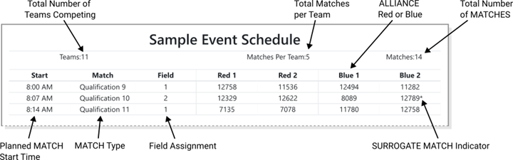
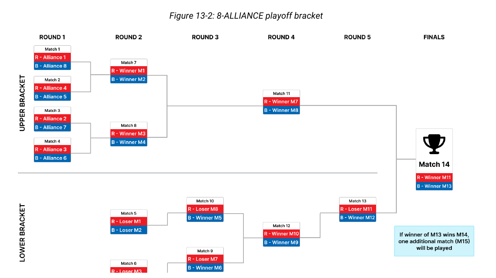
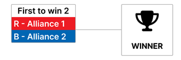
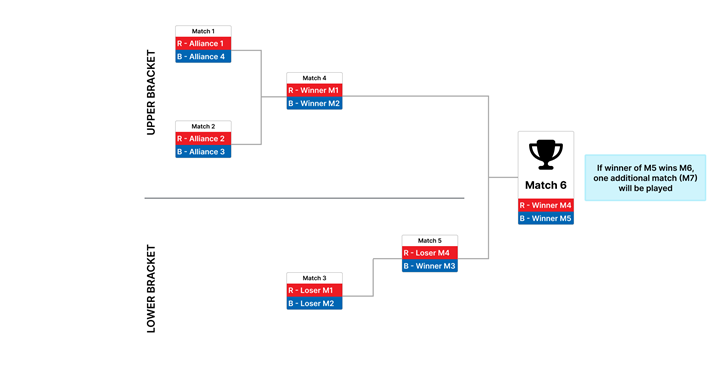
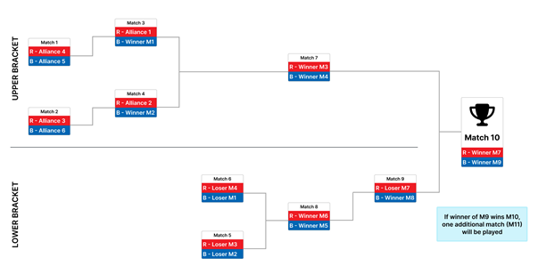
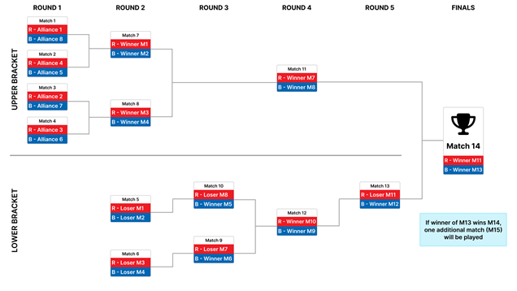
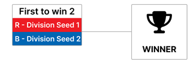
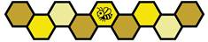

# 13 Tournament (T) {#s-13}

## 13.1 Overview {#s-13-1}

각 FIRST Tech Challenge Competition은 Head-to-head Tournament 형식으로 진행됩니다. 각 Tournament는 3가지 MATCH 유형으로 구성됩니다: Practice MATCHES(모든 Event에서 진행되는 것은 아님), Qualification MATCHES, Playoff MATCHES.

- **Practice MATCHES** — Qualification MATCHES 시작 전에 Competition FIELD에서 ROBOT을 운용할 기회를 제공합니다.
- **Qualification MATCHES** — 각 팀이 MATCH Point와 RANKING POINT를 획득하여 Seeding Position을 결정하고 Playoff MATCH 참가 자격을 얻을 수 있습니다.
- **Playoff MATCHES** — Event Winning ALLIANCE를 결정합니다.

이 규칙은 Section 4 Advancement에서 설명한 모든 Event Type에 적용됩니다. League Meet와 League Tournament에는 Section 14 League Play Tournaments (L)의 추가 규칙이 적용될 수 있습니다.

## 13.2 MATCH Replays {#s-13-2}

#### T201 \*Replay는 허용되지만 드뭅니다. {#rule-T201}

MATCH Replay는 ARENA FAULT가 발생했거나 FIELD STAFF가 FIELD Damage 또는 Personal Injury를 예상하여 MATCH를 중단한 극단적인 상황에서만 허용됩니다.

**ARENA FAULT**는 ARENA 운영상의 Error이며 다음을 포함하되 이에 한정되지 않습니다.

A. 정상적이고 예상 가능한 Gameplay 때문에 FIELD Element가 파손된 경우

B. ROBOT이 FIELD Element를 Abuse하여 파손시키고 그 Damage가 상대 ALLIANCE의 MATCH Outcome에 영향을 준 경우


ROBOT Abuse로 파손된 FIELD Element가 해당 ROBOT의 ALLIANCE Outcome에 영향을 준 경우는 ARENA FAULT가 아닙니다.


C. ROBOT Interaction 때문이 아닌데 FIELD Element가 Normal Tolerance 밖으로 이동한 경우

D. 여러 ROBOT에 동시에, 일반적으로 양쪽 ALLIANCE에 걸쳐 영향을 주는 광범위 Wireless Interference

E. MATCH Timer Display Failure

F. Section 10.8 Other Logistics에 명시된 경우를 제외한 FIELD STAFF Error

Head REFEREE가 MATCH Outcome에 영향을 준 ARENA FAULT가 발생했다고 판단하고 영향을 받은 ALLIANCE의 어느 팀이라도 Replay를 원하면 MATCH를 Replay합니다. 또한 FIRST Headquarters는 Head REFEREE 및 FIELD STAFF와 협의하여 ARENA FAULT가 Event Outcome에 영향을 준 MATCH를 Replay할 권한을 가집니다.


팀의 책임인 예기치 않은 ROBOT Behavior는 Replay 사유가 아닙니다. Low Battery, Programming Issue, ROBOT Mechanical Problem 등은 Replay 근거가 되지 않습니다.



Head REFEREE 관점에서 Error가 어느 ALLIANCE가 MATCH를 이겼는지 및/또는 RANKING POINT 배정을 바꾼다면 MATCH Outcome에 영향을 준 것으로 봅니다. FIRST Headquarters 판단에서 Error가 RANKING POINT 배정을 바꾸거나 Ranking Criteria에 사용되는 Point에 Dramatic Effect를 주면 Event Outcome에 영향을 준 것으로 봅니다.

Head REFEREE 관점에서 MATCH Outcome에 영향을 주지 않는 ARENA FAULT는 MATCH Replay로 이어지지 않습니다. 예시는 다음을 포함하되 이에 한정되지 않습니다.

A. Human 또는 ROBOT 활동에서 멀리 떨어진 FIELD 안으로 Plastic 조각이 떨어졌고, MATCH Outcome에 영향을 주지 않는 경우

B. ARENA Sound 재생이 지연된 경우

C. Penalty 또는 Scoring Achievement의 배정이 조정되거나 지연된 경우(해당 조정이 MATCH 후 이루어진 경우 포함)


#### T202 \*Replay에서는 Original MATCH의 조건을 재현합니다. {#rule-T202}

ARENA FAULT 또는 FIELD Damage로 MATCH를 Replay할 때 합리적인 범위에서 Original MATCH와 동일한 Condition을 만들기 위해 노력합니다.

A. Original MATCH에 없었거나 시작 전에 DISABLED였던 ROBOT은 Replay에서도 DISABLED

B. FIELD Damage Severity 때문에 Head REFEREE가 다른 판단을 하지 않는 한 동일 FIELD 사용

예외:

C. Replay에서 ROBOT/DRIVE TEAM Starting Location과 Pre-loaded SCORING ELEMENT는 원래와 동일하게 복제할 필요 없음


Original MATCH Condition을 복제하기 위해 노력하지만 Ambient Lighting 변화처럼 Event가 통제할 수 없는 Environmental Factor가 있을 수 있습니다.


## 13.3 Clarifications on MATCH Play Results (“Question Box”) {#s-13-3}

각 Event에는 ARENA Area에 하나 이상의 지정 Question Box가 있습니다. DRIVE TEAM이 MATCH, FIELD 등에 질문이 있으면 DRIVE TEAM Badge를 착용한 대표 최대 2명을 해당 Question Box로 보낼 수 있습니다. Timing에 따라 Head REFEREE 또는 FTA는 요청된 Discussion을 다음 MATCH 종료 후로 미룰 수 있습니다.

FIELD 또는 ROBOT Operation의 Technical Question은 FTA가 담당하며 필요하면 추가 Team Member를 대화에 초대할 수 있습니다. DRIVE TEAM이 Ruling 또는 MATCH Result 설명을 원하면 T301에 따라 MATCH Result가 표시된 뒤 최대 2명이 Head REFEREE에게 질문합니다.

FIRST Event Management Software는 MINOR/MAJOR FOUL 수량을 추적하지만 FIRST는 REFEREE가 각 FOUL의 세부 정보를 따로 기록하지 않도록 안내합니다. 따라서 REFEREE가 어떤 FOUL이 언제, 누구에게 발생했는지 모든 세부사항을 기억할 것으로 기대하지 않습니다.


Question Box에서는 합리적인 질문이라면 무엇이든 할 수 있고 Head REFEREE는 가능한 한 도움이 되는 Feedback을 제공하기 위해 노력합니다. 예를 들어 특정 FOUL이 어떻게/왜 불리는지, ROBOT Design/Gameplay 때문에 어떤 FOUL에 취약한지, 특정 Rule을 어떻게 적용하는지 등을 설명할 수 있으나 구체적인 세부사항을 모두 제공하지 못할 수도 있습니다.


#### T301 \*Head REFEREE와의 Interaction. {#rule-T301}

팀은 Head REFEREE에게 최대 2명만 질문할 수 있으며 그중 최소 1명은 STUDENT여야 합니다.

**위반:** Head REFEREE는 추가로 참여한 비준수 Team Member 또는 주변 대화에는 응답하지 않습니다.


일부 Event는 ARENA 접근을 DRIVE TEAM Member로 제한할 수 있습니다. Question Box 접근을 위해 Team 내부에서 Badge를 서로 바꾸는 것은 허용됩니다. 가능한 한 STUDENT가 대화의 Active Participant가 되어야 합니다. 동의 없이 Interaction을 녹음하지 마십시오(E116).


#### T302 \*MATCH 질문은 제때 해야 합니다. {#rule-T302}

T301 절차로 MATCH Result를 Clarify 또는 Dispute하려면 STUDENT Representative가 다음 시간 안에 Question Box에 와야 합니다.

A. Qualification MATCH 관련 질문: ALLIANCE Selection 시작 전 언제든지, 또는 Playoff MATCH가 없는 Event에서는 마지막 Qualification MATCH 후 5분 이내

B. Playoff MATCH 관련 질문: 다음 Playoff Round 시작 전까지. 마지막 Playoff MATCH라면 MATCH 직후


REFEREE도 사람이며 시간이 지날수록 특정 MATCH 세부사항을 기억하기 어려워집니다. 가능하면 해당 MATCH 이후 3 MATCH 이내에 질문·이의를 제기하는 것이 좋습니다. 팀은 최대한 빨리 질문하는 것을 권장합니다. 마지막 Playoff MATCH 후 5분을 넘긴 질문은 처리되지 않을 가능성이 높습니다.


#### T303 \*질문은 사실에 기반하고 건설적으로 하십시오. {#rule-T303}

Question Box에 오는 팀은 요청 내용을 미리 정리하고 Discussion을 돕기 위해 관련 Rule 또는 Q&amp;A Website Reference를 준비할 것을 권장합니다.


팀이 자신을 위해 Advocate하려고 Question Box를 이용했다고 해서 불이익이 있어서는 안 됩니다. 다만 Team Youth와 Volunteer 모두에게 Stress가 높은 상황일 수 있으므로 대화 중 FIRST Core Values를 기억해야 합니다. 일부 Event에서는 MATCH Result가 FTC-Events Page에 제공될 수 있습니다.


## 13.4 General Tournament Rules {#s-13-4}

#### T401 \*Event 중 Gameplay에 관한 최종 권한은 Head REFEREE에게 있습니다. {#rule-T401}

Head REFEREE는 FIRST Personnel, FTA, Event Director, Program Delivery Partner 및 기타 Event Staff의 의견을 받을 수 있지만 Head REFEREE의 판정은 최종입니다. Head REFEREE를 포함한 어떤 Event Staff도 어떤 출처의 MATCH Video, Photo, Artistic Rendering 등을 판정에 사용하지 않습니다.

A. RED CARD 또는 YELLOW CARD를 부여할 때 Head REFEREE는 해당 Rule Violation을 기록해야 합니다.

B. Event Director와 Program Delivery Partner는 Head REFEREE 판정을 뒤집을 수 없습니다.

C. Framework of Behaviors 및 Competition Integrity Contract(CIC) 위반은 Head REFEREE의 초기 판정을 넘어 추가 Escalation이 이루어질 수 있습니다.

D. 모든 Qualification 및 Playoff MATCH는 Certified Head REFEREE가 관찰해야 하며, Head REFEREE는 한 번에 MATCH 1개만 볼 수 있습니다.


이 매뉴얼의 규칙은 Human Head REFEREE가 적용하도록 작성되었습니다. 일부 규칙은 명확한 기준으로 쉽게 확인할 수 있지만 다른 규칙은 Human Judgment에 의존합니다. Head REFEREE는 자신 또는 다른 REFEREE가 MATCH 중 관찰한 정보를 바탕으로 순간 최선의 판정을 내립니다.

모호하거나 논쟁적인 상황에서 “올바른 판정은 무엇이었나?” 또는 “만약…”을 생각하기 쉽지만 FIRST Tech Challenge Gameplay에서 올바른 판정은 Head REFEREE가 당시 이용 가능한 정보를 바탕으로 Good Faith로 내린 판정입니다.


#### T402 \*REFEREE만 ROBOT을 DISABLED로 선언할 수 있습니다. {#rule-T402}

ROBOT은 MATCH 중 REFEREE가 DISABLED라고 선언한 시점부터만 DISABLED로 간주됩니다. ROBOT은 Rule Violation의 결과 또는 ROBOT Failure 때문에 DISABLED될 수 있습니다. Rule Violation 때문에 REFEREE가 ROBOT을 DISABLE하는 경우, DISABLE 전에 FIELD의 특정 Neutral Position으로 ROBOT을 이동하라고 팀에 지시할 수 있습니다.

#### T403 \*Event의 Non-gameplay Decision에 관한 최종 권한은 Event Director에게 있습니다. {#rule-T403}

Competition Manual은 Gameplay와 Judging을 포함한 Competition Rule Set을 제공하지만 FIRST Tech Challenge Event 운영을 위한 모든 Guideline을 망라한 문서는 아닙니다. T401에 따라 Head REFEREE 권한인 Specific Gameplay Rule 이외의 Issue는 Event Director의 재량이며 다음을 포함하되 이에 한정되지 않습니다.

A. Public Schedule에 게시된 Venue Access

B. Pit Size와 Utility Access

C. Health and Safety

D. Team Registration 및 Competition Eligibility

E. ARENA 밖에서의 Team Conduct

#### T404 \*Event의 모든 Competition FIELD는 서로 일관되어야 합니다. {#rule-T404}

여러 Competition FIELD를 사용하는 Event는 MATCH Schedule에 표시된 모든 Competition FIELD를 서로 일관되게 Setup해야 합니다. 고려해야 하는 항목은 다음을 포함하되 이에 한정되지 않습니다.

A. FIELD가 Floor에서 Elevate되는 정도

B. FIELD Display Monitor

C. FIELD Perimeter Type

D. FIELD TILE Size와 Type


Practice FIELD 등 다른 FIELD는 서로 또는 Competition FIELD와 동일할 필요가 없습니다.


#### T405 \*선택적 FIELD Measurement/Calibration 시간에는 ROBOT Practice를 할 수 없습니다. {#rule-T405}

ARENA가 Measurement를 위해 열려 있는 동안 ROBOT은 OpMode를 실행할 수 있지만 ROBOT(예: CHASSIS)을 자체 Power로 FIELD 주변에서 이동시킬 수 없습니다.

**위반:** VERBAL WARNING. Event 중 이후 위반이 발생하면 YELLOW CARD.


Event Director 재량으로 Qualification MATCH 시작 전에 ARENA를 최소 30분 동안 열어 팀이 ARENA를 Survey/Measure하고 ROBOT을 FIELD에 놓아 Sensor Calibration을 수행할 수 있습니다. 정확한 Open Time은 Event에서 팀에 안내합니다. 팀은 Head REFEREE 또는 FTA에게 특정 질문이나 의견을 전달할 수 있습니다.

**허용 활동:**

A. ROBOT Power On

B. OpMode Initialize

C. ROBOT CHASSIS 밖으로 MECHANISM Operate/Extend

D. ROBOT이 SCORING ELEMENT CONTROL

E. ROBOT을 Programming Laptop 및 기타 Device에 연결

F. Team Member가 ROBOT과 함께 FIELD 안에 위치

G. Team Member가 ROBOT을 수동으로 FIELD 여러 위치로 이동

H. Team Member 또는 ROBOT이 Tape Measure 같은 Tool 또는 Sensor로 FIELD 측정

**허용되지 않는 활동:**

I. ROBOT CHASSIS가 자체 Power로 FIELD 주변을 이동(AUTO/TELEOP Driving)

J. ROBOT이 SCORING ELEMENT LAUNCH

K. Team Member가 Practice 수행(예: ALLIANCE AREA에서 반복적으로 SCORING ELEMENT를 놓는 연습)


#### T406 \*Team Timeout은 없지만 MATCH 사이 Break는 있습니다. {#rule-T406}

Back-to-back MATCH에 참가하는 팀은 최소한 다음 Break를 받습니다.

A. Qualification MATCH: 이전 MATCH Result가 게시된 시점부터 다음 MATCH의 G301상 Expected Start Time까지 최소 5분

B. Playoff MATCH: 이전 MATCH Result가 게시된 시점부터 다음 MATCH의 G301상 Expected Start Time까지 최소 8분


MATCH Result가 게시되지 않는 경우(예: Immediate Replay) Head REFEREE 재량으로 팀에 합리적인 Reset Time을 제공합니다.

이 Break는 FIRST Event Management System이 자동 추적합니다. FIELD STAFF는 필요한 경우 예상 Start Time을 팀에 전달합니다. 팀은 FTA, Head REFEREE 또는 Designee에게 영향을 받는 MATCH의 Timing을 물어볼 수 있습니다.


#### T407 \*MATCH는 순서대로 진행합니다. {#rule-T407}

Qualification 및 Playoff MATCH는 Event Director와 협의한 Head REFEREE가 Extenuating Circumstance를 인정한 경우를 제외하고 Numerical Order로 진행합니다. 모든 Qualification MATCH는 ALLIANCE Selection 시작 전에 완료되어야 하며, 현재 Playoff Round의 모든 MATCH는 다음 Round 시작 전에 완료되어야 합니다.

순서를 벗어나거나 Replay되는 MATCH의 Timing은 FIELD STAFF 또는 Event Personnel이 해당 팀에 전달합니다.


순서가 바뀔 수 있는 Extenuating Circumstance 예는 다음과 같습니다.

A. 다음 가능한 Break, Day End, 다른 Qualification MATCH 종료 후, 또는 현재 Playoff Round 종료 시 Replay 진행

B. 한 Competition FIELD의 긴 Repair로 그 FIELD에서 MATCH 진행이 중단되지만 다른 FIELD는 계속 사용할 수 있는 경우

C. Team과 관련된 긴급하거나 예외적인 상황

이 규칙은 MATCH를 질서 있게 진행하면서 예상치 못한 상황에 유연성을 제공하기 위한 것입니다. 진행 순서와 관계없이 T406과 G301은 계속 적용됩니다.


## 13.5 Practice MATCHES {#s-13-5}

Practice MATCH가 있는 Event에서는 Qualification MATCH 전에 진행합니다. Practice MATCH Schedule은 가능한 한 빨리, 늦어도 Practice MATCH 시작 전까지 제공됩니다. FTC-Events Site에도 제공될 수 있습니다.

Practice MATCH는 Random Assignment이며 팀은 배정된 Practice MATCH를 서로 바꿀 수 없습니다. 각 팀에는 동일한 수의 Practice MATCH가 배정되지만 팀 수 × Practice MATCH 수가 4로 나누어지지 않으면 Event Management Software가 일부 팀을 Random으로 선택하여 추가 Practice MATCH를 배정합니다.

Schedule Constraint 때문에 모든 Event에서 Practice MATCH를 보장하지는 않습니다.

### 13.5.1 Filler Line {#s-13-5-1}

Scheduled Practice MATCH Event에서 빈 Slot을 채우거나 Open Practice Schedule Event에서 모든 Slot을 채우기 위해 Filler Line을 사용합니다. Queueing에 나타나지 않은 팀의 빈 Practice MATCH 자리를 First-come, First-served 방식으로 Filler Line의 팀이 채웁니다. Filler Line 팀 수는 Venue 공간에 따라 달라집니다.

Filler Line에 참가하려면 다음 모든 기준을 충족해야 합니다.

A. ROBOT은 Inspection을 통과해야 함(Open Practice Schedule Event에서는 면제될 수 있음)

B. DRIVE TEAM은 ROBOT과 함께 Filler Line에 들어가야 함

C. Filler Line에 있는 동안 ROBOT 작업 금지

D. 한 팀이 Filler Line에 두 자리 이상 차지할 수 없음

E. 자신의 Practice MATCH를 위해 Queueing 중이면 동시에 Filler Line에 들어갈 수 없음

## 13.6 Qualification MATCHES {#s-13-6}

### 13.6.1 Schedule {#s-13-6-1}

Qualification MATCH Schedule은 가능한 한 빨리, 늦어도 Qualification MATCH 예정 시작 15분 전까지 제공됩니다. I102에 따라 Eligibility가 있고 제시간에 Check-in한 팀만 Schedule에 포함됩니다.

팀은 Printed Hard Copy 1부, 사진 촬영 가능한 공개 게시본 안내, Local Digital Schedule Display 중 하나 이상을 통해 Schedule에 접근합니다. FTC-Events Site에도 제공될 수 있습니다. 각 Qualification Schedule은 각 팀이 Round당 MATCH 1개를 플레이하는 여러 Round로 구성됩니다.

모든 Event Type은 Event Director가 배정된 Schedule Time을 바탕으로 팀당 Qualification MATCH 5개 또는 6개를 Schedule합니다. FIRST Championship, FIRST Premier Event, Regional Championship Tournament는 FIRST Headquarters 및 Event Director 재량으로 더 많은 MATCH를 Schedule할 수 있습니다.

MATCH Schedule은 Event MATCH를 조정하는 데 사용됩니다. Figure 13-1은 Schedule에 표시되는 정보를 보여줍니다. SURROGATE MATCH는 Section 13.6.2 MATCH Assignment에 설명되어 있습니다.

**Figure 13-1 · Sample MATCH Schedule**

### 13.6.2 MATCH Assignment {#s-13-6-2}

FIRST Event Management Software는 미리 정의된 Algorithm으로 각 Qualification MATCH마다 각 팀에 ALLIANCE Partner 1팀을 배정하며, 팀은 Qualification MATCH 배정을 서로 바꿀 수 없습니다. Algorithm은 다음 우선순위를 사용합니다.

1. 각 팀이 MATCH 사이 최소 필요 시간을 확보
2. 같은 팀과 ALLIANCE가 되는 횟수 최소화
3. 같은 팀을 상대로 만나는 횟수 최소화
4. SURROGATE 사용 최소화
5. Blue/Red ALLIANCE 참가 횟수를 고르게 분배


MATCH Scheduling Algorithm에 대한 자세한 내용은 Idle Loop Software Website를 참고하십시오.


모든 팀에는 Round 수와 동일한 수의 Qualification MATCH가 배정됩니다. 단, 팀 수 × MATCH 수가 4로 나누어지지 않으면 일부 팀이 추가 MATCH를 하며 그 추가 MATCH에서는 SURROGATE로 지정됩니다. SURROGATE MATCH는 Schedule의 Team Number 뒤에 \*로 표시되고 항상 해당 팀의 세 번째 Qualification MATCH이며 Ranking에는 영향을 주지 않습니다. 다만 SURROGATE에게 부여된 YELLOW/RED CARD는 이후 MATCH로 이어집니다.

Back-to-back MATCH가 배정되면 T406에 따른 최소 Break를 받습니다.

### 13.6.3 Qualification Ranking {#s-13-6-3}

RANKING POINTS(RP)는 Qualification MATCH에서 ALLIANCE 성과에 따라 팀에 부여되는 Unit입니다. 각 Qualification MATCH 종료 시 Table 10-2에 따라 Eligible Team에 부여됩니다.

팀의 **RANKING SCORE(RS)**는 SURROGATE MATCH를 제외한 Qualification MATCH에서 획득한 RANKING POINT의 평균입니다.

Qualification MATCH 참가 팀은 RANKING SCORE로 순위가 정해집니다. 참가 팀 수가 n이면 1위부터 n위까지이며 1위가 가장 높은 RS입니다. SURROGATE MATCH는 모든 계산에서 제외됩니다. DISQUALIFIED된 MATCH는 모든 Sort Criteria에서 0으로 계산됩니다.

**Table 13-1 · Qualification MATCH Ranking Criteria**

<table><thead><tr><th>정렬 순서</th><th>기준</th></tr></thead><tbody><tr><td>1위</td><td>RANKING SCORE (RS)</td></tr><tr><td>2위</td><td>평균 ALLIANCE MATCH 포인트 — MINOR FOUL 및 MAJOR FOUL 제외 (평균 MATCH 포인트 − FOUL)</td></tr><tr><td>3위</td><td>평균 TIP 횟수</td></tr><tr><td>4위</td><td>평균 AUTO 포인트</td></tr><tr><td>5위</td><td>FIRST Event Management Software에 의한 무작위 정렬</td></tr></tbody></table>

#### T601 \*Qualification에서 DISQUALIFICATION은 DISQUALIFIED된 팀에만 적용됩니다. {#rule-T601}

Qualification MATCH에서 한 팀의 DISQUALIFICATION은 ALLIANCE Partner에게 영향을 주지 않습니다.

## 13.7 Playoff MATCHES {#s-13-7}

Playoff MATCHES는 Qualification MATCHES 뒤에 진행됩니다. ALLIANCE Selection으로 고정 ALLIANCE를 구성하고 Double-elimination Bracket을 통해 Event Winner를 결정합니다. Playoff에서는 RP를 얻지 않으며 승패로 다음 단계로 진출합니다. Playoff에서 한 팀이 DISQUALIFIED되면 전체 ALLIANCE에 적용되어 ALLIANCE 모든 팀이 0 MATCH Point를 받습니다.

#### T701 \*STUDENT Representative 1명 또는 2명을 보내십시오. {#rule-T701}

각 팀은 지정된 ALLIANCE Selection Time(일반적으로 마지막 Scheduled Qualification MATCH 직후)에 팀을 대표할 STUDENT 1명 이상 2명 이하를 ARENA로 보내야 합니다.

**위반:** Representative를 보내지 않은 팀은 Playoff Tournament 참가 자격이 없습니다.


Absent Team이 ALLIANCE Lead가 될 순위였다면 그보다 낮은 ALLIANCE Lead가 한 자리씩 올라갑니다. Playoff에 참가하지 않을 계획이라면 가능한 한 빨리 Event Director와 Head REFEREE에게 알려야 합니다.


#### T702 \*초대를 Decline한 팀은 다시 Pick될 수 없습니다. {#rule-T702}

ALLIANCE CAPTAIN은 다른 ALLIANCE의 Playoff Invitation을 Decline한 팀을 초대할 수 없습니다.

**위반:** ALLIANCE CAPTAIN은 다른 팀을 선택해야 합니다.


다른 ALLIANCE의 Invitation을 Decline한 ALLIANCE Lead는 자신의 ALLIANCE에 팀을 초대할 수는 있지만 다른 ALLIANCE에 다시 초대될 수 없습니다.


#### T703 \*Playoff MATCH에는 Backup Team이 없습니다. {#rule-T703}

ALLIANCE는 Playoff MATCH에서 Backup Team을 요청할 수 없습니다.


Playoff Tournament의 각 Round에서 ALLIANCE의 모든 팀이 참가해야 하므로 Partner 선택 시 Reliability를 고려할 것을 권장합니다.


#### T704 \*Playoff MATCH 중 Team은 추가 ARENA Access를 받을 수 있습니다. {#rule-T704}

Event Director 지시에 따라 Playoff MATCH 사이 ROBOT을 제시간에 유지·수리하기 위해 각 팀은 추가 Pit Crew Member 최대 3명을 사용할 수 있습니다. 이 Member는 DRIVE TEAM과 같은 ARENA Access를 받을 수 있지만 MATCH Play에는 참여할 수 없습니다.


추가 Pit Crew Allocation은 Venue별 조건이며 Event Director 재량입니다.


#### T705 \*여러 DISQUALIFICATION은 특별히 처리합니다. {#rule-T705}

Playoff MATCH에서 하나 이상의 ALLIANCE DISQUALIFICATION은 다음과 같이 처리합니다.

A. 한 ALLIANCE가 DISQUALIFIED이면 그 ALLIANCE가 패배

B. 양쪽 ALLIANCE 모두 DISQUALIFIED이면 시간상 먼저 DISQUALIFIED된 ALLIANCE가 패배

C. Head REFEREE가 두 ALLIANCE가 동시에 DISQUALIFIED되었다고 판단하면 MATCH는 Tie

### 13.7.1 ALLIANCE Selection Process {#s-13-7-1}

Qualification MATCH 종료 후 상위 Ranking Team이 ALLIANCE Lead가 됩니다. 각 ALLIANCE Lead의 지정 STUDENT Representative는 ALLIANCE CAPTAIN이라 하며 ALLIANCE Selection과 Playoff MATCH 사이에 Representative를 변경할 수 있습니다.

Ranked ALLIANCE는 Table 13-2의 최대 ALLIANCE 수까지 ALLIANCE 1, ALLIANCE 2 등의 순서로 지정됩니다. 각 ALLIANCE Lead가 다른 Team 1팀을 선택합니다. 선택된 팀이 수락하면 ALLIANCE Member가 됩니다. 다른 ALLIANCE Lead가 Invitation을 수락하면 그 아래 ALLIANCE Lead들이 한 자리씩 올라가고, 아직 선택되지 않은 가장 높은 Ranking Team이 새로운 ALLIANCE Lead가 됩니다.

Decline이나 조기 귀가 등으로 Table 13-2의 완전한 ALLIANCE를 모두 만들 수 없으면 Incomplete ALLIANCE로 진행합니다. Team 0개인 ALLIANCE는 상대에게 Automatic Win을 주고 MATCH를 건너뛰며, Team 1개인 ALLIANCE는 1 대 2로 MATCH를 플레이합니다.

### 13.7.2 Playoff MATCH Bracket {#s-13-7-2}

Playoff MATCH Bracket으로 Event Winner를 결정합니다. Playoff 참가 자격이 있는 Qualification MATCH 참가 Team 수에 따라 Table 13-2처럼 ALLIANCE 수를 결정합니다.


Event에 등록했지만 No-show인 Team이나 Award에는 참가하지만 Qualification MATCH Schedule에 포함되지 않은 Team은 Bracket Size 계산에서 제외합니다. Qualification MATCH에 참가했지만 Playoff에 참가할 의사가 없는 Team은 계산에 포함합니다.


**Table 13-2 · 전체 Qualification MATCH 참가 Team 수에 따른 Playoff ALLIANCE 수**

<table><thead><tr><th>Playoff 참가 자격이 있는 전체 Team 수</th><th>구성되는 Playoff ALLIANCE 수</th></tr></thead><tbody><tr><td>4–10 Teams</td><td>2</td></tr><tr><td>11–20 Teams</td><td>4</td></tr><tr><td>21–40 Teams</td><td>6</td></tr><tr><td>41–64 Teams</td><td>8</td></tr></tbody></table>


추가 Dual Division 관련 규칙은 Section 13.8 Dual Division Events를 참고하십시오.


Double-elimination Tournament는 ALLIANCE 수에 맞춰 Upper/Lower Bracket으로 구성됩니다. 2 ALLIANCE Tournament는 두 ALLIANCE가 Finals에서 맞붙습니다. 모든 ALLIANCE는 Upper Bracket에서 시작합니다. Upper에서 승리하면 Upper에 남고 패하면 Lower로 이동합니다. Lower에서는 이후 모든 MATCH를 이겨야 하며 전체 두 번째 패배 시 Tournament에서 탈락합니다.

Tie이면 Winner가 나올 때까지 추가 MATCH를 플레이합니다. Round 1에서는 높은 Ranking ALLIANCE가 Red이며 이후 Round의 ALLIANCE Color는 초기 Ranking과 관계없이 Figure 13-2에 따릅니다. Break는 최신 MATCH Result가 게시된 뒤 시작하며 Expected Start Time은 Schedule 시각 또는 어느 ALLIANCE든 이전 MATCH 종료 후 8분 중 더 늦은 시각입니다(T406).

**Figure 13-2 · 8-ALLIANCE playoff bracket**

Section 13.2에 따른 Replay 또는 Tie로 인한 추가 MATCH가 필요하면 팀에 진행 시간을 알립니다. 모든 팀이 더 빨리 Ready가 되지 않는 한 ROBOT Reset을 위해 최소 8분을 제공합니다(T406). 해당 MATCH는 다음 Round 시작 전에 완료되어야 합니다.

### 13.7.3 2-ALLIANCE Bracket and Typical Timing {#s-13-7-3}

**Figure 13-3 · 2-ALLIANCE playoff bracket**

**Table 13-3 · 2-ALLIANCE playoff bracket typical timing**

<table><thead><tr><th rowspan="2">Round</th><th rowspan="2">MATCH</th><th rowspan="2">Upper/Lower</th><th colspan="3"></th><th colspan="2">Gap (min)</th><th colspan="2">Next MATCH (MATCH # (ALLIANCE color))</th><th rowspan="2">Estimated Start (min)</th></tr><tr><th>FIELD</th><th>Blue</th><th>Red</th><th>Blue</th><th>Red</th><th>Winner</th><th>Loser</th></tr></thead><tbody><tr><td colspan="10">15-minute break Judges’ Choice* (1), Innovate/Design/Control Award (1)</td><td>0</td></tr><tr><td>Finals</td><td>1</td><td></td><td>1</td><td>A2</td><td>A1</td><td></td><td></td><td>M2</td><td>M2</td><td>15</td></tr><tr><td colspan="10">15-minute break Sustain/Reach/Connect Award (1)</td><td>18</td></tr><tr><td>Finals</td><td>2</td><td></td><td>1</td><td>A2</td><td>A1</td><td>0:15</td><td>0:15</td><td>M3*</td><td>M3*</td><td>33</td></tr><tr><td colspan="10">15-minute break Think Award (1)</td><td>36</td></tr><tr><td>Finals</td><td>3*</td><td></td><td>1</td><td>A2</td><td>A1</td><td>0:10</td><td>0:10</td><td></td><td></td><td>51</td></tr><tr><td colspan="10">Awards: Compass*, Finalists, Winners, and Inspire Award (1)</td><td>54</td></tr></tbody></table>

\* 필요한 경우

\*\* Award는 Event Director의 재량으로 Playoff Bracket 종료 후 수여할 수 있습니다.

### 13.7.4 4-ALLIANCE Bracket and Typical Timing {#s-13-7-4}

**Figure 13-4 · 4-ALLIANCE playoff bracket**

**Table 13-4 · 4-ALLIANCE playoff typical timing**

<table><thead><tr><th rowspan="2">Round</th><th rowspan="2">MATCH</th><th rowspan="2">Upper/Lower</th><th colspan="3"></th><th colspan="2">Gap (min)</th><th colspan="2">Next MATCH (MATCH # (ALLIANCE color))</th><th rowspan="2">Estimated Start (min)</th></tr><tr><th>FIELD</th><th>Blue</th><th>Red</th><th>Blue</th><th>Red</th><th>Winner</th><th>Loser</th></tr></thead><tbody><tr><td rowspan="2">1</td><td>1</td><td>Upper</td><td>1</td><td>A4</td><td>A1</td><td></td><td></td><td>M4 (R)</td><td>M3 (R)</td><td>0</td></tr><tr><td>2</td><td>Upper</td><td>1</td><td>A3</td><td>A2</td><td></td><td></td><td>M4 (B)</td><td>M3 (B)</td><td>6</td></tr><tr><td colspan="10">15-minute break</td><td>9</td></tr><tr><td rowspan="2">2</td><td>3</td><td>Lower</td><td>1</td><td>L2</td><td>L1</td><td>0:08</td><td>0:14</td><td>M5 (B)</td><td>4th</td><td>25</td></tr><tr><td>4</td><td>Upper</td><td>1</td><td>W2</td><td>W1</td><td>0:14</td><td>0:20</td><td>M6 (R)</td><td>M5 (R)</td><td>31</td></tr><tr><td colspan="10">15-minute break Judges’ Choice* (1), Design Award (1), Reach Award (1)</td><td>33</td></tr><tr><td>3</td><td>5</td><td>Lower</td><td>1</td><td>W3</td><td>L4</td><td>0:21</td><td>0:15</td><td>M6 (B)</td><td>3rd</td><td>48</td></tr><tr><td colspan="10">15-minute break Control Award (1), Innovate Award (1), Sustain Award (1)</td><td>51</td></tr><tr><td>Finals</td><td>6</td><td></td><td>1</td><td>W5</td><td>W4</td><td>0:15</td><td>0:33</td><td>M7*</td><td>M7*</td><td>66</td></tr><tr><td colspan="10">15-minute break Connect Award (1), Think Award (1)</td><td>69</td></tr><tr><td>Finals</td><td>7*</td><td></td><td>1</td><td>W5</td><td>W4</td><td>0:15</td><td>0:15</td><td></td><td></td><td>84</td></tr><tr><td colspan="10">Awards: Compass*, Finalists, Winners, and Inspire Award (2, 1)</td><td>87</td></tr></tbody></table>

\* 필요한 경우

\*\* Award는 Event Director의 재량으로 Playoff Bracket 종료 후 수여할 수 있습니다.

### 13.7.5 6-ALLIANCE Bracket and Typical Timing {#s-13-7-5}

**Figure 13-5 · 6-ALLIANCE playoff bracket**

**Table 13-5 · 6-ALLIANCE playoff bracket typical timing**

<table><thead><tr><th rowspan="2">Round</th><th rowspan="2">MATCH</th><th rowspan="2">Upper/Lower</th><th colspan="3"></th><th colspan="2">Gap (min)</th><th colspan="2">Next MATCH (MATCH # (ALLIANCE color))</th><th rowspan="2">Estimated Start (min)</th></tr><tr><th>FIELD</th><th>Blue</th><th>Red</th><th>Blue</th><th>Red</th><th>Winner</th><th>Loser</th></tr></thead><tbody><tr><td rowspan="2">1</td><td>1</td><td>Upper</td><td>1</td><td>A5</td><td>A4</td><td></td><td></td><td>M3 (B)</td><td>M6 (B)</td><td>0</td></tr><tr><td>2</td><td>Upper</td><td>2</td><td>A6</td><td>A3</td><td></td><td></td><td>M4 (B)</td><td>M5 (B)</td><td>6</td></tr><tr><td rowspan="2">2</td><td>3</td><td>Upper</td><td>1</td><td>W1</td><td>A1</td><td>0:09</td><td></td><td>M7 (R)</td><td>M5 (R)</td><td>12</td></tr><tr><td>4</td><td>Upper</td><td>2</td><td>W2</td><td>A2</td><td>0:09</td><td></td><td>M7 (B)</td><td>M6 (R)</td><td>18</td></tr><tr><td rowspan="2">3</td><td>5</td><td>Lower</td><td>1</td><td>L2</td><td>L3</td><td>0:15</td><td>0:09</td><td>M8 (B)</td><td>Tied 5th</td><td>24</td></tr><tr><td>6</td><td>Lower</td><td>2</td><td>L1</td><td>L4</td><td>0:27</td><td>0:09</td><td>M8 (R)</td><td></td><td>30</td></tr><tr><td rowspan="2">4</td><td>7</td><td>Upper</td><td>1</td><td>W4</td><td>W3</td><td>0:15</td><td>0:21</td><td>M10 (R)</td><td>M9 (R)</td><td>36</td></tr><tr><td>8</td><td>Lower</td><td>2</td><td>W5</td><td>W6</td><td>0:15</td><td>0:09</td><td>M9 (B)</td><td>4th</td><td>42</td></tr><tr><td colspan="10">15-minute break Judges’ Choice* (1), Design Award (2, 1), Reach Award (2, 1)</td><td>45</td></tr><tr><td>5</td><td>9</td><td>Lower</td><td>1</td><td>W8</td><td>L7</td><td>0:15</td><td>0:21</td><td>M10 (B)</td><td>3rd</td><td>60</td></tr><tr><td colspan="10">15-minute break Control Award (2, 1), Innovate Award (2, 1), Sustain Award (2,1)</td><td>63</td></tr><tr><td>Finals</td><td>10</td><td></td><td>1</td><td>W9</td><td>W7</td><td>0:15</td><td>0:39</td><td>M11*</td><td>M11*</td><td>78</td></tr><tr><td colspan="10">15-minute break Connect Award (2, 1), Think Award (2, 1)</td><td>81</td></tr><tr><td>Finals*</td><td>11</td><td></td><td>1</td><td>W9</td><td>W7</td><td>0:15</td><td>0:15</td><td></td><td></td><td>96</td></tr><tr><td colspan="10">Awards: Compass*, Finalists, Winners, and Inspire Award (3, 2, 1)</td><td>99</td></tr></tbody></table>

\* 필요한 경우

\*\* Award는 Event Director의 재량으로 Playoff Bracket 종료 후 수여할 수 있습니다.

### 13.7.6 8-ALLIANCE Bracket and Typical Timing {#s-13-7-6}

**Figure 13-6 · 8-ALLIANCE playoff bracket**

**Table 13-6 · 8-ALLIANCE playoff bracket typical timing**

<table><thead><tr><th rowspan="2">Round</th><th rowspan="2">MATCH</th><th rowspan="2">Upper/Lower</th><th colspan="3"></th><th colspan="2">Gap (min)</th><th colspan="2">Next MATCH (MATCH # (ALLIANCE color))</th><th rowspan="2">Estimated Start (min)</th></tr><tr><th>FIELD</th><th>Blue</th><th>Red</th><th>Blue</th><th>Red</th><th>Winner</th><th>Loser</th></tr></thead><tbody><tr><td rowspan="4">1</td><td>1</td><td>Upper</td><td>1</td><td>A8</td><td>A1</td><td></td><td></td><td>M7 (R)</td><td>M5 (R)</td><td>0</td></tr><tr><td>2</td><td>Upper</td><td>2</td><td>A5</td><td>A4</td><td></td><td></td><td>M7 (B)</td><td>M5 (B)</td><td>6</td></tr><tr><td>3</td><td>Upper</td><td>1</td><td>A7</td><td>A2</td><td></td><td></td><td>M8 (R)</td><td>M6 (R)</td><td>12</td></tr><tr><td>4</td><td>Upper</td><td>2</td><td>A6</td><td>A3</td><td></td><td></td><td>M8 (B)</td><td>M6 (B)</td><td>18</td></tr><tr><td rowspan="4">2</td><td>5</td><td>Lower</td><td>1</td><td>L2</td><td>L1</td><td>0:15</td><td>0:21</td><td>M10 (B)</td><td>Tied 7th</td><td>24</td></tr><tr><td>6</td><td>Lower</td><td>2</td><td>L4</td><td>L3</td><td>0:09</td><td>0:15</td><td>M9 (B)</td><td></td><td>30</td></tr><tr><td>7</td><td>Upper</td><td>1</td><td>W2</td><td>W1</td><td>0:27</td><td>0:33</td><td>M11 (R)</td><td>M9 (R)</td><td>36</td></tr><tr><td>8</td><td>Upper</td><td>2</td><td>W4</td><td>W3</td><td>0:21</td><td>0:27</td><td>M11 (B)</td><td>M10 (R)</td><td>42</td></tr><tr><td rowspan="2">3</td><td>9</td><td>Lower</td><td>1</td><td>W6</td><td>L7</td><td>0:15</td><td>0:09</td><td>M12 (B)</td><td>Tied 5th</td><td>48</td></tr><tr><td>10</td><td>Lower</td><td>2</td><td>W5</td><td>L8</td><td>0:27</td><td>0:09</td><td>M12 (R)</td><td></td><td>54</td></tr><tr><td rowspan="2">4</td><td>11</td><td>Upper</td><td>1</td><td>W8</td><td>W7</td><td>0:15</td><td>0:21</td><td>M14 (R)</td><td>M13 (R)</td><td>60</td></tr><tr><td>12</td><td>Lower</td><td>2</td><td>W9</td><td>W10</td><td>0:15</td><td>0:09</td><td>M13 (B)</td><td>4th</td><td>66</td></tr><tr><td colspan="10">15-minute break Judges’ Choice* (1), Design Award (3,2,1), Reach Award (3,2,1)</td><td>69</td></tr><tr><td>5</td><td>13</td><td>Lower</td><td>1</td><td>W12</td><td>L11</td><td>0:15</td><td>0:21</td><td>M14 (B)</td><td>3rd</td><td>84</td></tr><tr><td colspan="10">15-minute break Control Award (3,2,1), Innovate Award (3,2,1), Sustain Award (3,2,1)</td><td>87</td></tr><tr><td>Finals</td><td>14</td><td></td><td>1</td><td>W13</td><td>W11</td><td>0:15</td><td>0:39</td><td>M15*</td><td>M15*</td><td>102</td></tr><tr><td colspan="10">15-minute break Connect Award (3,2,1), Think Award (3,2,1)</td><td>105</td></tr><tr><td>Finals*</td><td>15</td><td></td><td>1</td><td>W13</td><td>W11</td><td>0:15</td><td>0:15</td><td></td><td></td><td>120</td></tr><tr><td colspan="10">Awards: Compass*, Finalists, Winners, and Inspire Award (3, 2, 1)</td><td>123</td></tr></tbody></table>

\* 필요한 경우

\*\* Award는 Event Director의 재량으로 Playoff Bracket 종료 후 수여할 수 있습니다.

## 13.8 Dual Division Events {#s-13-8}

Dual Division Event는 일반적으로 2개의 서로 다른 Competition Event(예: 각각 최소 2개 FIELD를 사용하는 2개의 Parallel Qualifying Tournament)처럼 운영되는 대규모 Event이며, 모든 Team에 대한 Judging은 동시에 진행됩니다. 각 Division의 Playoff MATCH가 끝나면 두 Division Winning ALLIANCE가 전체 Event Winner를 결정하기 위해 경쟁합니다.

Dual Division Event의 Advancement는 Section 13.8.1 Dual Division Advancement Points에 정의되어 있습니다.

Dual Division Event에서 Team은 아래와 같은 여러 방법 중 하나로 Division에 배정될 수 있습니다. 전체 세부사항은 Event Management Software Documentation을 참고하십시오. 어떤 방법을 사용할지는 지역 Program Delivery Partner의 재량입니다.

A. **Random Assignment** — Team List를 Shuffle한 뒤 절반으로 나눕니다. Division Size를 같게 만들 수 없으면 Software가 어느 Division에 Team 1개를 더 넣을지 Random으로 결정합니다.

B. FIM Method — FIRST in Michigan(FIM)이 개발한 “brute force randomizer” 방식에 기반합니다. 적절한 Randomness를 유지하면서 ROBOT Performance의 균형을 맞춥니다. Team은 가장 좋은 2개 Event의 Qualification Performance Metric으로 Ranking되고 Quartile로 나뉜 뒤 각 Quartile이 Division에 동일하게 나타나도록 분배됩니다. 여러 Metric으로 Division이 유사하게 맞춰졌는지 확인합니다. Division Assignment은 여러 Metric을 사용해 측정하여 두 Division이 서로 가깝게 일치하는지 확인합니다.

C. **Alternating Assignment** — Team Number로 Team List를 정렬하고 Division을 번갈아 배정합니다. 가장 낮은 Team Number가 Division 1, 다음은 Division 2, 그 다음 Division 1 순입니다.

D. **Child League Split-up**(League Tournament에서만 사용) — 각 Child League의 대표성이 각 Division에 균형 있게 분배되도록 시도합니다.

E. **OPR Method** — Division 사이 ROBOT Performance를 균형 있게 맞추려는 Algorithm입니다. 현재 Season 공식 Event에서 각 Team의 Offensive Power Rating(OPR)을 계산하고 Team별 최고 OPR을 선택한 뒤, 최고 OPR부터 낮은 OPR 순으로 Ranking하여 Division에 번갈아 배정합니다.

F. **Manual** — Program Delivery Partner가 수동으로 배정한 Team List를 Upload할 수 있습니다.

이전 Manual Section의 Rule에 더해 Dual Division Event에는 다음 Rule이 적용됩니다.

#### T801 \*두 Division은 같은 크기의 Playoff Bracket을 사용합니다. {#rule-T801}

Playoff ALLIANCE 수는 Table 13-2에 따라 **더 작은 Division의 Playoff 참가 자격 Team 수**를 기준으로 결정합니다.

#### T802 \*Dual Division Award는 Event Level에서 수여합니다. {#rule-T802}

모든 Award는 Division Level이 아니라 전체 Tournament Level에서 Judging되고 수여됩니다.

#### T803 \*Dual Division Award 수는 전체 Team 수를 기준으로 합니다. {#rule-T803}

Dual Division Event에서 수여되는 Award 수는 Table 6-1을 사용해 전체 참가 Team 수를 기준으로 결정합니다.

### 13.8.1 Dual Division Advancement Points {#s-13-8-1}

Dual Division Event의 Advancement Point는 Table 4-1에 따라 계산하되, Playoff Advancement Point는 아래 Table 13-7처럼 계산합니다.

**Table 13-7 · Dual Division Playoff Advancement Points**

<table><thead><tr><th>Category</th><th>Advancement Points Earned</th></tr></thead><tbody><tr><td>Playoff Advancement</td><td>1위(Winners) 40점 2위(Finalists) 20점 모든 Division Finalists 10점 모든 Division 3위 5점</td></tr></tbody></table>

### 13.8.2 Dual Division Playoffs {#s-13-8-2}

각 Division은 Section 13.6 Qualification MATCHES에 설명된 표준 Tournament를 진행한 뒤 Divisional Playoff를 통해 Division Winning ALLIANCE를 결정합니다. 두 Division Winning ALLIANCE는 Win-Loss Record를 Reset하고 2-ALLIANCE Double-elimination Bracket에서 서로 경기합니다.

Division은 Table 13-1의 Criteria를 사용하되 RANKING SCORE는 제외하여 Ranking합니다.

**Figure 13-7 · 2-ALLIANCE grand finals playoff bracket (Dual Division)**

Dual Division Event는 Divisional Playoff Bracket을 진행한 뒤 Figure 13-7처럼 두 ALLIANCE가 경기를 진행합니다. 먼저 MATCH 2승을 거둔 ALLIANCE가 Event Winning ALLIANCE가 됩니다. Typical Timing 예는 Table 13-8과 같습니다.

**Table 13-8 · 6-ALLIANCE Dual Division playoff bracket typical timing**

<table><thead><tr><th rowspan="2">Round</th><th rowspan="2">MATCH</th><th rowspan="2">Upper/Lower</th><th colspan="3"></th><th colspan="2">Gap (min)</th><th colspan="2">Next MATCH (MATCH # (ALLIANCE color))</th><th rowspan="2">Estimated Start (min)</th></tr><tr><th>FIELD</th><th>Blue</th><th>Red</th><th>Blue</th><th>Red</th><th>Winner</th><th>Loser</th></tr></thead><tbody><tr><td rowspan="2">1</td><td>1</td><td>Upper</td><td>1</td><td>A5</td><td>A4</td><td></td><td></td><td>M3 (B)</td><td>M6 (B)</td><td>0</td></tr><tr><td>2</td><td>Upper</td><td>2</td><td>A6</td><td>A3</td><td></td><td></td><td>M4 (B)</td><td>M5 (B)</td><td>6</td></tr><tr><td rowspan="2">2</td><td>3</td><td>Upper</td><td>1</td><td>W1</td><td>A1</td><td>0:09</td><td></td><td>M7 (R)</td><td>M5 (R)</td><td>12</td></tr><tr><td>4</td><td>Upper</td><td>2</td><td>W2</td><td>A2</td><td>0:09</td><td></td><td>M7 (B)</td><td>M6 (R)</td><td>18</td></tr><tr><td rowspan="2">3</td><td>5</td><td>Lower</td><td>1</td><td>L2</td><td>L3</td><td>0:15</td><td>0:09</td><td>M8 (B)</td><td>Tied 5th</td><td>24</td></tr><tr><td>6</td><td>Lower</td><td>2</td><td>L1</td><td>L4</td><td>0:27</td><td>0:09</td><td>M8 (R)</td><td></td><td>30</td></tr><tr><td rowspan="2">4</td><td>7</td><td>Upper</td><td>1</td><td>W4</td><td>W3</td><td>0:15</td><td>0:21</td><td>M10 (R)</td><td>M9 (R)</td><td>36</td></tr><tr><td>8</td><td>Lower</td><td>2</td><td>W5</td><td>W6</td><td>0:15</td><td>0:09</td><td>M9 (B)</td><td>4th</td><td>42</td></tr><tr><td colspan="10">15-minute break</td><td>45</td></tr><tr><td>5</td><td>9</td><td>Lower</td><td>1</td><td>W8</td><td>L7</td><td>0:08</td><td>0:14</td><td>M10 (B)</td><td>3rd</td><td>60</td></tr><tr><td colspan="10">15-minute break</td><td>63</td></tr><tr><td>Finals</td><td>10</td><td></td><td>1</td><td>W9</td><td>W7</td><td>0:08</td><td>0:25</td><td>M11*</td><td>M11*</td><td>78</td></tr><tr><td colspan="10">15-minute break</td><td>81</td></tr><tr><td>Finals*</td><td>11</td><td></td><td>1</td><td>W9</td><td>W7</td><td>0:08</td><td>0:08</td><td>F1</td><td></td><td>96</td></tr><tr><td colspan="10">End of Divisional Playoffs / Judges’ Choice* (1), Design Award (3, 2, 1), Reach Award (3, 2, 1)</td><td>99</td></tr><tr><td>Event Finals 1</td><td>F1</td><td></td><td>1</td><td>DivA</td><td>DivB</td><td>0:15</td><td>0:15</td><td>F2</td><td>F2</td><td>114</td></tr><tr><td colspan="10">15-minute break Control Award (3, 2, 1), Innovate Award (3, 2, 1), Sustain Award (3, 2, 1)</td><td>117</td></tr><tr><td>Event Finals 2</td><td>F2</td><td></td><td>1</td><td>DivA</td><td>DivB</td><td>0:08</td><td>0:08</td><td>F3*</td><td>F3*</td><td>132</td></tr><tr><td colspan="10">15-minute break Connect Award (3, 2, 1), Think Award (3, 2, 1)</td><td>135</td></tr><tr><td>Event Finals 3*</td><td>F3*</td><td></td><td>1</td><td>DivA</td><td>DivB</td><td>0:08</td><td>0:08</td><td></td><td></td><td>150</td></tr><tr><td colspan="10">Awards: Compass*, Div. Finalists, Division Winners, Event Finalist, Event Winners and Inspire Award (3, 2, 1)</td><td>153</td></tr></tbody></table>

\* 필요한 경우

\*\* Award는 Event Director의 재량으로 Playoff Bracket 종료 후 수여할 수 있습니다.

