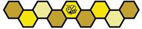

# 15 FIRST Championship (C)

2026-2027 FIRST Championship에서 Team은 6개의 Division으로 나뉩니다. 각 Division은 Section 13.6 Qualification MATCHES 및 Section 13.7 Playoff MATCHES에 설명된 표준 Tournament를 진행하여 Division Winning ALLIANCE를 결정합니다. 이 6개의 Division Winning ALLIANCE는 FIRST Championship FIELD에서 Championship Playoffs에 진출하여 Section 15.5 FIRST Championship Playoffs에 따라 FIRST Tech Challenge Championship Winner를 결정합니다.

## 15.1 Awards Modifications 

Venue 제한과 Event의 많은 Team 수를 수용하기 위해 FIRST Championship의 Judging Process가 수정될 수 있습니다. Process 또는 Award Modification은 Section 1.7.3 Team Updates에 설명된 마지막 정규 Team Update 또는 그 이전에 게시됩니다.

Section 6 Awards (A)의 Award는 Table 15-1에 표시된 예외를 제외하고 각 Division에서만 모두 수여됩니다.

**Table 15-1 · FIRST Championship Awards**

| Award                 | Per Division | FIRST Championship |
| --------------------- | ------------ | ------------------ |
| Inspire Award         | 1위, 2위, 3위   | 1위                 |
| FIRST Leadership List | 0            | 10                 |
| Compass Award         | 0            | 1                  |

## 15.2 Game Modification 

FIRST Championship BIOBUZZ Tournament에서는 SCORING ELEMENTS의 수, 종류, 분포와 Scoring Achievement(RP) Threshold가 조정될 수 있습니다. 모든 Game Modification은 Section 1.7.3 Team Updates에 설명된 마지막 정규 Team Update 또는 그 이전에 게시됩니다.

모든 Division FIELD는 Floor에서 약 24 in.(60.95 cm) 높이의 Riser 위에 설치됩니다. 모든 DRIVE TEAM Member와 FIELD STAFF는 Floor Level에 위치합니다. Team이 사용할 Practice FIELD 일부도 Elevated 상태로 제공됩니다. Elevated FIELD가 어떻게 보이는지에 대한 예는 Kickoff의 FIELD Tour Video를 참고하십시오.

모든 Division FIELD Perimeter는 제자리에 고정(anchored)되며 AndyMark Perimeter Strap을 포함하지 않습니다.

일부 또는 모든 Division FIELD에는 다른 또는 추가 Decal, Metal Coating, Material Change, Light 등을 포함하여 외관을 변경하는 추가 Modification이 적용될 수 있습니다. 이러한 Modification은 오직 미관상의 변경이 되도록 모든 노력을 기울이며 FIELD Performance 또는 ROBOT Design에 영향을 주지 않도록 합니다. 이러한 Modification의 세부사항은 Section 1.7.3 Team Updates에 설명된 마지막 정규 Team Update 또는 그 이전에 게시됩니다.

## 15.3 3-ROBOT ALLIANCES 

FIRST Championship의 ALLIANCE는 3대의 ROBOT으로 구성됩니다. 각 Division Playoff Tournament 전에 Section 13.7.1 ALLIANCE Selection Process에 설명된 절차에 따라 ALLIANCE를 구성하지만, 다음과 같이 2번째 Selection Round를 계속 진행합니다.

**Round 2:** 각 ALLIANCE Lead의 두 번째 선택에도 동일한 방법을 사용하지만 Selection Order는 반대로 진행하여 ALLIANCE 8이 먼저 선택하고 ALLIANCE 1이 마지막으로 선택합니다. 이 Process 결과 각각 3개 Team으로 구성된 8개의 ALLIANCE가 만들어집니다.

Division 및 Championship Playoff MATCHES에서 ALLIANCE는 각 MATCH를 자신의 ALLIANCE에 속한 3대 ROBOT 중 어떤 2대로든 시작할 수 있습니다. 어느 2대의 ROBOT이 플레이할지 MATCH 전에 FIELD STAFF에게 미리 알릴 필요는 없지만, 늦은 결정으로 G301에 따라 MATCH 시작을 지연시켜서는 안 됩니다.


예를 들어 2대 ROBOT이 Queuing을 떠난 뒤 ALLIANCE가 MATCH에서 플레이할 다른 2대 ROBOT 조합으로 바꾸기로 결정한다면 MATCH Delay로 판단될 가능성이 높습니다.



#### C301 \*Replay에서는 같은 ROBOT을 사용하십시오. 

Playoff MATCH를 Replay해야 하는 경우 Replay에 사용하는 2대 ROBOT은 Original MATCH에서 사용한 ROBOT과 동일해야 합니다. 유일한 예외는 Head REFEREE가 ARENA FAULT 때문에 ROBOT이 작동 불가능 상태가 되었다고 판단한 경우이며, 이 경우 ROBOTS를 변경할 수 있습니다. Tie 때문에 추가 MATCH를 플레이하는 경우에는 3대 ROBOT 중 어떤 2대를 사용해도 됩니다.

> FIRST Tech Challenge Team은 대부분의 Event보다 FIRST Championship에서 훨씬 더 많은 MATCH를 플레이하며 Event의 Team 수도 훨씬 많습니다. 세 번째 ROBOT을 Draft하면 각 ALLIANCE가 내장 Backup ROBOT을 확보하고 서로 다른 MATCH Strategy를 고려하여 Draft할 수 있는 유연성이 생깁니다.


## 15.4 FIRST Championship Pit Crews 

FIRST Championship Playoffs에 참가하는 ALLIANCE의 각 Team은 T704에 따라 Pre-MATCH Strategy, ROBOT Repair 및 Maintenance, 기타 Team Support Function을 돕기 위해 ARENA 내부에 추가 Pit Crew Team Member 3명을 둘 수 있습니다. 추가 Pit Crew Member는 ARENA의 Pit Area에 머물러야 합니다.

추가 Team Member는 Adult 또는 STUDENT일 수 있습니다.

## 15.5 FIRST Championship Playoffs 


FIRST Championship Playoff Tournament Structure에 대한 추가 정보는 향후 Team Update의 일부로 공개됩니다.


